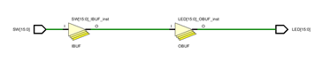

# Buffers

The goal of lectures to verbalize words, hear words, set expectations, build context while looking at examples of work to be done.  

## Sources: Verilog code

module switchLED(
​    input [15:0] SW,
​    output [15:0] LED
​    );
​    assign LED = SW;
endmodule

## RTL Analysis ScreenShot

Notice that it has been cropped.  This is the RTL Analysis of the Verilog Code. It  shows 4 buffers when really there are 16. The RTL analysis  tries to focus on patterns, not the number of patterns.

## Module

[15:0] pronounced "Fifteen down to zero"
[15:0] represents 16 wires individually named like an array
Buffers are the yellow triangles. 
Inputs are on the left (switches or SW are on the left)
Outputs are on the right (light emitting diode or LED)
SW has energy/power to **drive** the LED. 

## Circuit 

16 identical independent circuits operating in parallel
SW **drives** the input_buffer.
Input_buffer **drives** the output_buffer.
Output_buffer **drives** the LED.

## 48 Nets (Wires) 

16 SWs or Leaf Cells or **inputs**
 input is **moved** by human hand  
16 wires  or Nets connect the SWs to input buffers vivado added     
vivado added input buffer because the power source behind the switch was unknown
16  input buffer **drive** output 16 output buffers

SW *output* **connects** to input_buffer *input*
Input_buffer *output* **connects** to output_buffer *input*
Output_buffer *output* **connects** to the LED *input*

## Messages

*The  goal is no warnings, no errors.* 
A project has one top module which is connected to the external world through a constraints file.
Inputs and outputs to all other modules flow through this module. 
Here there is just one module. When there are more than one module, this message will disappear. 

## Synthesis

Constraints limit Vivado. Vivado is designed to make circuits run fast. Otherwise projects can usually be done more economically using C, python, or a programming language. We are going to have to constrain Vivado in the future just so we can do simple, logical things that normally would never be done with this software ... such as using our fingers  and a switch as a clock rather than a clock that runs very very fast.

## Logic

**Active High**
​	Logical zero
​		SW output is zero when off
​		LED is off when SW output is 0
​	Logical one
​		SW output is one when on
​		LED is on when SW output is 1

**Active Low**
​	Logical zero
​		SW output is zero when on
​		LED is on when SW output is 0
​	Logical one
​		SW output is one when off
​		LED is off when SW output is 1

## TriState Logic

Two wall light switches can control one light in our homes. These are called 3 way switches at Lowes or Home Depot. Why three way?

Digital electronics call these tri-state. Both the light switches and digital electronics require three wires. A state is on .. light on. Another state is off .. light off. The third state is disconnected, open or high output impedance.  The third state is not driven .. meaning no energy is output. Some other output can take control of the wire. 

Most nets are driven by one source. If driven by two sources that agree (both logical 1 or both logical 0), then no problem. But if they disagree  there  will be smoke. Something will break. Xilinx, through the Vivado software checks for this and doesn't allow it to happen to their FPGA chip. But there is a way to allow both switches to drive a single  LED. 

Verilog assumes that a net or wire is two state.  The line with tri LED;   below  changes this default to three states. The verilog primitive "bufifi" is an instruction to create a tristate buffer. Two are created below called b1 and b2.    

Either of the two tristate buffers can drive the LED. 

Why doesn't Vivado allow two switches to control one LED? 

How is the above different from the two state situation? 

When sw0 is 0, the tristate buffer doesn't try to ground the LED. It outputs nothing. What is the difference between 0 (false) and nothing? 

Nothing means not hooked up. Nothing means the tristate  buffer output wire is logically cut.  Open. Infinite output impedance.  Off.  If sw=0 and sw1=1 there will not be a fight.  Switch1 (sw1)  will win. Switch2 (sw2) has checked out of the game.   

So what is the difference between 0 and off? There is not difference in a two state circuit. There is a difference in a tristate buffer circuit. Off means disconnected. 0 means remove all energy from the wire. 

What is the difference between 0 and 1? 0 means remove all energy from the wire. Stop it from acting like an  antenna. 1 means flood the wire with energy. Build up the pressure.

So what if both sw1 and sw2 are both 0?  Can a blue tooth wireless transmission cause the wire to fill up with electromotive force EMF and cause the LED to glow? Yes! This is the drawback.  

Is this something a designer should be worried about? Yes! When working with tristate wires, have to make sure that the wire is driven by some input at all times. Could be driven to 1 or driven to a 0.

Why emphasis on tristate in this lab? Three reasons:

1. What does the error message multi-driven net mean? What would you look for as an error in your circuit design?
2. An entire computer can be built with tristate buffers. Printers from the 1970's by HP were sometimes built entirely with tristate buffers. Nothing else. 
3. Seven segment displays and RAM use tristate to cut down on the number of wires or nets required by using tristate.

## 

