# Buffers and Voltage Controlled Buffers 
There are three folders containing three vivado projects.  In this lab and all other labs, you will be asked to demonstrate each circuit to an instructor, answer the questions (look up the answer online or make a hypothesis). Suggest you edit this readme file. 

## Buffers

#### Port Diagram

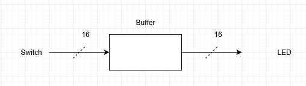

#### Verilog Code

module switchLED(
    input [15:0] SW,
    output [15:0] LED
    );
    assign LED = SW;
endmodule

#### RTL Schematic Screen shot

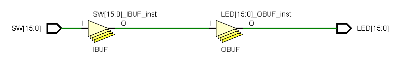

#### Synthesis Schematic Screen shot

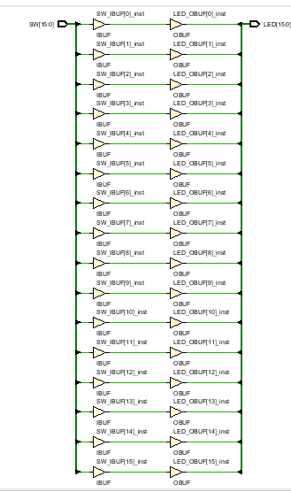

#### Implementation Device screen shot zoomed in on something interesting

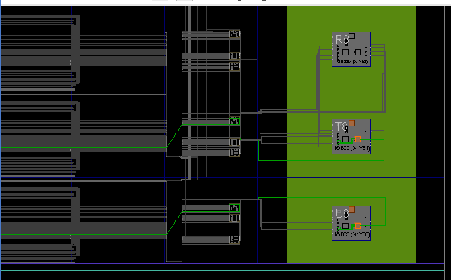

#### Testing

#### Prompts

What is a net?     

A net is a wire in a circuit.

*What is a cell?* 

A leaf cell is an input to the circuit. They are the switches on our model of the board. They give life to the board similarly to the function of a biological cell.

*What is an IO port?*

An IO port controls the inputs and outputs of a circuit respectively. The circuits are then able to communicate with other hardware via these connections. You would attach a peripheral through an IO port.

*What do the yellow triangles labeled OBUF do?*  

Those yellow triangles are output buffers that regulate the amount of voltage going to the LED, so that it is not overwhelmed and damaged.

*What physically is a zero?*

A lack of voltage flowing into the input of circuit, which happens when the relevant switch on the circuit is in the down position.

*What logically is a zero?* 

That is when the circuit pin is considered off.

*What physically is a one?*

One is typically referred to as 5V flowing into the input of a circuit, which happens when the relevant switch on the circuit is in the up position.

*What logically is a one?* 

One symbolizes the circuit pin being on which turns on the LED for this section of the lab.  

## MultipleLEDs  
#### Port Diagram

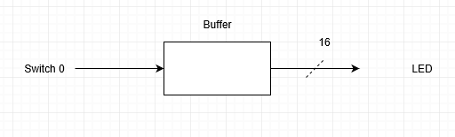

#### Verilog Code

module switchLED(
    input SW,
    output [15:0] LED
    );
    assign LED = SW;

endmodule

#### RTL Schematic Screen shot

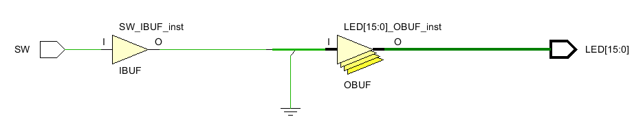

#### Synthesis Schematic Screen shot

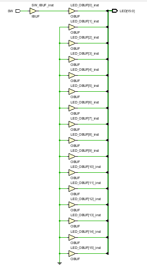

#### Implementation Device screen shot zoomed in on something interesting

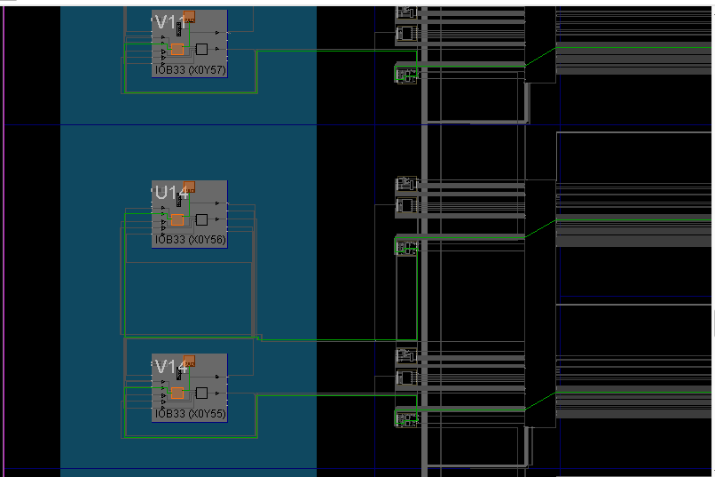

#### Testing

#### Prompts

Look at the verilog code and the constraints file.  *Describe the changes to the constraints file from the first project.* 

The number of switches commented out.

A typical circuit built has power flowing through the switch and then a bunch of LED's fan out from the switch, splitting up the current and getting dimmer and dimmer. *Is that happening in this project?*

Read this [stack exchange article](https://electronics.stackexchange.com/questions/282357/what-is-supposed-to-happen-in-verilog-if-a-signal-of-one-width-is-assigned-to-an). Instead of 16 lines of verilog code, everything can be put in one line: 

LED=SW  

as in the first project. But this time there is only one switch. *What happens?* 

The bigger question is why? 

A deep dive into the detail requires finding confirmation of the stack exchange article. Confirmation was found on slides 14 and 15 of this [Stu Sutherland article](http://www.sutherland-hdl.com/papers/2006-SNUG-Boston_standard_gotchas_presentation.pdf).  Information in the article describes what happens. 

The next step is to ask "Why this chaos?" which requires diving into even more detail. This was found  [here](https://www.electronics-tutorials.ws/binary/signed-binary-numbers.html) comparing unsigned and signed with 1's compliment and 2's complement.  This is traditional, old school digital design information. 

The most relevant information was found in the [IEEE 2012 System Verilog standard](https://drive.google.com/open?id=0B65fOszQEMiVU2d1NXBqcmVPSFk) on page 222, but  confusing information is scattered everywhere. This is just math! Verilog does math. Why all this chaos? 

This leads to searching [Xilinx vivado](https://forums.xilinx.com/t5/Synthesis/verilog-math/td-p/205895) for advice on math.  Summarize this. *Why does the Xilinx representative dance around the ignorance of the person answering the question?* 

This is your instructor diving deeper and trying to hit bottom of a detail well. But is no bottom, just underground tunnels. 

Read enough of the prompts below to answer the above question. 

#### -------------------------------Prompts Stop Here for this circuit -----------------------------------

There is some verilog math code here in [openCores](https://opencores.org/projects/verilog_fixed_point_math_library). The next question is will that verilog code synthesize in vivado? 

*Given that Xilinx sells [Math IP for their FPGAs](https://www.xilinx.com/products/intellectual-property/nav-dsp-and-math/nav-math.html), what do think the chances of the open core solution working?*

*What do you think the chances of the open core solution being slower, or implemented differently by Vivado in the FPGA are?*

If you really need math, Xilinx provides a CPU for you called [MicroBlaze](https://www.xilinx.com/products/design-tools/microblaze.html). You write C code, with [Xilinx libraries](https://www.xilinx.com/support/documentation/sw_manuals/xilinx2017_1/oslib_rm.pdf), and vivado translates the normal C libraries into what?

*What does [RTOS](https://en.wikipedia.org/wiki/Real-time_operating_system) stand for?* 

*What does [bare metal](https://xilinx-wiki.atlassian.net/wiki/spaces/A/pages/18842463/3rd+Party+Operating+Systems) mean ?* 

*How is an RTOS different from [linux for the MicroBlaze](http://xilinx.wikidot.com/microblaze-linux)?* 

*Why go through this trouble when the [raspberry pi](https://www.makeuseof.com/tag/different-uses-raspberry-pi/) exists?* 

## MultipleSwitches

This project or circuit fails. Two switches can not drive one LED.  Take screen shots until you reach an error message:

#### Port Diagram

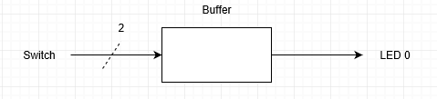

#### Verilog Code

module switchLED(
    input [2:0] SW,
    output LED
    );
    assign LED = SW[0];    
    assign LED = SW[1];
    
endmodule

#### RTL Schematic Screen shot

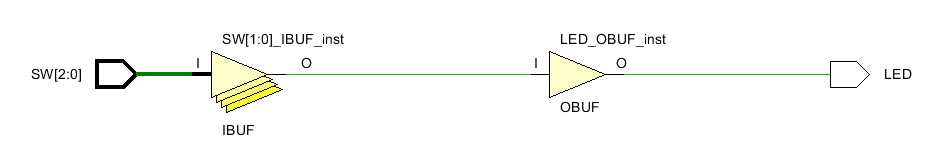

#### Synthesis Schematic Screen shot

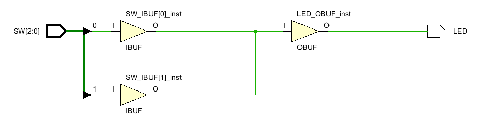

#### Implementation Device screen shot zoomed in on something interesting

#### Testing

#### Prompts

*What are the vivado error messages?  Guess what each means in your own words.* 

The first error message says there was a problem during the construction of the optimal design, so it was not completed. The second message specifies what the problem was, in that two switches were driving the same net.

*How do the net, cell, IO ports change?* 

The nets from each cell connect to each other before connecting to the LED.

*Does vivado fail during RTL Analysis, Synthesis, Implementation or Bit File Generation?*

Vivado fails during implementation. 

*What does the error message **multi-driven net** mean? What would you look for as an error in your circuit design? What is a **multi-driven net**?*

The error message multi-driven net means that somewhere in the circuit two inputs are connected to the same wire. I would look in the circuit design for which switches were assigned to which LEDs and to see if there were multiple switches assigned to 1 LED. A multi-driven net is a net that gets its on/off status from multiple inputs.

****

## BeCreative!

Hook the switches to the LED's in some creative way of your choice using the concepts you learned in this lab. You can start a vivado project from scratch or copy one of the folders above to create your own circuit.

#### Port Diagram

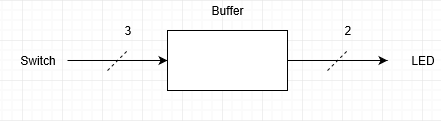

#### Verilog Code

module hw1(
    input a,
    input b,
    input c,
    output x,
    output y
    );
    wire A,Ab,cb,cbb;
    assign A = ~a;
    assign Ab= A|b;
    assign cb= b^c;
    assign cbb = b&cb;
    assign x = Ab;
    assign y = Ab|cbb;
    
endmodule

#### RTL Schematic Screen shot

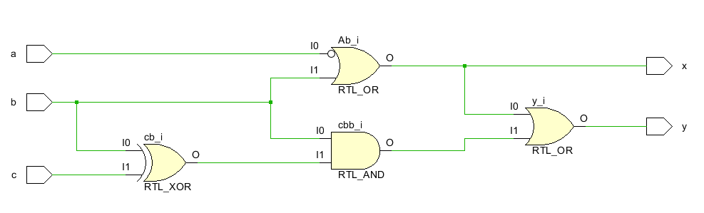

#### Synthesis Schematic Screen shot

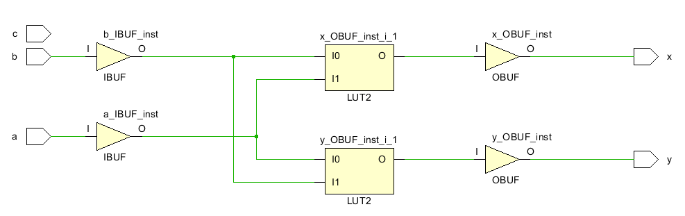

#### Implementation Device screen shot zoomed in on something interesting

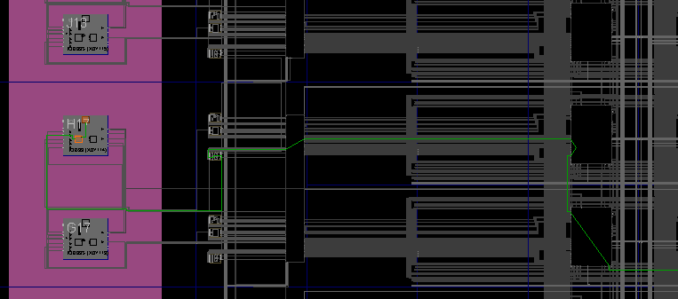

#### Testing

