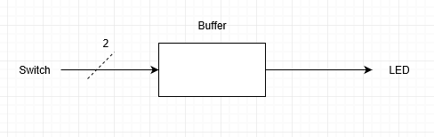
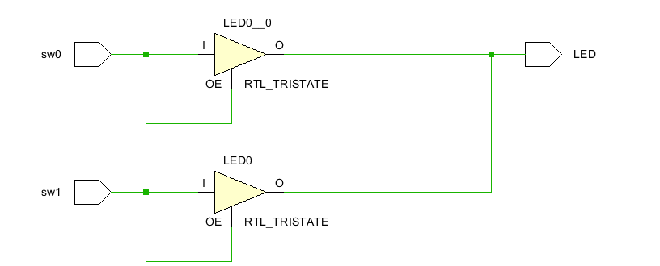
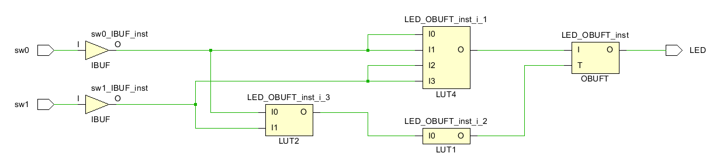
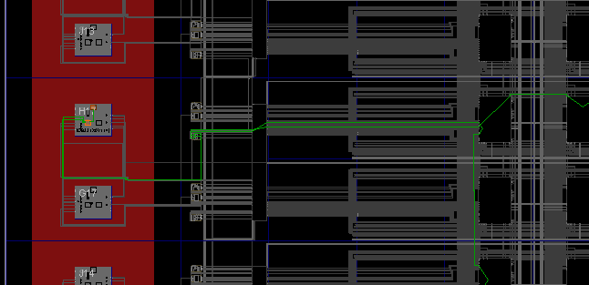
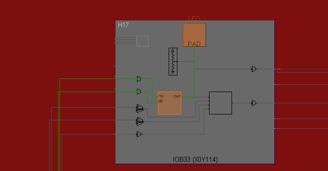
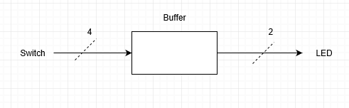
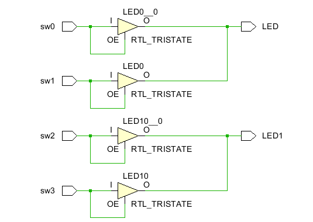
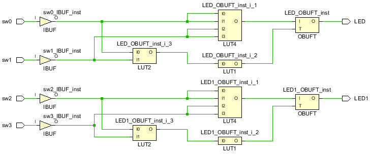
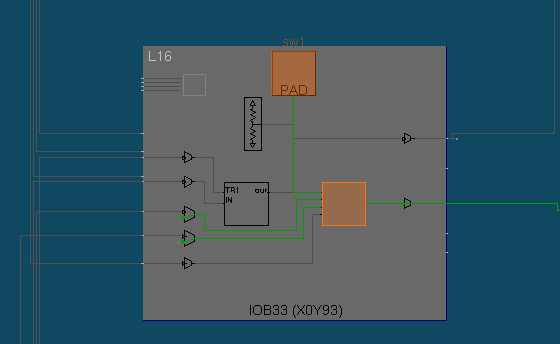

# Voltage Controlled Buffers  
Why doesn't **Vivado** allow two switches to control one LED?  Because one switch could try to send "on" to the LED. The other switch could try to send "off" to the LED.  They would fight.  Ultimately something would burn up .. the Nexys4 DDR board would be damaged. 

This is solved by moving from two states of on or off to three states or "triState" which include states of on, off and don't care.  Don't care has many names including "open" and "high  impedance", and "infinite output impedance".

#### Port Diagram

#### Verilog Code

`timescale 1ns / 1ps

module vcb(
   input  sw0,
   input  sw1,
   output tri LED
   );
   bufif1 b1(LED, sw0, sw0);
   bufif1 b2(LED, sw1, sw1);
endmodule

#### RTL Schematic Screen shot

#### Synthesis Schematic Screen shot

#### Implementation Device screen shot zoomed in on something interesting  

#### Testing

Here is the above different from the two state situation from the first lab.  When sw0 is 0, the tristate buffer doesn't try to ground the LED. It outputs nothing. *What is the difference between 0 (false) and nothing .. don't care .. high input impedance... etc?* 

When the output is nothing, it makes it seem as though the wire has been removed from the circuit. This means that whatever other outputs are connected to the circuit will have sole decision-making power in the overall output of the circuit.

*What happens when both switches are zero (false)? What could happen?*

The wire is drained of energy and not driven by anything. A bluetooth wireless transmission can cause the wire to fill up with EMF and cause the LED to glow. 

*So what is the difference between 0 and off?* 

In a tristate buffer circuit, when the switch sends 0, it removes all energy from the wire. In the same circuit, an off switch is synonomous with the switch sending nothing. In a two-state buffer circuit, there is no difference between 0 and off.

*What is the difference between 0 and 1?* 

1 fills the wire with energy while 0 removes all the energy from the wire.

*What does a designer have to worry about when working with tri-state?* 

The designer has to worry about whether the wire is driven by some input at all times.

*What kind of gate (and, nand, or, nor, xor, xnor, not) is this circuit?*

The circuit is an OR gate.

*Zoom in on a pull down resistor*

## BeCreative!

Hook the switches to the LED's in some creative way of your choice using the concepts you learned in this lab.  Think about the circuits that cell phones are going to control in your home. Imagine all the remotes, all the physical wall switches, all the on off  buttons and dimmer buttons in all devices begin controlled by your cell phone. You are designing a circuit to be imbedded in all devices and walls. 

#### Port Diagram

#### Verilog Code

`timescale 1ns / 1ps

module vcb(
   input  sw0,
   input  sw1,
   input  sw2,
   input  sw3,
   output tri LED,
   output tri LED1
   );
   bufif1 b1(LED, sw0, sw0);
   bufif1 b2(LED, sw1, sw1);
   bufif1 b3(LED1, sw2, sw2);
   bufif1 b4(LED1, sw3, sw3);
endmodule

#### RTL Schematic Screen shot

#### Synthesis Schematic Screen shot

#### Implementation Device screen shot zoomed in on something interesting

#### Testing

Many people are replacing light bulbs with LED's that last forever. Most are 12 volt DC.  They are being connected to AC through wall warts that waste energy. Some are running 12 volt systems in parallel with the AC. Some are using AC to switch the 12 volt. 

​	[wikipedia Multiway_Switching Traveler_system_2](https://en.wikipedia.org/wiki/Multiway_switching#Traveler_system_2)

There is a transition, a business opportunity, a standards opportunity here.  Compare the "3-way" and "4-way switches" at Home Depot or Lowes.  

*Can a voltage controlled buffer reduce the amount of copper needed?*

