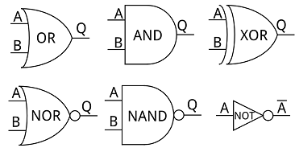
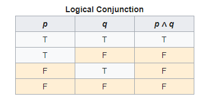
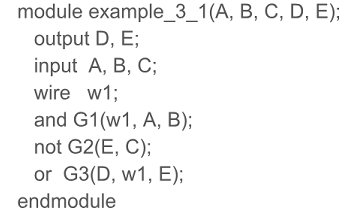
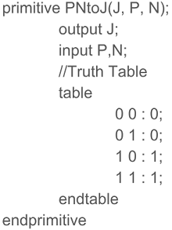
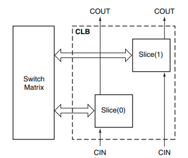
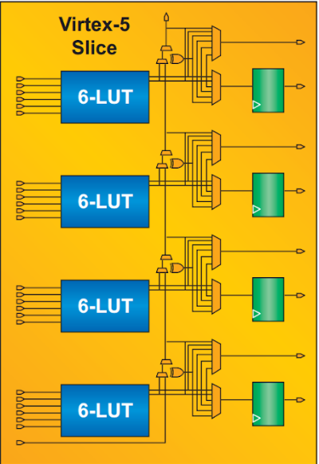

# AndNand

## Digital Design Goals

Anything that can be done in hardware can be done in software. *Why build hardware?*

​	better manage power
​	faster

Fortunately, lower power circuits are typically faster. Unfortunately, digital design in the last 40 years has explored all the tips and tricks to making faster circuits. Most design software will not allow you to make mistakes. Vivado will complain if you tell it to build a slow circuit and then redesign the circuit (using the accumulated knowledge and rules in the last 40 years) so it is fast. And you may not recognize the design.

## Verilog Abstraction Levels

Previous digital courses have focused on Boolean Algebra,  designed with gates and sprinkled with a few algorithms such as error correction.  These are the  names  in history that contributed to the evolution of this discipline:

[George Boole](https://en.wikipedia.org/wiki/George_Boole), 1854, English, Boolean Algebra  
[Ada Lovelace](https://www.youtube.com/watch?v=EUkgMTLjSPI), 1854, English first programmer  
[Augustus De Morgan](https://en.wikipedia.org/wiki/Augustus_De_Morgan), 1854, English   Logician
[Claude Shannon](https://en.wikipedia.org/wiki/Claude_Shannon), 1938, MIT, Gates  
[Richard Hamming](https://en.wikipedia.org/wiki/Richard_Hamming), 1950, Bell Labs, Error Correction  
[Sophie Wilson](https://en.wikipedia.org/wiki/Sophie_Wilson), 1985, English .. ARM CPU (Raspberry Pi, Cell phones, 60 billion sold)  

Originally drawings on paper used Shannon's Gate symbols which by now it is assumed most of you have played with:

These gates could be turned into boolean algebra that looked something like this:

This has turned into a geometry type class called Discrete Algebra. It can be found in computer science, engineering or math departments in various colleges. 

A third way circuits are/were designed used truth tables:

Vivado can understand gates, truth tables and boolean expressions if they are translated into verilog first.  

This is a truth table written in verilog: 

Boolean expressions are done with the **assign** command. 

Truth tables are used still used to capture project requirements. Gates have turned into symbols of what Vivado software did in RTL, Synthesis and Implementation schematics. Boolean expressions are called "data path" abstractions and decorate the more important "control path" abstractions as we will found out in the second half of this course. 

Today the design symbols are found in port interface drawings, and what look like modified traditional computer science flow charts. From these drawings and charts, Verilog RTL code is written.  Then Vivado looks at the verilog code and builds a circuit. 

Finally Vivado will finish off the project by creating a bit file that activates (switches) wires in a configurable logic block (CLB).

Each slice contains circuit symbols, only one of which is an xor gate:

Vivado no longer lets us program the LUTs, the Muxes, or the flip flops directly. *Why?* Most likely engineers make mistakes and hurt the FPGA chips that contain these CLBs. Or maybe we make mistakes that slow the Xilinix FPGA chips down and make the company look bad. In any case, Vivado no longer contains the tools to program the CLBs or Slices directly.  Nor does it let us program switches or analog devices. 

But Vivado does let us see how it implements our verilog code inside the CLBs. *Why?* Vivado is a bunch of rules that are rapidly evolving.  For example sometimes Vivado will say "you can not do that" and will delete part of your circuit.  Your goal is to figure out why, and adjust your design strategy. Looking at how Vivado is trying to synthesize and implement your circuit helps inspire this process along with decoding error messages. 

Verilog's abstraction levels include:

​	Analog .. capacitors, resistors, power supplies, diodes, inductors
​	Switch   .. transistors
​	Slice .. configurable logic block (CLB)
​	Primitive .. truth table
​	Structural, Gate … and,or, nand, nor, xor, nxor gates
​	Data flow … boolean math assign command
​	RTL … behavioral, algorithmic level, control flow

