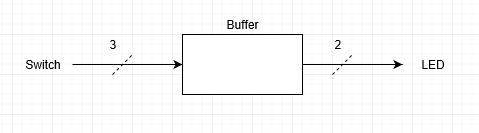
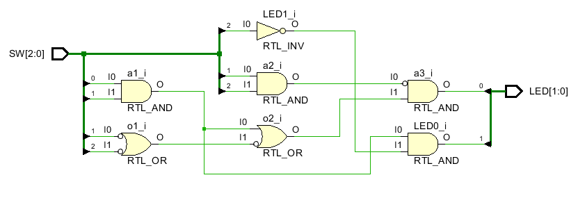
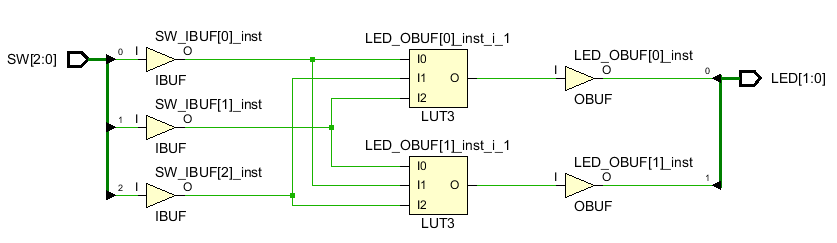
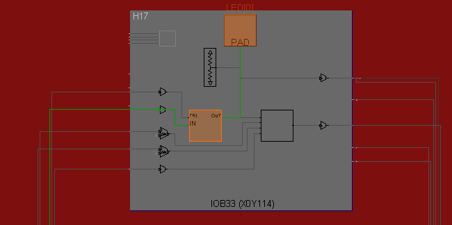
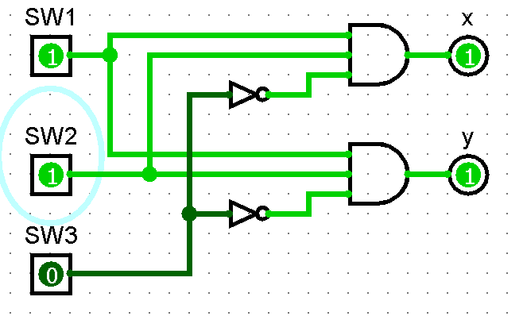
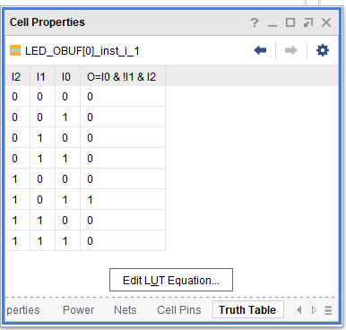
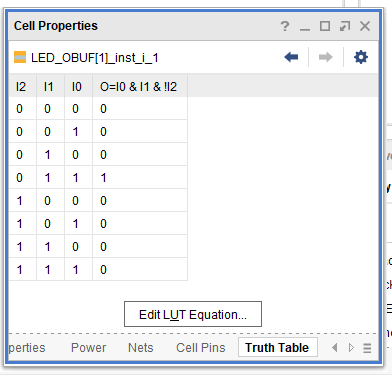

# LotsOfGates
Vivado turns all circuits into the primitives of a CLB Slice: LUTs, muxes, carry-logic, xor gates, d flip flops. Understanding these is the goal of this course. We have covered XOR gates.  The goal of this lab is to understand LUTs. 

The goal here is to predict [LookUpTables](https://en.wikipedia.org/wiki/Lookup_table) (LUTS) values.
Then find their contents in Vivado and compare.
Then look at how Vivado deals with identical circuits. 

## Project_1

Below is a diagram of a circuit with two outputs. The outputs are identical. The bottom part with two input gates reduces to the top circuit of one three input Nand gate. The circuit was built in  [logisim](https://sourceforge.net/projects/circuit/) which is a java runtime program free to download. The logisim circuit called [two identical circuits](https://github.com/ENES-246DigitalElectronics/ENES246/blob/master/-4LotsOfGates/TwoIdenticalCircuits.circ), can also be downloaded.  The top circuit uses one gate. The bottom circuit uses 5 gates.  The question is what does Vivado do with these circuits?

#### Port Diagram

#### Verilog Code

`timescale 1ns / 1ps   

module vcb(
   input  [2:0] SW,
   output [1:0] LED
   );
   wire w1,w2,w3,w4;
   and a1(w1,SW[0],SW[1]);
   nor  o1(w2,~SW[1],~SW[2]);
   nand a2(w3,SW[1],SW[2]);
   or   o2(w4,w1,w2);
   and  a3(LED[0],w3,w4);
   assign LED[1] = SW[0] && SW[1] && !SW[2];
endmodule

#### RTL Schematic Screen shot

#### Synthesis Schematic Screen shot

#### Implementation Device screen shot zoomed in on something interesting

#### Testing

To test to make sure the FPGA is working properly, flip the switches so that sw0 and sw1 are on and sw2 is off, then check to that both LED0 and LED1 are on. All other switch combinations should make both LEDs turn off.

One might expect that Vivado would reduce these to a single circuit and reuse the circuit. There have been software packages that do this.  The logisim software can do this. Download logisim and the circuit above, and with this circuit open in logisim, go to project, analyze the circuit, minimize, set as expression for output x, set as expression for output y, ok, yes sure. *What happens?*

*Add screen shot of logisim of the resulting circuit.*  

Now explore what Vivado does in your screen shots above. Clearly Vivado could see two identical circuits. *What does Vivado do instead?*

Vivado follows the instructions of the circuit described in the verilog code.

To see Vivado LUT's truth tables, click on schematic, right click on the LUT and choose cell properties, move the tab from General to truth table. *Add screen shots of the Vivado LUT truth tables.* 

Obviously Vivado understands the verilog code. *How are the truth tables the same?* 

The truth tables are the same because the output of LED_OBUF[0]  has a different output equation than LED_OBUF[1]. When compared to each other, having a 101 input on the LED_OBUF[0] LUT and a 011 input on the LED_OBUF[1] equate to the simplified circuit shown in the Logisim circuit. Put simply, one of the LUTs negates sw1 while the other negates sw2 in its output, therefore the same output is produced by slightly different inputs.

*How are the truth tables different? What did Vivado do to make the circuits different?* 

The truth tables differ because the output in LED_OBUF[0] negates sw1 instead of following the pattern left in the Logisim circuit like LED_OBUF[1] does. Vivado did not wire the switches to identical inputs between the two LUTs.

## Project_2

Repeat project_1 with your own design. Develop two identical circuits. Build the first circuit with 3 inputs, 2 outputs and at least 5 gates. The second circuit can be a simple version of the first.  Then repeat the instructions of project 1.  Document your circuit with the port diagram and screen shots. 

#### Port Diagram

#### Verilog Code

#### RTL Schematic Screen shot

#### Synthesis Schematic Screen shot

#### Implementation Device screen shot zoomed in on something interesting

#### Testing

*Is anything different?* 

# Ethics of choosing which Algorithms to Teach

You are student at a university. *Why would professors demand in the first course on digital circuit design that you learn  [Karnaugh Maps,](https://en.wikipedia.org/wiki/Karnaugh_map)  [Quine McCluskey Algorithm](https://en.wikipedia.org/wiki/Quine%E2%80%93McCluskey_algorithm), and  [Petrick Cover](https://en.wikipedia.org/wiki/Petrick%27s_method), which seems unrelated to the labs, doesn't predict Vivado behavior and is at best buried in the Vivado software?*

Suppose you are engineer designing the Vivado software. You get the question from a customer, a fellow engineer using your companies product and paying your salary: "Why doesn't Vivado see one circuit?" Read this [forum post](https://forums.xilinx.com/t5/Synthesis/Question-about-LUT-usage-in-a-very-very-simple-combinatorial/td-p/221143).  *What is your answer to this question?*

Engineers develop conspiracy theories when trying to predict the future. *Given the above chaos discovered in Vivado while doing the labs above, what do you expect to happen as you try to cram larger and larger circuits into an FPGA?* 

