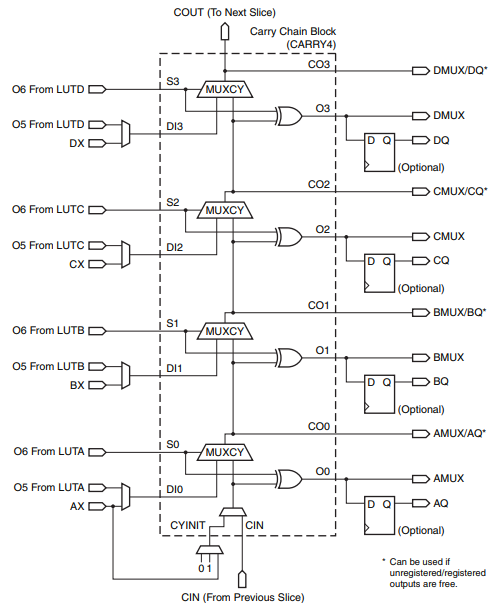

# MuxOfMux

## Digital Design Goals

#### LUT is a crippled Mux

Transistors,  voltage controlled buffers, or NAND gates can be used to build an entire computer. So can a **Mux**. **Mux** stands for [multiplexer](https://en.wikipedia.org/wiki/Multiplexer). A multiplexer is like the parent selecting which kid gets to play with the toy while other kids wait. A LUT is like a **mux** with the kids desires (the truth table) frozen in time (lNIT)  with the parent being the wires into the LUT selecting the row of the truth table. A **Mux** lets wires from else where select a particular row in the truth table. 

#### Control Path and Data Path

Digital designers look at a circuit and first see wires. Then they identify the **control** wire or **data** wires. They trace the wires in their minds to create **paths**.  The paths are called **control paths** and **data paths**. A Mux select line is controlled. The select line(s) select the ones and zeros of a single data wire. There may be 64 data wires attached to a mux.  

The control path opens and closes a valve. A BJT [transistor](https://en.wikipedia.org/wiki/Transistor#Bipolar_junction_transistor_(BJT)) has a wire called the "base" which controls the flow between an input called collector and output called emitter.  A FET transistor has a wire called "gate" which controls the flow between an input called Source and output called Drain.  Transistors are used to build [NAND](https://en.wikipedia.org/wiki/NAND_gate)  gates. 

A [voltage controlled buffer](https://en.wikipedia.org/wiki/Digital_buffer#Tri-State_Digital_Buffer) has a wire called **control** that connects or disconnects a **data** input to an **output**. A voltage controlled buffer is a generic transistor. The not version of a voltage controlled buffer can be used to create a NAND gate:

#### MUX is a more Complicated Gate

An AND gate is a switch. Think of one of the two inputs as the **control**. Think of the other input as **data**. The **data** only gets through if the **control** is a one.  A NAND gate operates in a similar fashion and can be used to build a mux. 

Voltage **control**led buffers can be used to build a **mux**. 

A NAND, voltage **control**led buffer, and transistor all share the same three port interface:

#### Primitive Mux has 4 port diagram

The most simple **mux** has a four port diagram:

The circuit symbol is a triangle with the nose chopped off. The big flat side of the triangle has all the data inputs. The chopped off nose has the the data outputs. Control  wires are attached to the sides of the triangle.  Often the output of a mux turns into control for another circuit. 

A port diagram is the single big box made of dash marks below. It represents a carry logic path control path. This diagram is different in that some detail explaining the carry logic path port in terms of CLB primitives is inside the port diagram. 

The data inputs are on the left and outputs are on the right. Control starts off as data going left to right and then turns a corner and moves from bottom to top. This can actually be seen physically inside the FPGA's  [fast_carry_logic_path](https://www.xilinx.com/support/documentation/user_guides/ug474_7Series_CLB.pdf):

This is a picture of the carry forward configuration of an FPGA. Any math operation or comparison (greater than, less than, equal to, not) results in carries like those taught in elementary math. These carries are control lines. When there are many control lines, they have to be co-ordinated. This coordination is what results in a physical FPGA geometry. 

#### Many Mux

There are many Mux in a FPGA configuration block. 

Almost all other boxes you see in a building wiring closet, mainframe shop or IT center with many wires attached are one form or another of a mux. The data coming in can be analog or digital. The control is always digital. The control can look at the data coming in and control based upon whether it is streaming video, compressed video, text/graphics, keyboard/mouse, file transfer, etc.  They have different types of data paths and different control mechanisms. They have names like   [stat mux](https://en.wikipedia.org/wiki/Statistical_time-division_multiplexing), [Front-End Processors](https://en.wikipedia.org/wiki/Front-end_processor) , [MAUs](https://en.wikipedia.org/wiki/Media_access_unit),  Switches, Bridges, etc. Today they have all turned into routers of the IP protocol. 

#### Modules

The lab goal is to find verilog code that uses the muxes of the FPGA  and then use them to build larger and larger muxes using verilog modules. 