# MuxOfMux
Vivado turns all circuits into the primitives of a CLB Slice: LUTs, muxes, carry-logic, xor gates, d flip flops. Understanding these is the goal of this course. We have covered XOR gates and LUTs. The goal now is to cover muxes. 

## 1m2x1Mux

#### Port Diagram

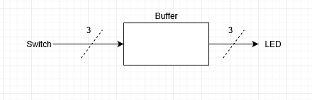

#### Verilog Code

`timescale 1ns / 1ps
module m2x1Mux(
  input a,
  input b,
  input select,
  output f,
  output g,
  output h);

  //gate implementation
  wire invsel,asel,bsel;
  not U_inv (invsel,select);
  and U_anda (asel,b,invsel),U_andb (bsel,a,select);
  or U_or (f,asel,bsel);

  //tristate implementation
  bufif1 nb0(g, a, select);
  bufif0 nb1(g, b, select);

  //rtl implementation
  assign h = select ? a : b; //if select then a else b .. cryptic notation

endmodule

#### RTL Schematic Screen shot

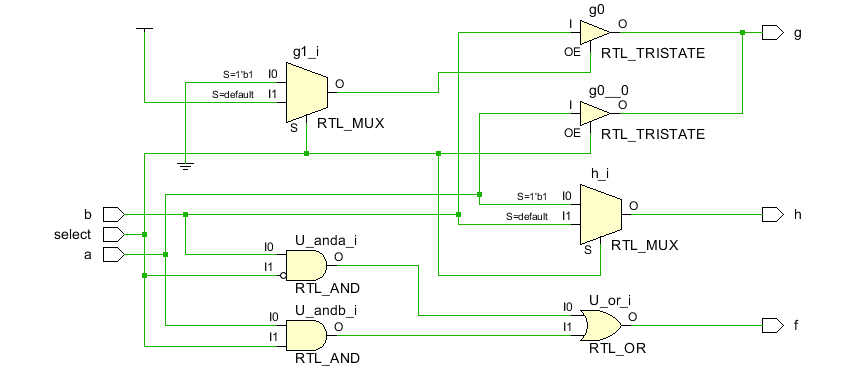

#### Synthesis Schematic Screen shot

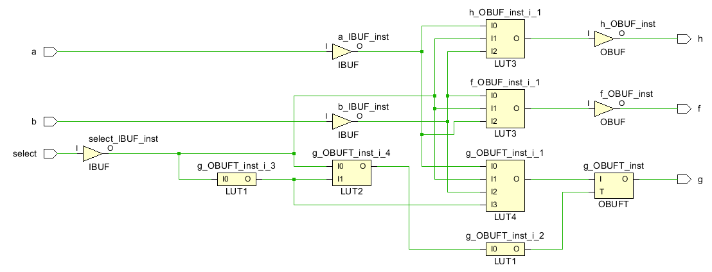

#### Implementation Device screen shot zoomed in on something interesting

#### Testing

The circuit works properly when switch2 toggles which switch controls all 3 LEDs. When switch2 is in the on position, all three LEDs should turn on and off in sync with switch0. When switch2 is in the off position, all the LEDs should respond to switch1.

#### Prompts

This mux is implemented both with gates, tristate and RTL. 

*How is the RTL example related to a tri-state buffer?*

*What are the differences between the three at after RTL Analysis?* 

*What are the differences between the three when implemented in the FPGA?*

*What are the differences after synthesis in the schematic?*

*What happened in the Device implementation to these three? are they all the same or different?*

*Is the RTL implementation in your opinion too cryptic?* 

*Harmonize the ? : with the description of these assign conditional symbols in this  [ut](https://www.utdallas.edu/~akshay.sridharan/index_files/Page5212.htm) manual.* 

*Can you leverage any of these to make a m4x2 mux? Describe what you tried here before looking at the m4x2 mux project.* 

## 2m4x2Mux

#### Port Diagram

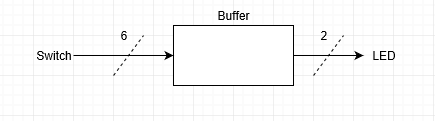

#### Verilog Code

####  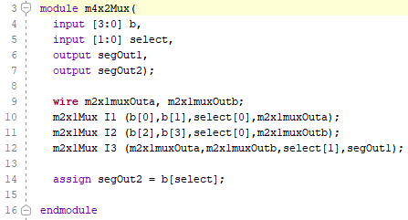

#### RTL Schematic Screen shot

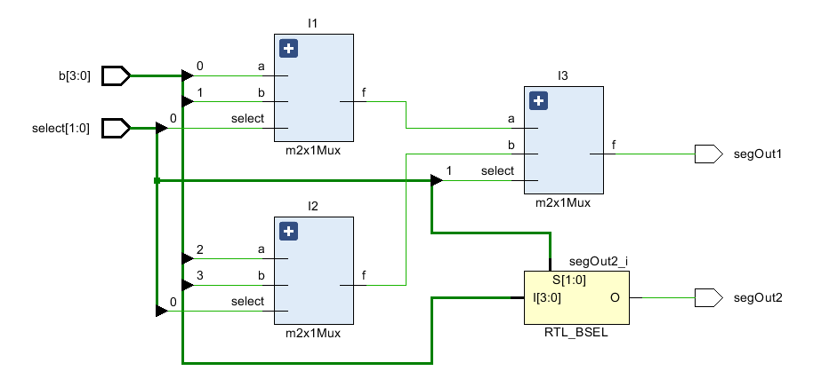

#### Synthesis Schematic Screen shot

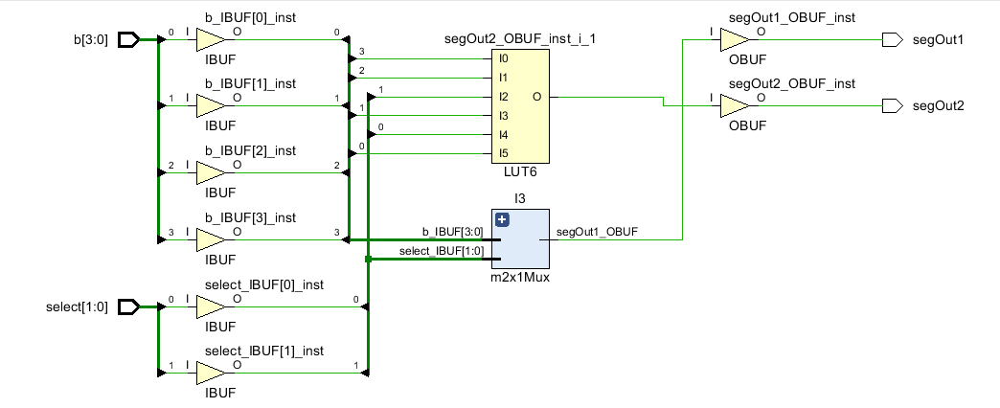

#### Implementation Device screen shot zoomed in on something interesting

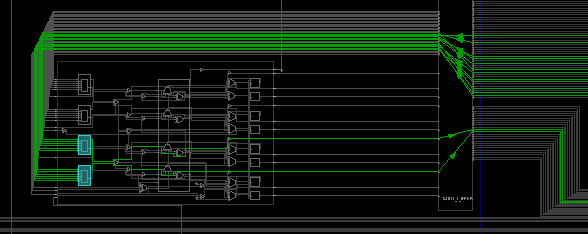

#### Testing

Use switch4 and switch5 to code a binary value for select and the corresponding switch values between 0 and 3 will control both LED0 and LED1.

#### Prompts

*Verilog code on lines 10,11, and 12  are instantiating the  previous m2x1mux 3 times. Given that this mux was done with one line of code, three lines of code could replace 10,11,12 without calling this module?* 

*Looking at line 14 from a traditional programming point of view, it looks like one is choosing one element of an array or list and putting it's value in segOut2. But select is defined as a net or a pair of wires driven by a physical world switch.  And b consists of three wires. How can two wires select three wires?*

## 3m16x4Mux

#### Port Diagram

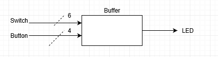

#### Verilog Code

`timescale 1ns / 1ps

module m16x4Mux(
 input [15:0] tTC,
 input [3:0] ABCD,
 output muxOut);
 wire [3:0] wInternal;
 m4x2Mux m1(tTC[3:0], ABCD[1:0], wInternal[0]);
 m4x2Mux m2(tTC[7:4], ABCD[1:0], wInternal[1]);
 m4x2Mux m3(tTC[11:8], ABCD[1:0], wInternal[2]);
 m4x2Mux m4(tTC[15:12], ABCD[1:0], wInternal[3]);
 m4x2Mux m5(wInternal, ABCD[3:2], muxOut);
endmodule

#### RTL Schematic Screen shot

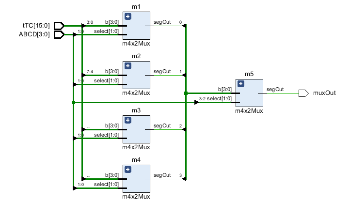

#### Synthesis Schematic Screen shot

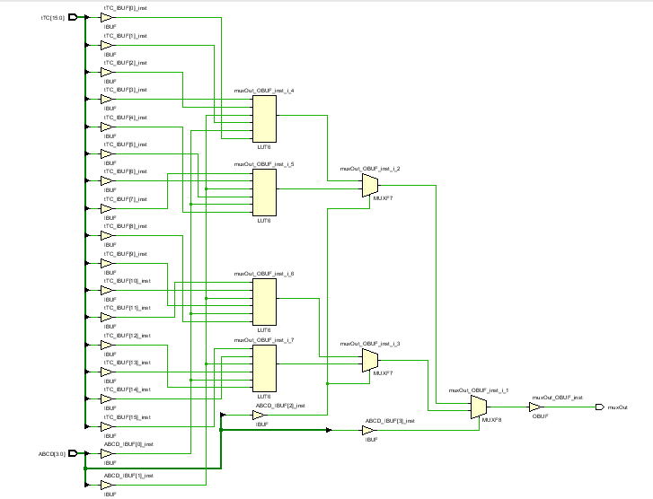

#### Implementation Device screen shot zoomed in on something interesting

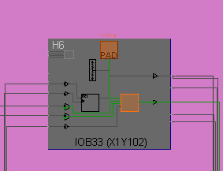

#### Testing

The M18, P17, P18, and M17 buttons on the FPGA determine which switches control LED0 through a hexadecimal selection process. M18 is the smallest bit, and I listed them in increasing fashion.

#### Prompts

*Put a screen shot of the exploded design sources here:*

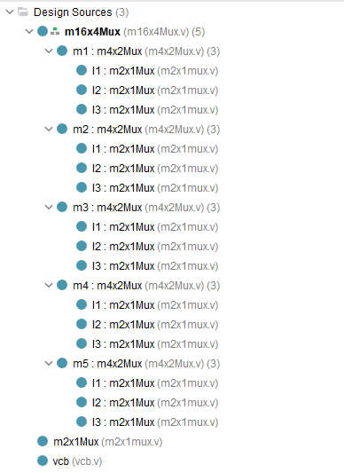

*Put a screen shot of the exploded RTL schematic here:*

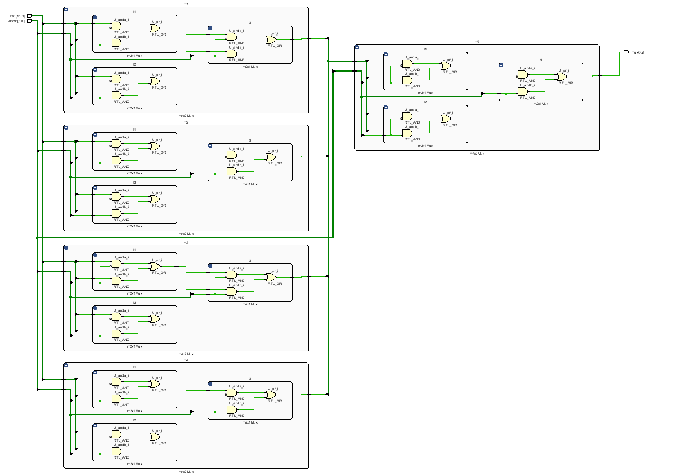

*How many port diagrams are necessary for this project?*

*How many modules are there?*

*How many implemented or instantiated modules are there?*

*In the RTL schematic, what is Vivado trying to communicate to us with the colors yellow and blue?*

*How many lines of verilog code are there in this design?*

*At what workflow stage (RTL, Synthesis, Implementation, Generate Bitstream) is the schematic started?*

*At what workflow stage (RTL, Synthesis, Implementation, Generate Bitstream) is the schematic finished?*

*What typically changes between the schematic start and finish?*

*At what workflow stage (RTL, Synthesis, Implementation, Generate Bitstream) is the device or FPGA usage diagram started?*

*At what workflow stage (RTL, Synthesis, Implementation, Generate Bitstream) is the device or FPGA usage diagram finished?*

*At what workflow stage (RTL, Synthesis, Implementation, Generate Bitstream) is the XDC file last checked?*

## 4m16x4MuxRTL

#### Port Diagram

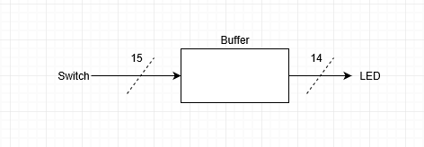

#### Verilog Code

module m16x4Mux(
    input [15:8] I,
    input [3:0] select,
    input bank,
    input enter,
    input reset,
    output bankSelected,
    output q,
    output reg [15:8] LED,
    output [3:0] LEDselected
    );
    

    reg [15:0] muxInput;
    
    initial muxInput=0;
    
    always @* begin
        if (reset) muxInput = 0; else begin
            if (enter) if (bank) muxInput[15:8] = I[15:8]; else muxInput[7:0] = I[15:8];
            else if (bank) LED[15:8] = muxInput[15:8]; else LED[15:8] = muxInput[7:0];
        end
    end
    assign LEDselected = select;
    assign q = muxInput[select];
    assign bankSelected = bank;
endmodule

#### RTL Schematic Screen shot

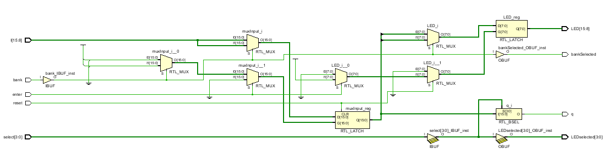

#### Synthesis Schematic Screen shot

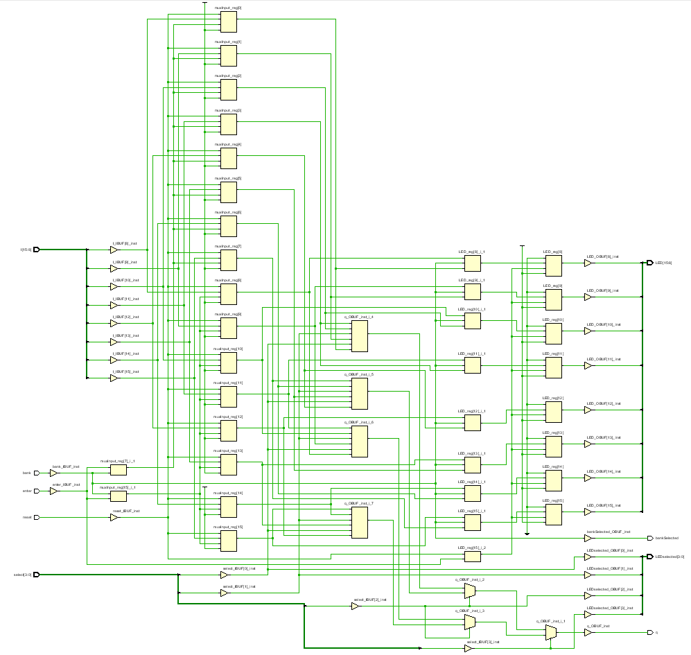

#### Implementation Device screen shot zoomed in on something interesting

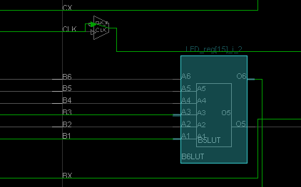

#### Testing

The switch[3:0] control LED[3:0] and determine the select variable value which shows the value of muxInput[]  in q or LED4. Switch4 determines whether switch[15:8] represent muxInput[15:8] or muxInput[7:0]. Switch5 determines whether switch[15:8] changed the values in muxInput[] or not. Switch6 resets the values in muxInput[] to zeros.

#### Prompts

*Go through each line of the code and comment on it .. explain the variables .. explain what is happening. Paste the commented verilog code here.*  

*This is the first program to use registers. Why are registers needed?* 

*What drives [15:8] LED?*

*MuxInput gets information from where?*

*Why is enter necessary?*

*What is the difference between initial and reset?*

*Why is initial and reset necessary for muxInput, but not LED?*

*How many lines of verilog code were necessary to create the 16x4 mux?*

*How many lines of verilog code were necessary to manually test the 16x4 mux with the nexys4ddr board?*

*How many verilog modules were used in this Vivado project?*

*Where is the original documentation for this command that creates muxes?* 
It is impossible to prove a negative, such as "it is impossible" .. "It is not on the internet." The appropriate response is to **document exhaustion**.  This means writing a list of places tried, URL's tried, experiments performed that were close but not answer the question. The goal of  **documented exhaustion** is to provide a starting point for someone else to take a stab at answering the question.  *Read the below and either answer the question or add to the **documented exhaustion**.* 

Search terms tried: verilog bit width

URL's read that are close but don't answer the question:
This stackexchange article talks about [verilog width concatenation](https://electronics.stackexchange.com/questions/282357/what-is-supposed-to-happen-in-verilog-if-a-signal-of-one-width-is-assigned-to-an) ... which is a similar topic.    
This presentation from [Standford](https://web.stanford.edu/class/archive/ee/ee371/ee371.1066/tools/verilog_tips.pdf) talks about how to build arrays of wires but not this command.    
This is a lab from [University of Maryland College Park](https://ece.umd.edu/class/enee245.S2015/Lab7.pdf) very similar to this lab, but doesn't mention this technique.    
This is the [link](http://electrosofts.com/verilog/mux.html) that inspired playing around with this command.    
[Cliff Cummings](http://www.sunburst-design.com/papers/)  is an engineer that has been at the forefront of driving Verilog and System Verilog evolution and maybe in his writing somewhere there is an answer. 

## 5Lut_Mux

One goal might be to use the primitives within the FPGA CLB. Chapter 3 of the Vivado 7 Series Libraries  lists off the primitives. Chapter 4 describes how to implement them using VHDL and Verilog. Explore the LUT and MUX in this project. 

#### Port Diagram

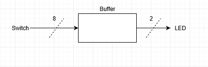

#### Verilog Code

module LUT6_MUXCY_test (
	input  [2:0]  data_in,
	input  [2:0]  sel,
	input         muxcy_sel,
	input         muxcy_carry,
	output 		  muxcy_data_out,
	output        lut_data_out);

	LUT6 #(.INIT (64'h0000000F003355FF)) selection_lut (
			.I0 	(data_in[0]), 
			.I1 	(data_in[1]), 
			.I2     (data_in[2]),
			.I3     (sel[0]),
			.I4     (sel[1]),
			.I5     (sel[2]),
			.O      (lut_data_out)); 

	MUXCY combiner_muxcy ( 
		   .DI      (1'b1),
		   .CI      (muxcy_carry),                     
		   .S       (muxcy_sel),
		   .O       (muxcy_data_out)) ;

endmodule

#### RTL Schematic Screen shot

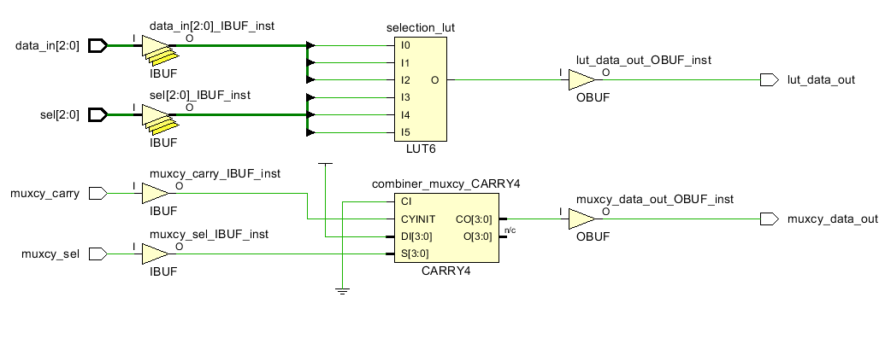

#### Synthesis Schematic Screen shot

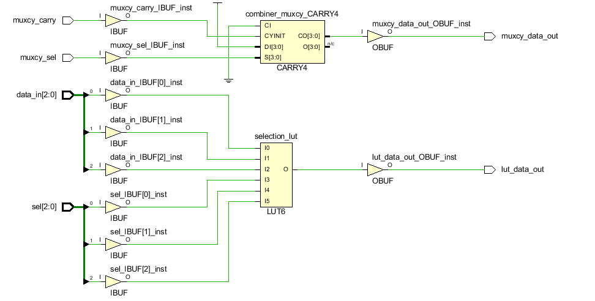

#### Implementation Device screen shot zoomed in on something interesting

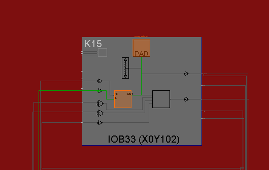

#### Testing

Look at the truth table in the Verilog code and be able to describe the switches needed to access a row in it and predict the output. 

The truth table shows the hex value given in the code from top to bottom and in 64 bit form. Each switch combination aligns with a specific bit and control LED0.

LED1 is controlled by switch[7:6] and demonstrates a simple for 4 port MUX with one of the data  ports always on. The select switch determines whether the carry switch controls LED1. The carry switch controls until turned off.

#### Prompts

*Does it look like the primitives can be accessed in Verilog?* 

*Can you see a direct relationship between the primitive used and the primitive referenced in the Verilog code?*

*The Mux implementation leaf cell seems to highlight a vertical path within the CLB. Why?*

*How is the LUT instantiation different from the normal instantiation of calling a pre-existing module ?*

*What Line of the Code puts a truth table in the LUT?*

*How many rows are there to the truth table?*

*How is the LUT instantiation different from the normal instantiation of calling a pre-existing module?*

*Look through chapters 3 and 4 of the Vivado 7 Series Libraries.  Focus on the Design Entry Method box.  Then answer these questions.*

*What does instantiation mean?*

*What does inference mean?*

*Have we inferred buffers (BUFG) in projects before?*

*What does instantiation mean?*

*What does inference mean?*

*Verilog has tristate [buffer primitives](http://verilog.renerta.com/mobile/source/vrg00003.htm)  named bufif0 and bufif1. These names don't appear in the Vivado 7 series libraries. Why? What are the risks of using the buffers Xilinx has named in this document?*

*Look up LUT6 in the Vivado 7 series library document. We instantiated it in this project. Is Instantiation possible according to the document?* 

*What is the preferred design entry method?* 

*Is MUXCY in the Vivado 7 series library document like LUT6?* 

*We instantiated MUXCY in this project's verilog code. And it looks like it was successfully implemented. We can test it. Read this [article](https://forums.xilinx.com/t5/Welcome-Join/where-are-the-muxcy-and-xorcy/td-p/311931) from from Jan 2013 about MUXCY and XORCY. Do you think it is wise to use this piece of a CLB in a circuit design project?*

*What would you guess is the preferred entry method for a MUXCY .. if it existed in the Vivado 7 series library?*

*Why do you think Xlinix still supports MUXCY (because we used it!), yet don't document it?*

*Xilinix was the [first FPGA vendor](http://hardwarebee.com/list-fpga-companies/) to start shipping LUT6 FPGAs. Intel FPGAs come from purchasing Xilinx's major competitor for years .. and ships a LUT6. How does [Flex-Logix](http://www.flex-logix.com/6lut-faster-denser/) fit into this competition?*

*Why is this question important to you, the college, the market place?* 

*What does [Flex-Logix name it's equivalent](http://www.flex-logix.com/dsp-applications/) of LUT6?*  

*Is the code on this [web site](http://www.flex-logix.com/dsp-applications/) verilog or it's competitor VHDL?*

*What class at HCC teaches you what a [FIR](http://www.flex-logix.com/dsp-applications/) is?* 

## Ethics

The ethics questions below are more important than your answers. The goal in answering them is to remember the question. So the best answers are a non-trivial, thoughtful, relevant hypothesis. 

#### Ethics of Change

The simplicity of the RTL versions of the mux command raises the question of what is possible with the assign command? Where is the manual that goes over all this? Where can we discover what is possible? The problem is that there are many manuals with complete backwards compatibility to the dawn of verilog history in the 1980's.  These are the official Verilog standards.  They are all supersets .. meaning some vendors (Vivado) **don't** implement everything.  And Vendors lock you into their world with propritary  extensions of the verilog code. 

​	IEEE 1364-1995 (Verilog 1995)  
​	IEEE  1364-2001 (Verilog 2001)   
​	IEEE  1364-2005 (Verilog 2005)  
​	IEEE  1800-2005 (SystemVerilog)  
​	IEEE  1800-2009 (SystemVerilog)  
​	IEEE  1800-2012 (SystemVerilog)   
​	IEEE  1364-2014 ([Verilog-AMS 2.4](http://www.accellera.org/downloads/standards/v-ams))    

It is impossible to test thousands inputs combinations and state transitions by hand. This problem coupled with the chaos of Verilog subsets of a superset make searching the internet for verilog solutions problematic. The reasons for this chaos involve testing.  This is discussed below. But first we must look at the ethics of change. 

Engineers are professionals like doctors and lawyers. They are by law allowed, protected and encouraged to experiment/improve at every opportunity. Engineers make new versions. Doctors improve treatment and surgery techniques.  Lawyers find new ways to interpret laws and dream up new ones. This constant change creates a chaos. 

Technicians, nurses and paralegals & judges are the anchors, the experts, the people that build walls around this change. They extract from the chaos what works, complain about what doesn't and become the conservative force that captures what is good for society. **In the process technicians, nurses and paralegals become experts.**  Engineers, doctors and lawyers are merely artists. There is lots of research showing that once the human species captures some knowledge, it never forgets .. even if the number of individuals knowing a very small piece of it becomes much smaller than during the technology's growth period. 

This part of society works. But there is a down side. A barrier, a Catch22 starts growing for those trying to become Engineers or Technicians, Doctors or Nurses. Specialization, complexity, pre-requisite knowledge starts growing. A new generation has trouble getting a job. They ask "How can I get the experience the job says I need without getting the job?" An old generation creates a bubble around themselves. The younger generation sees this as a barrier to entry. The older generation retires. Society in general get's scared.  Standing still, repeating success is a disaster for any organization. 

*So how does a younger generation pop a generation bubble or climb over the experience barrier and get a job?*

*What does the younger generation have to do on their resume and while in college ... when the complexity, the accumulated knowledge, the expertise, the experience required seems impossible to accumulate?*

*How does a young generation serve the world, the human species popping this generational bubble?*

