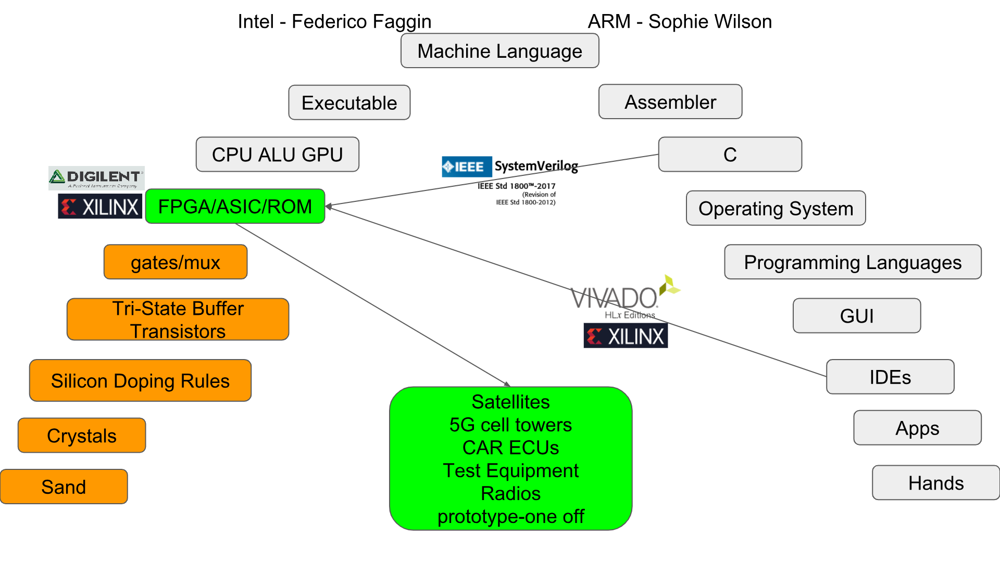

## Assumption you have some experience with Loops

If  Else  
While   
For  
Case    

## Goal

Explore circuits created using a C like programming language  called **Verilog**.   Learn the difference between a ***data_Path*** and ***control_Path***. 

## Requirements

Have Installed Vivado software from Xilinx   
Get a [Nexys 4 DDR board](https://reference.digilentinc.com/reference/programmable-logic/nexys-4-ddr/reference-manual) from instructor.  
Ability to move switches and watch LEDs.    
Download  [all the Vivado Projects](https://github.com/1sfoerster/FGPAintro/archive/master.zip) ... including this presentation.  
Click on the file name, then extract three times.   
Should unpack over 1,700 files into the downloads folder into subfolder called FPGAintro-master.   

## Going to Learn to Use Hardware Manager a Bit Differently

Click on > Open Hardware Manager  
Click on Open target     

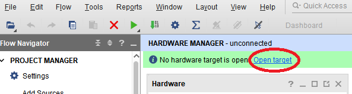

Click on Auto Connect

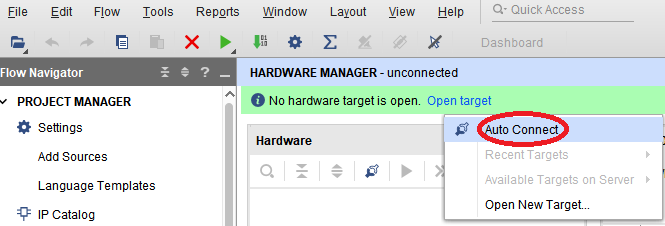

Wait through two splash screens until this appears and click on Program Device

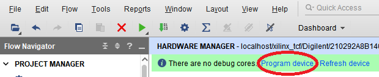

Click on the three dots below

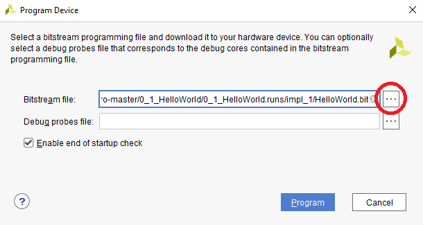

Navigate to the BitStream folder by clicking on the up arrow three times   

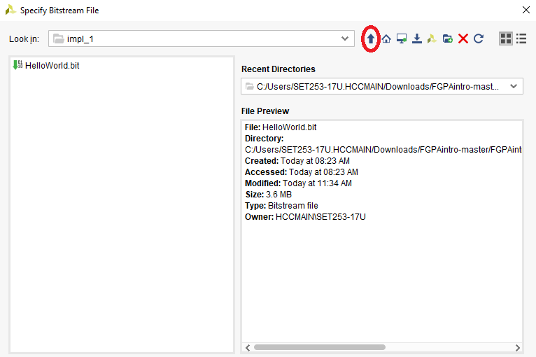

Open the  bitfile folder by double clicking on it. 

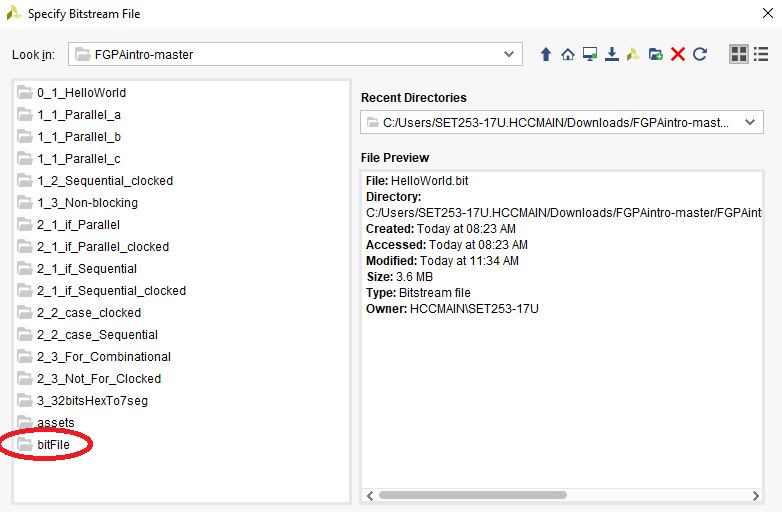

Then double click on the bit file called 0_1_HelloWorld.bit

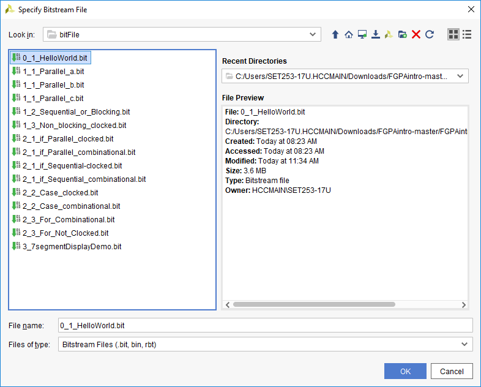

Then program the FPGA. By clicking on the program button. 

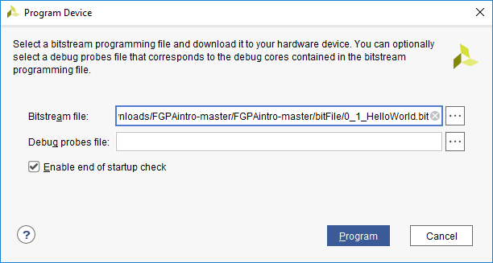

The goal is to go through these bit files, looking at the code and RTL schematic, one file at a time.

Here is how to go onto the next  program/circuit. Click on the three dots again.

and choose a different name from this list.

## Instructions:

For each of the projects below, just run the bit file. If you want to explore any of the projects, you can revert to normal operation. Look for testing and prompts at the end of each of these projects.  The goal is to focus on the verilog code, not the gates. 

## 0 Hello World

### 0_1_HelloWorld

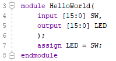

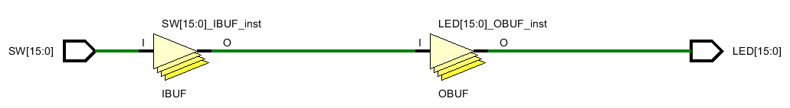

#### Testing

Switches should turn the LED's immediately above the switch on and off.

___

#### Prompts

There is no way to flip Most Significant Bit (MSB 15) and Least Significant Bit (LSB 0) that I've found. Do an exhaustion search (5 minutes max) through the [IEEE 1800-2017 Verilog](https://drive.google.com/open?id=1EbhvMzfXrxTpw5W_Dg2yy_2f-p6aA8Ne) standard looking for a way to do it. Record the sections that you explored looking for code that might work. 

## 1 Parallel, Sequential, Non-blocking Programming

### Line order DOESN'T Matter

### 1_1_Parallel_a

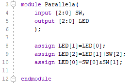

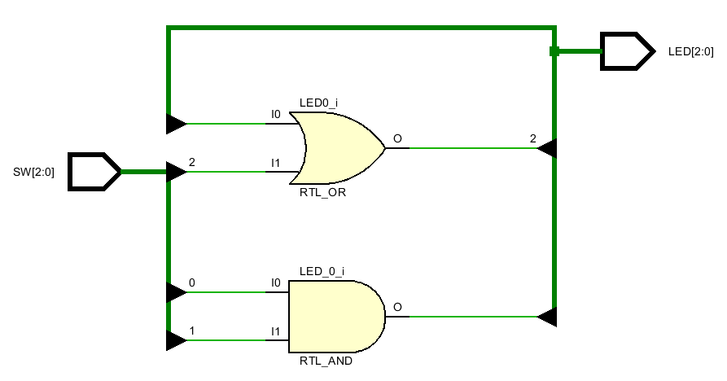

### 1_1_Parallel_b

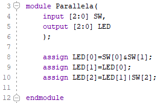

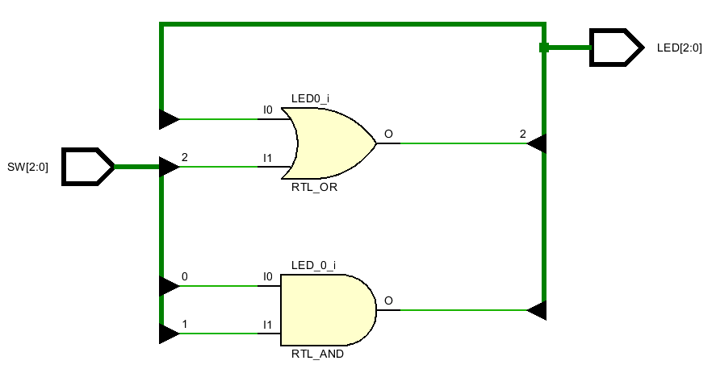

### 1_1_Parallel_c

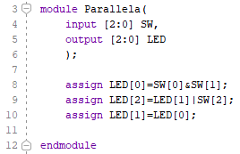

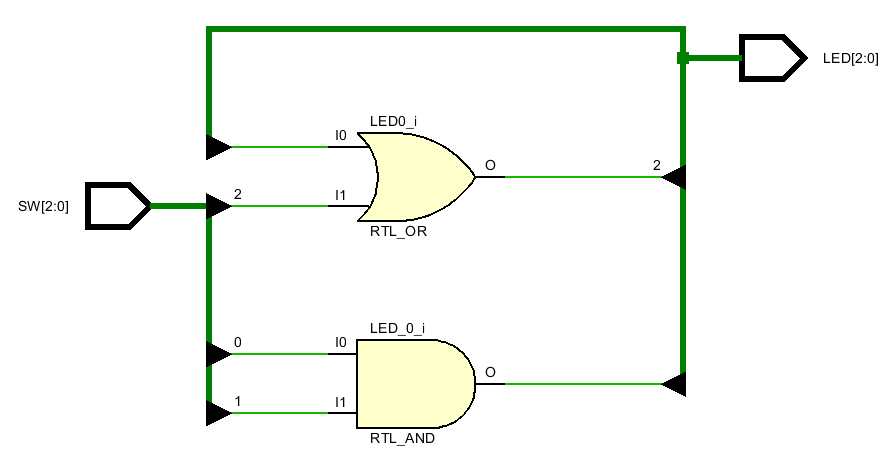

#### Testing

There is a Logisim file called 1_circuit.circ in this folder that contains a better schematic than the above the shows how the circuit work. All switches off, all led's off. Switches 0,1 on, all led's on and switch 2 does nothing. When either SW 0 or SW1 is off, SW 3 controls led 3. 

#### Prompt

Rather than designing circuit thinking about gates, muxes, Luts and buffers we are asked to begin designing  circuits thinking in terms of RTL Verilog. The above schematic is called an RTL schematic. It is not as clear as Logisim files. *Under what circumstances is the RTL schematic useful?* When looking to see if inputs are connected or ignored. When looking to see if all outputs exist and they are not trivially tied high or low. 

### Line order DOES Matter

### 1_2_Sequential or Blocking

Should never use always_latch. This was a test to see if the RTL schematic contained a Latch. It doesn't. Even the Register Transfer Analysis (RTL) part of synthesis strips out the Latch. Latches are evil in most circuits. 

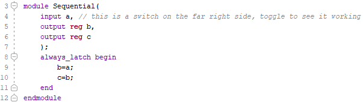

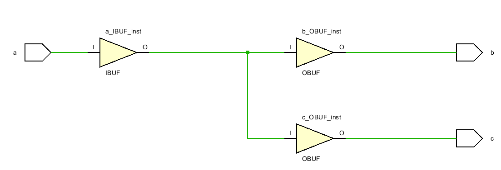

#### Testing

A turns off and on b and c. 

#### Prompt

 Reg means register. The RTL code uses the word Register above. *Does the RTL schematic above show registers?* No. 

*Why must in Verilog, the output b be called a reg?* Because it might change value in the begin_end block and what is going to "remember" these changes? 

*If instead of the always_latch begin .. end block, the code said assign b=a ... would reg be necessary?* No.  The input a would "drive" the output b. 

*Does Vivado try to eliminate unnecessary REG's?* Yes.

*Which is more like a normal program .. assign statements or always_latch begin end blocks?* Always_latch begin end blocks. 

### 1_3_Non_Blocking_clocked 

Non-Blocking or Non-Sequential has to be clocked.

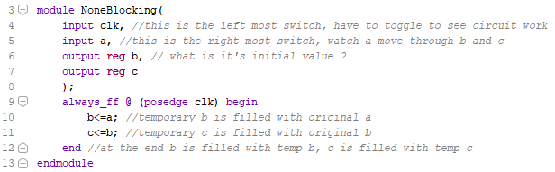

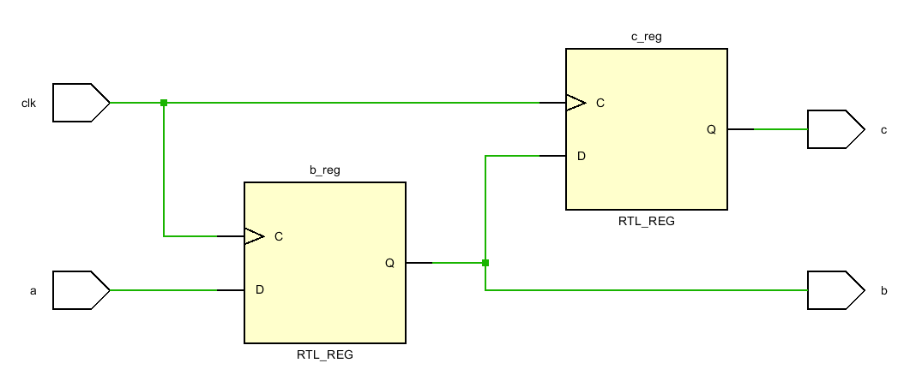

#### Testing

The change in a's value doesn't get into the B register and displayed on the b LED until after a clock ticks.
Old b's value moves into C register before it a's value moves into the B register. On the next tick (second one), a's original value moves from B into C. In the mean time a could have changed the changed a would be in the B register. Looks sort of like shifting.

#### Prompts

*What is the difference between blocked and non-blocked?* A normal line of C or C++ or Fortran or any other language blocks the next line from executing until it finished. Non-blocked allows all lines below to partially execute. 

*What is meant by partially execute?* The <= indicates non-blocking. The line b<=a means a's contents are put in a temporary b. The next line c<=b means that b's old contents (not temporary) are put into a temporary c. Then when the clock ticks in the future, temporary b moves into b and temporary c moves into c. C ends up with b's old value. B ends up with a's old value. 

*That was too complicated. Explain non-blocking in another context.* Think of pressing down on guitar strings to play a cord before stroking the strings really fast (simultaneously) with the other hand. Think of positioning fingers above the piano keys to play a cord before pushing all done at once. This is what non-blocking is.

## 2 Loops and Skips

Loops have to terminate when describing circuits. This means the **while** command **is not supported**. The while command  repeats an indeterminate number of times.  [Recursion](https://en.wikipedia.org/wiki/Recursion_(computer_science)) and more generally the [halting problem](https://en.wikipedia.org/wiki/Halting_problem) of software is not possible in hardware. Vendors will not implement anything that enables this in hardware because supporting something like this would instantly consume all resources within the FPGA.  

Loops are implemented within **always_comb** create [combinational logic](https://en.wikipedia.org/wiki/Combinational_logic). Loops implemented within **always_ff** create [finite state machines](https://en.wikipedia.org/wiki/Finite-state_machine) and the [synchronous circuits](https://en.wikipedia.org/wiki/Synchronous_circuit)  of modern CPUs, GPUs, and ALUs. Leading edge [Neuromorphic](https://en.wikipedia.org/wiki/Neuromorphic_engineering) and [Asynchronous](https://en.wikipedia.org/wiki/Asynchronous_circuit#Asynchronous_CPU) CPUs are not supported.

### 2_1_If_Parallel_combinational

The if command is the most heavily used. This circuit has two circuits sharing the same inputs and interpreting them in the same way.   This first circuit is demonstrating if's using the same selection criteria.

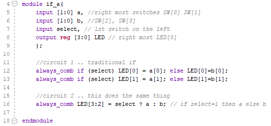

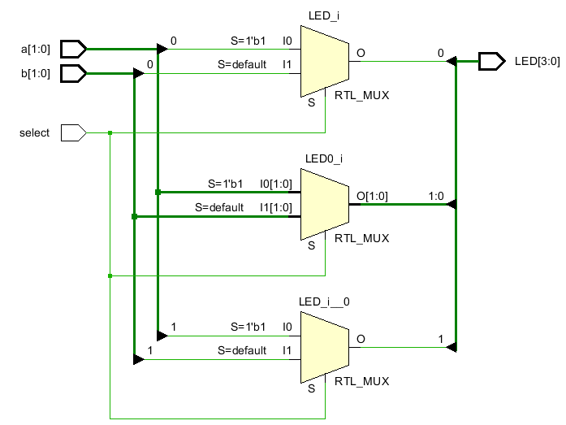

#### Testing

There are four LED's, two from each circuit. The two LED pairs are always identical. The select input always chooses the A pair when 1 and the B pair when 0 to put on the output.  

#### Prompts

*Which of the RTL_Mux above reflects the verilog command line "LED[3:2] = select ? a : b"?* The middle one with multiple wires going in and coming out of it. 

*The pair of if commands are executed in blocking, non-blocking or parallel?* Parallel. In fact all the lines are executed in parallel. They could be in any order. 

*Which is RTL thinking, MUX or the "if else"  command?* If Else

*Is the line "LED[3:2] = select ? a : b" RTL thinking?*   Substituting "?" for if and ":" for else does make nested, messy if then commands more readable. It even makes case commands more readable. But it is not part of C. This means that it is a harder starting point for someone from a C background. Ultimately it is a matter of "style" that is often negotiated in a team or company. 

### 2_1_if_Sequential_combinational

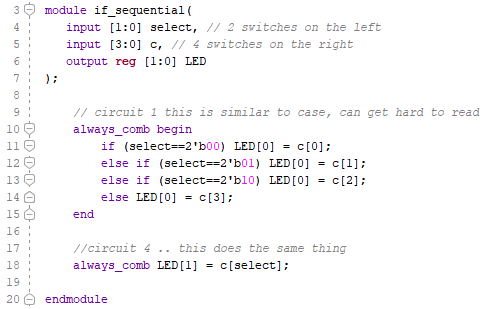

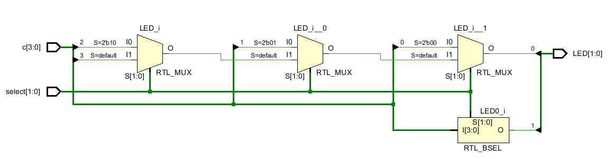

#### Testing

C is four bits. Select is 2 bits. There are four possible combinations of 2 bits: 00, 01, 10 and 11. These four select one of C's four bits. 

#### Prompts

*What is the name of the Leaf Cell associated with LED[1] = c[select]?* RTL_BSEL. 

*What is the name of the Leaf Cell associated with a normal if else command?* RTL_Mux.

*The are both RTL correct?*  Yes.

*What would non-RTL look like?* A box filled with blue rather than yellow. 

*Which is going to execute slower and why between the parallel if commands and sequential?* Sequential is going to execute slower because there are more gates between the input and the output. 

### 2_1_if_parallel_clocked

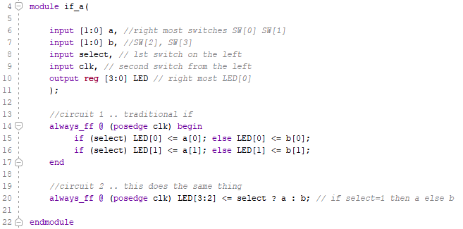

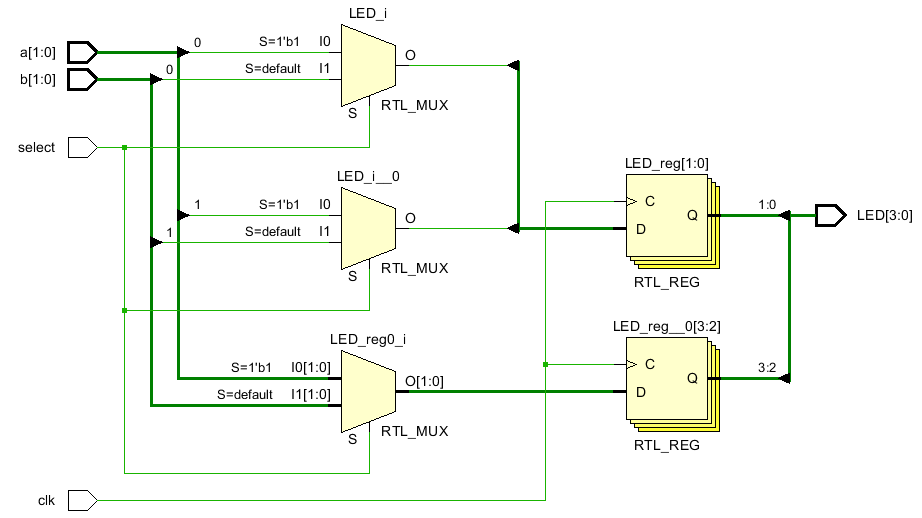

#### Testing

Same as parallel _combinational above. There are four LED's, two from each circuit. The two LED pairs are always identical. The select input always chooses the A pair when 1 and the B pair when 0 to put on the output.  Except you don't see the choice until toggling the clock.

#### Prompt

*Which circuit is faster?* The parallel_combinational. The above is slowed down by the clock.

*If the clock were 100Mhz, would the clocked version be faster?* No. The combinational version tries to go at the speed of light through the gates .. but the gates slow it down a tiny bit. 

*Why would anybody put this kind of circuit in an always_ff begin end block?* There isn't a good reason. 

### 2_1_if_Sequential_clocked

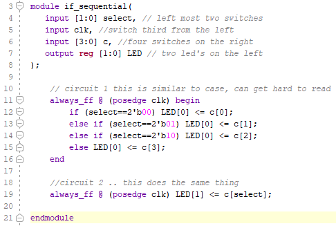

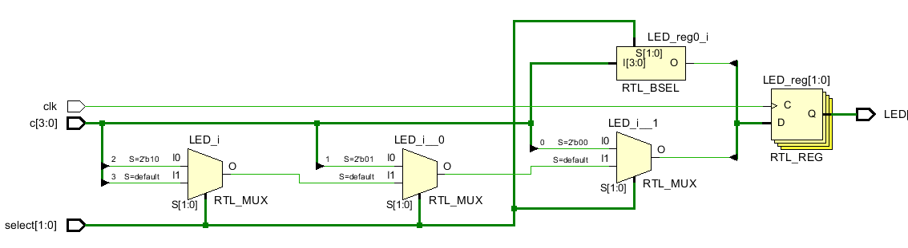

#### Testing

Same as sequential _combinational above. C is four bits. Select is 2 bits. There are four possible combinations of 2 bits: 00, 01, 10 and 11. These four select one of C's four bits.   Except you don't see the choice until toggling the clock.

#### Prompt

*Is clocked faster?* No for the same reasons above.

*What is the difference between the parallel and sequential versions of the if else command?* The parallel is associated with switching the contents of a number of wires from one set of values to another in response to one situation. The sequential is more like a case command where there are four situations. 

*What is the technical term for situation?* State

### 2_2_Case_*data_Path*

The words sequential, parallel only apply to combinational circuits. These are called "***data_Path***"  circuits and run at speeds close to the speed of light. When not running, they consume less energy than  clocked circuits. The question asked here is "where is case useful?" 

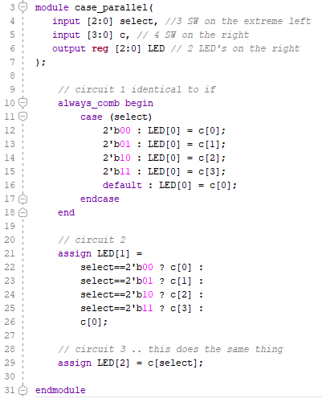

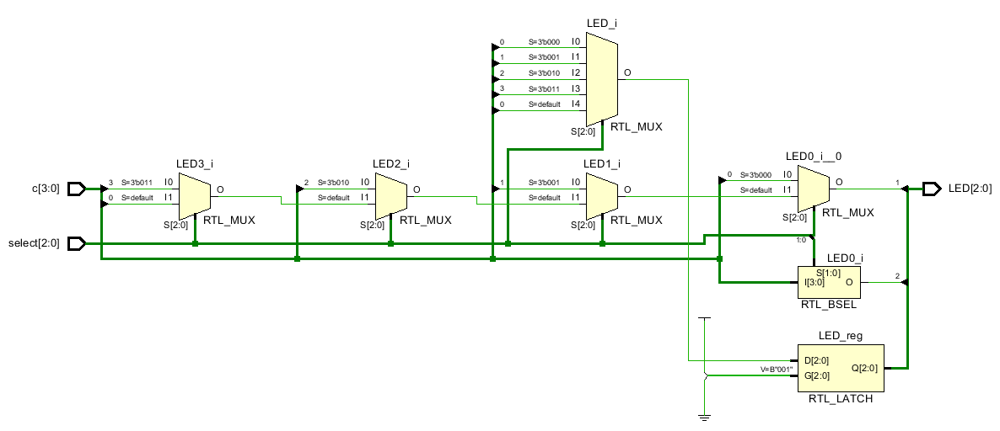

#### Testing

Same as sequential combinational above. C is four bits. Select is 2 bits. There are four possible combinations of 2 bits: 00, 01, 10 and 11. These four select one of C's four bits. 

#### Prompts

The most concerning thing about this circuit is the RTL_LATCH leaf cell above. Search [verilog case if latch](https://www.google.com/search?q=verilog+case+if+latch). *Are latches good or bad?* Bad

___

*Does synthesis remove the latch? (Attach a screen shot)*

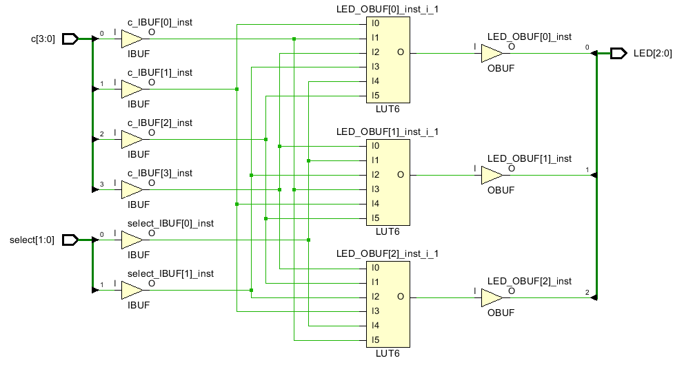

Yes. Synthesis eliminates the latch.

---

*So why in the original RTL Schematic does Vivado scare us with a Latch?* Probably trying to guide us in how to write verilog code. 

---

*Which circuit above is causing the Latch, which are we being warned about? Eliminate circuit 1. Cut and paste the RTL schematic here.* 

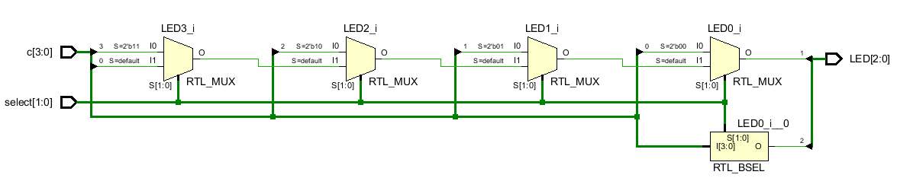

So all the chaos, including the latch, was caused by the case command. The original circuit above has a **default** condition that logically is unnecessary. According to most search results, the whole reason for adding a default condition is to prevent a latch.  

---

*What does this mean about the use of the CASE command for sequential/parallel combinational circuits compared to the  if command?* Nothing. Probably synthesized into the same LUT truth table. Probably uses the same FPGA resources. 

---

*If everything is turned into a truth table, why would the RTL schematic cause the CASE command  to generate something so different at the RTL schematic level? What is Vivado trying to tell us?* The CASE command will work, but start using the IF command. 

---

*The "? :" if command in circuit 2 has a logically unnecessary c[0] at the end. Does eliminating it cause a latch? Attach a screen shot of the RTL schematic.* 

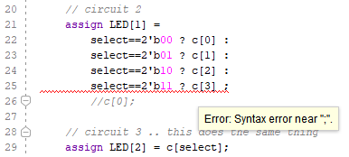

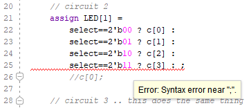

There is no RTL schematic. Vivado or Verilog is not letting us type in the "? :"  **without the logically unnecessary c[0]**!  

---

*Ok. Then why doesn't the third version of the circuit demand something logically unnecessary?* The one line nature of the syntax forces covering all situations or states (4 in this example). Case and "? :" don't have to cover all possible situations or states. This is why there has to be a default. 

---

*Why can't the Vivado synthesizer detect that all possible situations or states are covered, and therefore a "default"  is unnecessary?* Vivado does figure out that the RTL Latch is unnecessary. It is the Verilog standard Vivado supports that is the source of the problem. The Verilog standard is backward compatible at a logic level with previous standards. The default stuff was written into the standard. Vivado is free to change the circuit in many ways when implementing the circuit in the FPGA. 

---

*Logically, why did the default have to exist in the original Verilog standard?* Default exists for the same reason it exists in other programming languages. Consider the output (LED above). LED has to be a **reg** or register in order remember it's value. Different drivers are telling it to remember different things.  The case command could drive LED into a **subset** of all input possibilities. This could require the LED to remember it's original value in case it is not told anything. 

---

*Why not just leave output alone, unchanged. Why is a default required? This eliminates the option of leaving the output unchanged if not explicitly told what to do.* In order to leave the output alone and unchanged, the original value of the output has to be remembered going into CASE or going into IF in all of it's versions. This is why the latch appears even though always_latch was not used above. 

---

*Specify some, default to previous, force all unmentioned to a specific value, three things? Too complicated. Fog. Chaos. How do I think about this?*

Engineers design circuits by traveling them in their mind. Watch [Tron](https://en.wikipedia.org/wiki/Tron) which stands for trace on ... a debugging command in the [Dartmouth Basic language](https://www.netogram.com/basiclanguagecommands.htm).  Does it branch or come together? Why? Call this in the moment design. 

At the other extreme, engineers design with the complete big picture in mind, noting major features, minor features. The most ugly feature is a latch. It interrupts flow, causes chaos and the fog. 

Many have played with latches and produced a design methodology called [asynchronous sequential network](https://en.wikipedia.org/wiki/Asynchronous_circuit) or ASN. [Few](http://www.greenarraychips.com/) have succeeded. Maybe it is time for engineers to begin living and working in this fog. There is a huge upside possible: incredible speed improvement, massive reduction in energy, possible mirroring of the human brain.  But so far, the human race has not had the time or resources to try and push through the fog. Latches are exterminated. Banned.

---

*How do other programming languages handle this issue?* Local variables, global variables, instantiation, functions, subroutines, objects ...  done in software with clocked hardware. 

---

*How does Verilog handle this issue?* Split all circuits up into ***data_Path***s (combinational) and ***control_Path***s (clocked). With in ***data_Path***s your goal is to only use if commands, case commands that <u>cover all possibilities</u>. Within clocked ***control_Path***s you focus on the big picture and use case commands and if commands that <u>don't have to cover all possibilities</u>. 

---

*Ok. Got it. It looks like the Case and IF commands can be used without defaults in **data_Path**s. But they could throw latches if not all cases are explicitly covered. To prevent this we should not use CASE and IF commands in **data_path**s. What alternative commands have been created that force coverage of all possibilities?* 

"? :" syntax for spreading out ***data_Path***s and LED[2] = c[select] for combining back into to one. 

---

*Where does "LED[3:2] = select ? a : b" syntax appear in the [IEEE_1800_2017 System Verilog](https://drive.google.com/open?id=1EbhvMzfXrxTpw5W_Dg2yy_2f-p6aA8Ne) Standard?* Searched  for ? and found:

5. Lexical conventions, 5.12 Attributes, Example 8, top of page 81.
6. Data Types, 6.2 Data types and data Objects, towards button of page 85.

In Table 11-1 it is called a "conditional operator" page 256.  Let's call "? :" the conditional operator from now on.

Looks like it is scattered through out the standard. 

---

*Where does "LED[2] = c[select]" syntax appear in the [IEEE_1800_2017 System Verilog](https://drive.google.com/open?id=1EbhvMzfXrxTpw5W_Dg2yy_2f-p6aA8Ne) Standard?*

searched "unpack", "packed",  "concatenation" uses {}, looking up "index" found something similar
in 7.4.4. Memories but not exactly

[Is not taught at college park](https://ece.umd.edu/class/enee245.S2015/Lab7.pdf), but the conditional operator is

[original source](http://electrosofts.com/verilog/mux.html) offers no language in the standard 

---

*"Data Path" appears twice in the 1,300 page IEEE standard. "Control Path" doesn't appear at all. Where do the terms data_path and control_path come from*?  [The Harvard computer architecture](http://wiki.c2.com/?HarvardArchitecture). 

### 2_2_Case_*control_Path*

***Data_Path*** and ***control_Path*** code chunks are easy to tell apart. ***Control_path*** lives within an always_ff statement. ***Data_Path*** is everything else.

***Data_Path*** takes input, fans it out, spreads it out and then puts it back together again to form output. We want as much of our circuits in the ***Data_Path*** as possible. They will consume less energy and operate faster. So for example we want to multiply in the ***data_Path*** using a truth table.  But these techniques fill up an FPGA really fast. To fit everything into an FPGA, we need to create ***control_Path***s.  We need to start using clocks and algorithms. 

 Let's start off exploring ***control_Path***s by asking the question "How do If and Case change within a ***control_Path***?" 

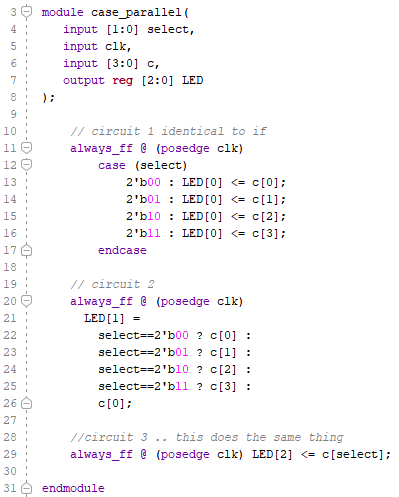

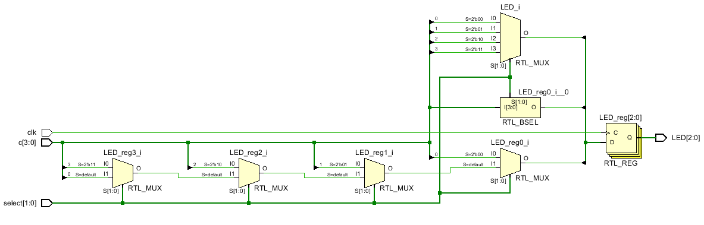

#### Testing

This tests just like the data_path, but have to toggle the clk switch on the (third from left) to get the data out.

---

#### Prompts

*The case command doesn't have a default. Was default required above?* No.

*Why was default added above?* Because it is good design to never require use of the "previous remembered value," in either ***data_Path***s or ***control_Path***s.

### 2_3_NestedForLoopsWithShift

This looks like two for loops, on nested in the stepping through code, but in the end it is turned into LUTs. No registers. 

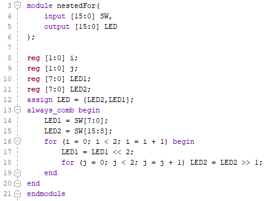

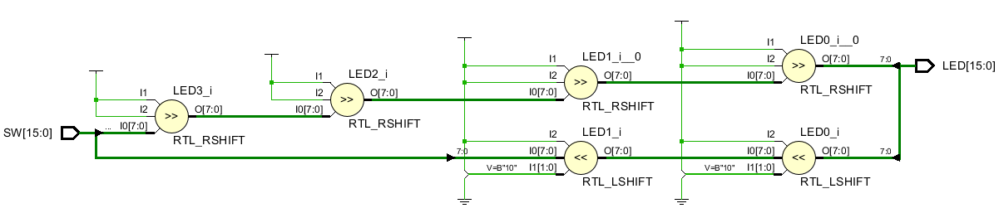

#### Testing

The outside for loop (i) executes twice but shifts left 2 times on each pass for a total of four shifts.
The inside loop(j) executes twice for each outside loop execution for a total of 4 times, shifting once each. This makes four shifts also (in a different direction. So for example if all 16 switches are set to one, there will be four LED's off on the left, four LED's off on the right and eight LED's on in the middle.

#### Prompts

*How is this different from what you expected?* Normally one thinks of a four loop stepping through code. But above there is no memory. The >> << symbols are RTL symbols for shift. There are six shifts total, but their arrangement in the code reflect the nesting. 

*What happened to the loop i and j variables?* They disappeared. 

What was created above, a ***data_Path*** or ***control_Path***? ***data_Path***

### 2_3_NestedForClocked

Is a flip flop tacked on to the end of the circuit? How many clock ticks does it take to get through the circuit?

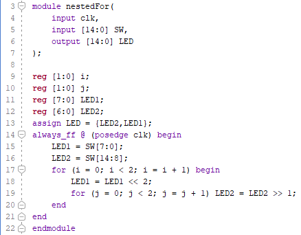

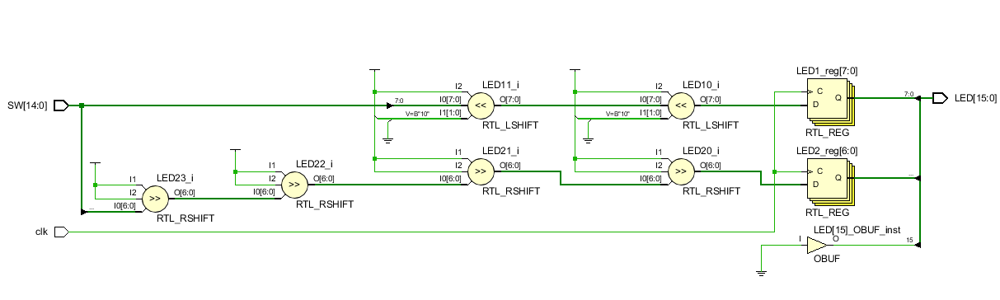

#### Testing

Works like before, except the 15th switch is used a the clock. Have to toggle the clock to get an output.

#### Prompts

*Is this consistent with the synthesis of the other loop constructs above?* Yes.

*Are there any advantages to using a clock?* Maybe if the FPGA recourses used are less.

### 2_3_HexToBinData_PathOnly

This turns a 4 digit hex number (0-15) into a 6 digit decimal number (0-9,0-9). So for example hex of (1011) is "b", in decimal would be five bits (1 0001) or 11. The problem with this is it doesn't scale easily. 

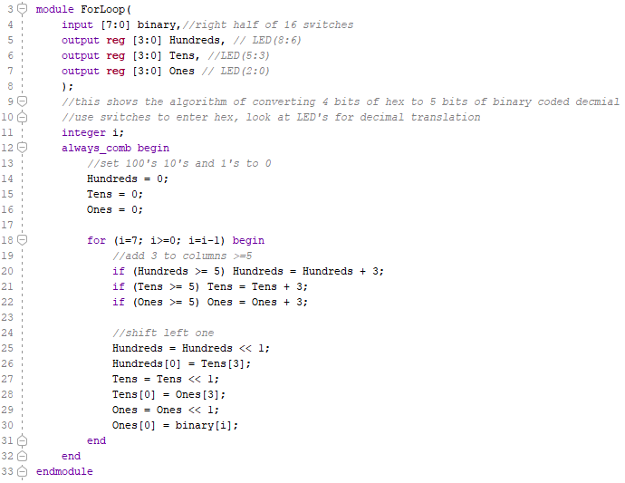

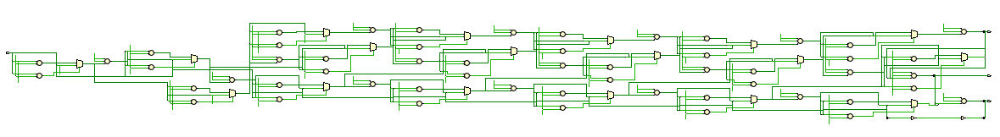

#### Testing

The right half of switches (7 bits) turns into (12 bits). When the switches are set to 1111 1111 or hex ff,  the decimal equivalent is  2^8 = 255 which in BCD is 0010 0101 0101.

#### Prompts

*What resources does this simple circuit consume?* 11 Luts out of 63,400 possible.

*How many nested similar loops would be needed to fill up the FPGA?*  63,400 divided by 11 four times has a remainder of 4 Luts. This means translating mere 8^4 = 4,096 bits into BCD is going to fill up the FPGA. For perspective a, single 64*64 bit output is 4,096 bits. Translating this into decimal would fill up the FPGA. 

*So if data_Paths and the resulting truth tables grow large quickly, what is the solution?* Add clocks. Calculate a partial solution that is smaller. Store the results and repeat calculation until done. This is called an algorithm. 

### 2_3HexToBinwithNestedForLoopsData_Path

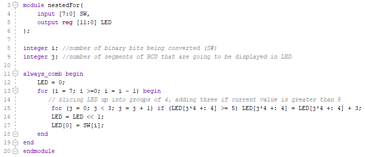

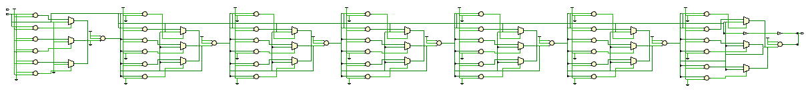

#### Testing

Tests identically to the single for loop version above.

#### Prompts

*Is comparing the RTL schematic shots for some sign of quality relevant?* No. Look at them to see if the Verilog code passed the RTL test. Look to make sure all the inputs are connected and the outputs are not tied to ground or pull up resistor. 

*Is comparing resources used a good measure?* Sort of. Thus uses 9 Luts, not 11 like the code above. But vivado  default is to emphasize speed when synthesizing, implementing and generating the bit stream. The goal is not reducing FPGA resources. So it typically makes a mess. 

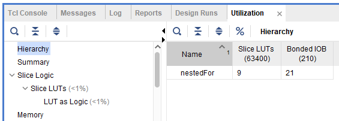

*How does this code scale up to say 28 bits hex input, 32 bits BCD output to 8, seven-segment displays?* Make i start at 28 in the first loop, and j<8 in the second loop.  The number of lines of code doesn't increase.

### 2_3_HexToBinWithControlPath

Verilog code that works in ***data_Path*** also works in ***control_Path***.  It might not seem that way at first. The biggest differences are the variables, the nets, a series of wires with 1s or 0s on them, bits. The Verilog name for this is a bit vector name. 

But the traditional algorithm thinking of computer science classes that results in a flow chart does't translate easily into (***control_Path***) and (***data_Path***). The problem is how bit vectors are named and used. 

This program has no data_Path. It is one big control_Path. 

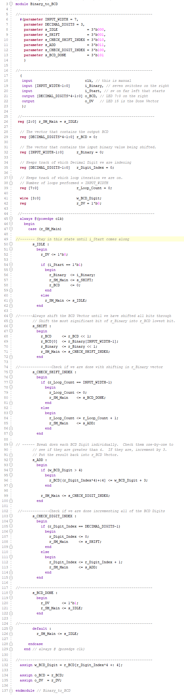

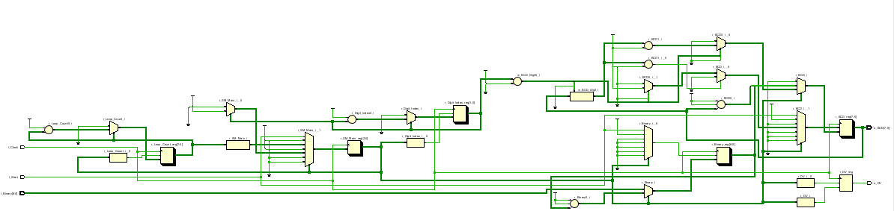

#### Testing

Enter a binary number in the right hand 7 switches (6:0) and then look at the the right hand 12 LED's (11:0) for the BCD translation. Operator has to act like the controller of this circuit by choosing a bit value to translate, setting the i_start high (left most switch), moving the clk up and down (next switch to the right of i_start). It takes over 50 clock ticks for this circuit to run. Before the o_DV light (above) start turns on, must turn start off. 

---

#### Prompts

*The HexToBCD control_Path is designed to be controlled by another **control_Path**. What input bit controls when it starts?*  i_Start.

*If i_Start is never moved back to 0, what happens?* o_DV flashes for one clk cycle and the answer is displayed and then it is immediately replaced with zeros and o_DV goes to zero as the algorithm starts again.

*How long does i_Start have to be high?* One HexToBCD clock cycle. 

*How would the **control_Path** controlling this HexToBCD convertor know when to drop the i_Start bit?* It could have to run the same clk as HexToBCD, at the same frequency, to know when HexToBCD has completed at least one clk tick. 

*What would happen if the control_Path controlling  HexToBCD dropped i_Start to zero out of rhythm with HexToBCD?* If the controller is too fast, HexToBCD may never start and display all 0's. If the controller clock is approximately the same speed, the display will alternate between display of all 0's and a partial answer. The display would blur and look like dim letter eights. If the controller is too slow,  HexToBCD would flash the answer too fast to see and sit in the idle state most of the time displaying 0's. 

*What is an alternative to synchronizing the control circuit and HexToBCD clocks?* HexToBCD could be modified to wait for i_Start to go low and o_DV high at the same time. Then the controlling circuit could hold start high until o_DV is high, drop i_Start and then HexToBCD would start a new conversion.

*Since both control_Paths have clocks, what is the language used to describe the two clock relationships?* The first is called Synchronous Clocks. The second is called Asynchronous Clocks. 

*If there are massive numbers of circuits doing synchronous and another competing design is doing asynchronous, which is going to be faster?* Synchronous

*Which is going to be harder to implement?* Synchronous

*What does the implementation? The engineer writing verilog or Vivado?* Ultimately Vivado with the engineers help. 

*Lots of the information and warning messages in Vivado are about clocks. Why does Vivado need to be told what these clock relationships are?*  To route wires. 

*The FPGA chip is tiny. Why is Vivado so worried about clocks?*  As speed goes up, the distance bits can be transmitted reliably goes down. The routing of clocks to different parts of the FPGA turns into a different puzzle than that of the logic. Fortunately, that part of the puzzle is the responsibility of Xilinx and Vivado. 

### 3 _7segmentDisplayDemo

The circuit below only creates two control_Paths to create two clocks. The both are descended from the same clock so they are synchronous. Everything below the two "always_ff begin end" is data_Path.  There are nine parallel data_Paths below. 

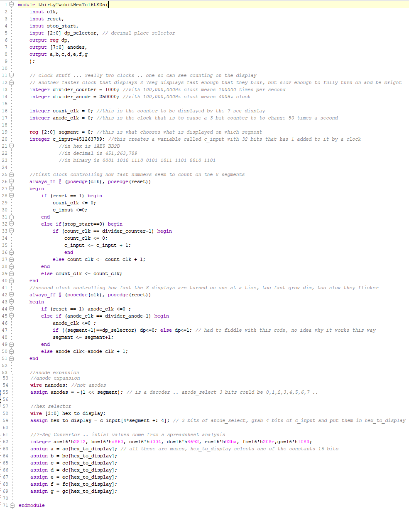

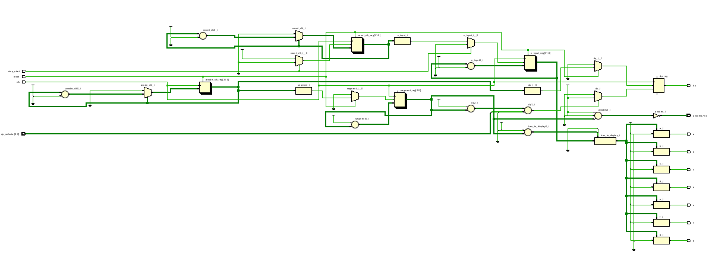

#### Testing

It will just sit there and count. You should be able to pause to see values in the places where it is counting so fast that the display looks like solid 8s. You should be able to reset it to zero.

#### Prompts

*Suppose you want to modify this circuit to include the hexToBCD circuit above. Suppose you want to try the synchronous link first. What event would trigger a new number to convert, the setting of i_Start to 1?* Incrementing c_input. 

*Where would you pull i_Start down to zero?* Incrementing count_clk.

*Where would i_Start trigger a conversion of the hex from 32 to 28 bits?* Somewhere in the data_path. 

*Why would this work?* i_Start is held high through the next clock tick. It is knocking on the door of a flip flop leading into HexToBin. HexToBin moves iStart into it's world and begins conversion. The conversion from 32 to 28 bits has to happen before the next clock tick so iStart begins with a new count number. Only data_Paths are fast enough (remember speed of light) to do this. 

*Can a vector changed inside the control_Path also be changed in a data_Path?* No.  The changes will be out of synch and cause unintended consequences. 

*Can i_Start be looked at or trigger an asynchronous event in the data_Path?* Yes as long as i_Start is not modified. 

### 4_ 7segmentDisplayBCD

This modifies the above project to count in BCD or HEX. A third switch has been added to switch between a HEX display and BCD display. 

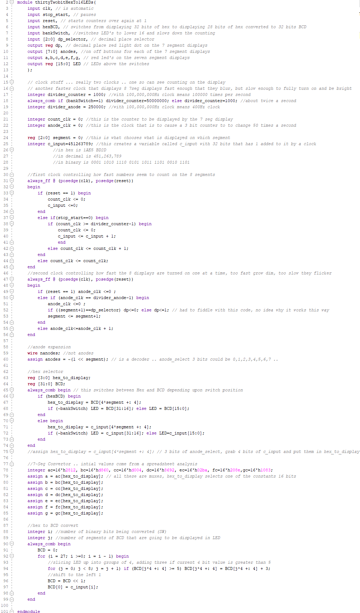

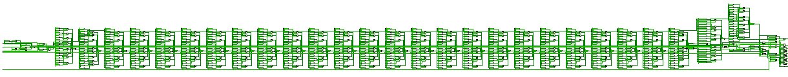

#### Testing

Everything works .. left most switch pauses, next switch moving right resets to 0, next switch to the right switches from binary to BCD ... both on the LED's and in the display .. next switch slows everything down and switches the LED's to the lower 4 segments. 