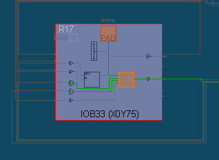
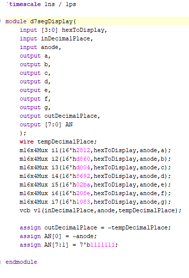
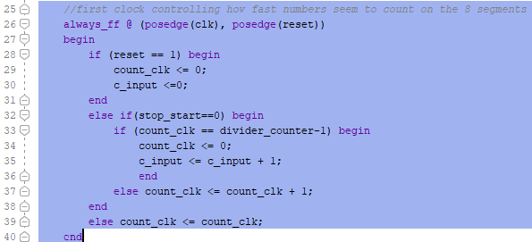

You have tested a Voltage Controlled Buffer VCB in Lab 2.

You have built muxes in Lab 5

Now is the time to start putting all these pieces together in a larger project. 

# 1_SevenSegDisplays

The goal of this project is to manually explore how a 7 seg Display works. You just need to shoot screen shots and test.

#### Port Diagram

#### Verilog Code

module simple7Seg(
    input [15:0] SW,
    output [6:0] C,
    output DP,
    output [7:0] AN,
    output [15:0] LED
    );

   assign C = SW[6:0];
   assign DP = SW[7];
   assign AN = SW[15:8];
   assign LED = SW;
endmodule

#### RTL Schematic Screen shot

#### Synthesis Schematic Screen shot

#### Implementation Device screen shot zoomed in on something interesting

#### Testing

Switch[6:0] should control one of the 7 segments. Switch7 should control the decimal point. Switch[15:8] should control each of the anodes going from left to right. Additionally, the Switches should control the LED right above it.

## 2 _HexTo7SegDisplay

Here the goal is to explore how to display Hex on a 7 Seg Display. The problem is how to display 10,11,12,13,14,15 which are possible with 4 switches. 

There is some logic behind this code. Look at the equation for seg(6) or g. Only three numbers turn off  segment g: **0, 1 or 7**,  **0001 or 0111**, (**~x[3] & ~x[2] & ~x[1]** ) |(**x[2] & x[1] & x[0]** ). 

Is this obvious to a electrical or computer engineer working in the field?  **Yes.** 

10 in hex is a. 11 in hex is b. 12 in hex is c. 13 in hex is d. 14 in hex is E and 15 in hex is F.
*Modify this project so that the above characters are Propose assign statements for these 6 displays for the letters of hex in a manner similar to the way 0,1,23,4,5,6,7,8 and 9 are displayed.* 

#### Port Diagram

   for get this ... there should have been a port diagram for this project 

#### Verilog Code

   paste your modified code here

#### RTL Schematic Screen shot

  make this of your modified code

#### Synthesis Schematic Screen shot

  make this of your modified code

#### Implementation Device screen shot zoomed in on something interesting

  make this of your modified code

#### Testing

testing the modified and unmodified should be the same

Use the left 4 switches to make 4-bit representation of hex numbers and the LEDs should represent the BCD form of the number with LED4 acting as the carry-bit. The rightmost 7-segment display should display the hex representation of the 4-bit binary number.

## 3_d7SegDisplay

#### Port Diagram 

xxxxx don't try to draw xxxxxx

#### Verilog Code

shoot screen shot

#### RTL Schematic Screen shot

#### Synthesis Schematic Screen shot

#### Implementation Device screen shot zoomed in on something interesting

#### Testing

Switch5 turns the rightmost 7-segment display on and off. When on, it should display the hex representation of the 4-bit binary number given by the switch[3:0]. Switch4 turns the decimal point on and off.

------

#### Prompts

*Can you explain how this spreadsheet was formed and it's relationship to the code above?*

*In this lab there is another folder named 7SEG. Find the code that does something similar and shoot a screen shot of it here.* 

*Discuss the pros and cons of all three and pick one of them.*

## 4_d4x7segDisplay

#### Port Diagram

xxxxx don't try to draw xxxxxx

#### Verilog Code

`timescale 1ns / 1ps

module d3x7segDisplay(
	input [11:0] hexToDisplay, //uses 12 bits because have 16 switches and need 4 of them to manually control the anodes and decimal place
	input [1:0] iDP, // in Decimal Place .. is 2 bit number so that only one decimal place can be turned on at a time
	input [1:0] Annode, // again, is 2 bit number so after going through decoder, can only use one at a time
	output a, //these are for one 7 seg ment display
    output b, //the particular seen seg display being used is determined by Annode
    output c,
    output d,
    output e,
    output f,
    output g,
    output oDP, //output decimal place, is turned on only when iDP and Annode match
    output [7:0] outAnnode_selector
    );
    wire [3:0] iDecimalPlace; 
    wire [3:0] iAnnode;
       
	d2to4decoder d0(iDecimalPlace,iDP); //active high, turns 2 bit number into 4 bit with only one of the four bits high
	d2to4decoder d1(iAnnode,Annode); // active high, turns 2 bit number into 4 bit with only one of the four bits high
	
	d7segDisplay u0(hexToDisplay[3:0], iDecimalPlace[0], iAnnode[0], a,b,c,d,e,f,g,oDP); //all this logic is active high
	d7segDisplay u1(hexToDisplay[7:4], iDecimalPlace[1], iAnnode[1], a,b,c,d,e,f,g,oDP); //need one of these for each segment driving
	d7segDisplay u2(hexToDisplay[11:8],iDecimalPlace[2], iAnnode[2], a,b,c,d,e,f,g,oDP); //iAnnode only turns on one
	d7segDisplay u3(hexToDisplay[11:8],iDecimalPlace[3], iAnnode[3], a,b,c,d,e,f,g,oDP); 
	//They have to be in a group like this because all 7seg displays are hooked to the same a,b,c,d,... wires as output devices 
	
	//outAnnode_selector is what determines whether a particular 7seg display is turned on or not
	assign outAnnode_selector[3:0] = ~iAnnode; //annode is active low so if iAnnode is a 1, then outAnnode_selector is 0 and is turned on 
	assign outAnnode_selector[7:4] = 4'b1111; // 1 means display is off  .. have to turn unused off   

endmodule

module d7segDisplay(
    input [3:0] hexToDisplay,
    input iDP,
    input anode,
    output a,
    output b,
    output c,
    output d,
    output e,
    output f,
    output g,
    output dp
    );
    wire invertedDP;
    m16x4Mux i1(16'h2812,hexToDisplay,anode,a);
    m16x4Mux i2(16'hd860,hexToDisplay,anode,b);
    m16x4Mux i3(16'hd004,hexToDisplay,anode,c);
    m16x4Mux i4(16'h8692,hexToDisplay,anode,d);
    m16x4Mux i5(16'h02ba,hexToDisplay,anode,e);
    m16x4Mux i6(16'h208e,hexToDisplay,anode,f);
    m16x4Mux i7(16'h1083,hexToDisplay,anode,g);
    assign invertedDP = ~iDP;
    vcb i8(invertedDP,anode,dp);
endmodule

module d2to4decoder(Y, X);

 output [3:0] Y;
 input [1:0] X;
 reg [3:0] Y;

 always @* begin
	case ( {X} )
		2'b00: {Y} = 4'b0001;
		2'b01: {Y} = 4'b0010;
		2'b10: {Y} = 4'b0100;
		2'b11: {Y} = 4'b1000;
		default: {Y} = 4'bxxxx;
	endcase
 end

 endmodule

 module d3to8decoder(Y, X);

  output [7:0] Y;
  input [2:0] X;
  reg [7:0] Y;

  always @* begin
     case ( {X} )
         3'b000: {Y} = 8'b00000001;
         3'b001: {Y} = 8'b00000010;
         3'b010: {Y} = 8'b00000100;
         3'b011: {Y} = 8'b00001000;
         3'b100: {Y} = 8'b00010000;
         3'b101: {Y} = 8'b00100000;
         3'b110: {Y} = 8'b01000000;
         3'b111: {Y} = 8'b10000000;         
         default: {Y} = 8'bxxxx;
     endcase
  end

  endmodule

#### RTL Schematic Screen shot

#### Synthesis Schematic Screen shot

#### Implementation Device screen shot zoomed in on something interesting

#### Testing

Sw[15:14] give a 2-bit number determining which of the four rightmost 7-segment displays will display the decimal place. Sw[13:12] give a 2-but number determining which of the four rightmost 7-segment displays will be on. Sw[11:0] give a 12-bit number that is converted to HEX and each digit of the HEX is assigned to a 7-segment display in order from MSB to LSB. 

------

#### Prompts

This really shouldn't be called 4 segment displays. *How many displays does it really use?*

[Resource Utilization](https://forums.xilinx.com/t5/Implementation/Vivado-utilization-report/td-p/317517) forum question and answer.  Read this and do a screen shot of resource utilization of the last project above, so when this project is finished they can be compared.

## 5_32bitsHexTo7seg

This is working! Goal is to figure out how to use it in future labs.

#### Port Diagram

#### Verilog Code

#### RTL Schematic Screen shot 

#### Synthesis Schematic Screen shot

#### Implementation Device screen shot zoomed in on something interesting

 Lots of stuff going on

Lot more flip flops being used to count, remember things.

------

#### Testing

Left most switch[15]  pauses the counting.
Switch[14] resets to 0, pausing on a random segment
Switches 0 through 2 control the decimal place. 

------

#### Prompts

*What does the utilization report look like?*

*Which* *counter would you delete if another program was controlling the number to be displayed? Cut and paste a picture of the code that would be deleted in order to do this.*

*What 32 bit variable name that you would add as an input to this module, and connect it to a top level with something to display? (Hint right now it is seeded with a constant.)* c_input

*Are clk, reset, stop_start, count_clk, divider_counter needed if the counter clock is removed?* clk is still needed. Everything else will not be mentioned in the code if the counter clock is removed. 

*What will have to be changed if the 32 bit Hex to BCD code is added?* c_input will be feed into the hex to BCD circuit, the output of the circuit will require modification of the //hex selector circuit, replacing c_input. 

*What variable controls how fast the counting is done?* divide_counter.

*To slow down the counting, what would need to be done ... make the number larger or smaller?* Larger. 

*Modify the screen code shot above with red boxes around all the commands that are new to you.* 

## Next Steps

Add gray out or dim
Add blink at four different rates
StopWatch support
Alphabet support

: colon support for in the future .. or try to get to work now

### Ethics of Different Institutional Objectives

There are three groups of Engineers with different objectives:

1. Engineers work for vendors .. For example Engineers work to improve Xilinx hardware FPGAs and Xilinx Vivado software to use them.
2. Engineers work for commercial/defense companies. Some use Xilinx. Others use Xilinx's competition. 
3. Engineers work for educational institutions. They teach and create open source, public, free tools for their doctorate degrees. Their students build circuits with a variety of tools and don't try to be an expert at one of them. 

*Describe one area where these three different institutions conflict.* 

*Describe where the FPGA companies like Xilinx and the open source world conflict.*

*In what way are engineers removed from their employer's competing goals and more free to work together in standards committees?*

*What does an engineer represent ... like a lawyer representing clients, doctors representing patients?*

*What motivates all three groups of engineers to start cooperating and working together building a common standard such as the next version of Verilog?*

*Why has the [US supreme court](https://supreme.justia.com/cases/federal/us/435/679/) ruled that engineers from competing companies meeting and forming organizations is not price fixing, is **not** [anti-competitive collusion](https://caselaw.findlaw.com/us-supreme-court/435/679.html)?* 

