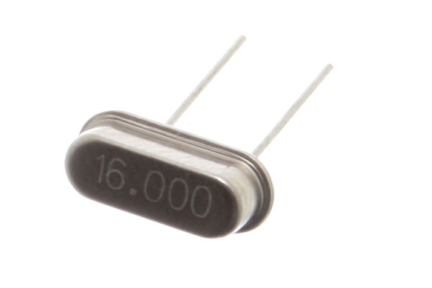

# Clocks, Counters, Slices, Priority Encoders

The first half of this course has been completed. We have created circuits using gates and RTL logic.  They all have executed at almost the **speed of light**. These circuits have various names and have been described in various ways. Memorize them:

​	Combinatory
​	Combinational
​	Boolean Equations
​	Truth Tables
​	Asynchronous

We have looked at clocks in a Test Bench. This was confusing. A clock makes no sense. We have seen ticks in Verilog code where a line starts off with #3 which means delay or **pause 3 ticks for testing logic**. 

Now we are going to look at a real clock. The ones we hear about when choosing which CPU to purchase in our laptop or desktop.  The clock is external to the FPGA. It gets in like a switch. It is turned on in the *.XDC file. Physically the clock is a [crystal inside a silver can](https://en.wikipedia.org/wiki/Crystal_oscillator) that takes a few moments to reach a steady temperature and then begins oscillating at an amazingly precise frequency.

​		

The [Nexys4 DDR board](https://reference.digilentinc.com/reference/programmable-logic/nexys-4-ddr/reference-manual) has a 100MHz crystal. Intellectual property from Xilinx (circuits from Xilinx) can increase this speed up to 450MHz and with perhaps some [jitter](https://en.wikipedia.org/wiki/Jitter) up to 650Mbps. The FPGA, memory IC, and the board itself are capable of the maximum data rate of 667Mbps.  Intel I9 processor's base speed is around 3.8GHz. Bits per second (bps) and cycles per second (Hz) are [roughly equivalent](https://electronics.stackexchange.com/questions/56265/difference-between-hz-and-bps).

## 1_clockTest

The goal of this project is see the most simple counter possible.  

#### Port Diagram

#### Verilog Code

module clkDivider(
    input clk,
    input rst, //SW[0]
    input [1:0] outputBankSelect, //SW[1],SW[2] there are 32 bits of cout_up, displayed 8 at a time in the LEDs
    input slowFast, //SW[3]
    output [7:0] count_small,
    output [2:0] anode_small,
    output [7:0] AN,
    output a,
    output b,
    output c,
    output d,
    output e,
    output f,
    output g
    );
     
reg [31:0] divider_counter = 50000000; // 100,000,000/50,000,000 = 2 counts per second 
reg [31:0] divider_anode = 100000000; //with 100,000,000/100,000,000 = 1 count per second

integer count_clk = 0; //this is the counter to be displayed by the 7 seg display
integer anode_clk = 0; //this is the clock that is to cause a 3 bit counter to to change 50 times a second

integer count_up = 100000000; //this is a 32 but counter that add's 1 
reg [2:0] anode_up = 0; //this counts slowly so can see individual anodes .. or not .. if you want to see them all on

always_ff @ (posedge(clk), posedge(rst))
begin
    if (rst == 1) count_clk <= 0;
    else if (count_clk == divider_counter-1) begin
     count_clk <= 0;
     count_up <= count_up + 1;
     end         
    else count_clk <= count_clk + 1;
end

always_ff @ (posedge(clk), posedge(rst))
begin
    if (rst == 1) anode_clk <=0 ;
    else if (anode_clk == divider_anode-1) begin
        anode_clk <=0 ;
        anode_up <= anode_up+1;
    end         
    else anode_clk<=anode_clk + 1;
end

assign count_small = count_up[8*outputBankSelect +: 8];
assign anode_small = anode_up[2:0];

//creates the three bars on the seven segment displays
assign AN = ~(1 << anode_up);
assign a=0;
assign b=1;
assign c=1;
assign d=0;
assign e=1;
assign f=1;
assign g=0;

//switches counting speeds
always_comb 
    if (slowFast==0) begin
        divider_counter = 50000000; // 100,000,000/50,000,000 = 2 counts per second 
        divider_anode = 100000000; //with 100,000,000/100,000,000 = 1 count per second
    end
    else begin
        divider_counter = 500000; // 100,000,000/100,000,000 = 200 counts per second 
        divider_anode = 50000; //with 100,000,000/50,000 = 200 count per second
    end

endmodule

#### RTL Schematic Screen shot

#### Synthesis Schematic Screen shot

#### Implementation Device screen shot zoomed in on something interesting

#### Testing

You should uncover a bug during the test of this circuit.

The circuit is supposed to be a counter that is capable of counting in 16 and 32 bit numbers. Sw[0] resets the counter (or stop/starts it). Sw[2:1] selects which 8-bit section of the 32-bit number to display on the 7-segment display. Sw[3] changes the number between a 32-bit counter and 16-bit counter.

___

#### Prompts

*What are the symptoms of the problem?* 

The circuit never resets and the numbers are displayed wrongly on the 7-segment display. Also, when the counter is displaying a 16-bit number, it does not show all the digits at the same time, it goes through each digit only showing one at a time.

*There are two manual solutions to the problem. What are they?*

*Could this be considered a feature to the circuits user given that the other user is probably another circuit .. ie (7segDriver) ?*

*Could the "waiting" required be blamed on some complexity of the circuit?*

*Is this a problem of verilog logic, vivado synthesis or implementation, or a more traditional algorithm problem of a C++ or Java Class?* traditional algorithm problem of a C++ or Java Class.

*The problem is associated with freezing, counting fast and counting slow. What line numbers in the code are associated with this?* 

*Given multiple solutions and one symptom, does this imply multiple problems or one problem?*

*What is the problem?*

# 2_bitSlicing

The goal  is to find a way to grab 4 bits out a group of 32 in a single line of code.  This technique is called bit slicing.  This is similar to slice or split in other languages.  This is used in two places in the 7seg display code: "hex" selector and  "hex to BCD" convert.

#### Port Diagram

#### Verilog Code

module bitSlice(
    input [2:0] select,
    output [3:0] hexOut
    );

    /* https://stackoverflow.com/questions/13399663/splitting-a-bit-array-in-verilog*/
    
    integer c_input = 451263789; // using 32 of the 128 bits 
    //goal is to display a group of 4 bits: 0001 1010 1110 0101 1011 1101 0010 1101
    // using 4 bit wide hexOut instead of eight bit wire [7:0] out = in[8*idx +: 8];
    
    assign hexOut = c_input[4*select +: 4];
    /* this means there are 8 possible groups of 4 bits in 32 bits, 
    If select is 0 then c_input[4*(0) +: 8] == c_input[7:0]
    If select is 7 then c_input[4*(7) +: 8] == c_input[31:24]
    */
endmodule

#### RTL Schematic Screen shot

#### Synthesis Schematic Screen shot

#### Implementation Device screen shot zoomed in on something interesting

#### Testing

3 Select bits select 1 of 8, 4 bit groups from a 32 bit constant and display on LEDs.  The constant is inside the port diagram:

------

#### Prompts

Slicing or Slitting is part of a number of languages including  [python](https://www.programiz.com/python-programming/methods/built-in/slice) , [matlab](https://stackoverflow.com/questions/11318724/matlabs-slice-function-not-working-as-desired), [perl](https://perldoc.perl.org/functions/split.html) and is a common concept name to use when searching for something similar in other languages [C](https://stackoverflow.com/questions/14618342/copying-a-subset-of-an-array-into-another-array-array-slicing-in-c), [regular expressions](https://stackoverflow.com/questions/35578470/how-to-slice-characters-from-string-using-regex). *Is slice or split a concept or syntax in verilog*? Concept.

In the SystemVerilog standard [IEEE_Std1800-2017](https://github.com/ENES-246DigitalElectronics/ENES247/blob/master/IEEE_Std1800-2017_8299595.pdf) (released in Feb. 2018), search for "+:" . *What section, sub-section, sub-sub section ... etc. is this documented .. and how is this described?* 

1. Aggregate data types
   7.4 Packed and unpacked arrays
   7.4.3 Operations on arrays
   ​	— Reading and writing a variable slice of the array, e.g., A[x+:c] = B[y+:c]

Suppose this test didn't work. You would then go to the Xilinx's reference called [ug901-vivado-synthesis.pdf](https://github.com/ENES-246DigitalElectronics/ENES247/blob/master/ug901-vivado-synthesis.pdf) which is randomly updated.  *What page is "+:" found  that is not in the middle of code and how is it described?* 

On page 222 in Dec. 19, 2018 version of ug901 is described as  "Variable Part Selects Verilog Coding Example".

*Given that the "+:" symbol appears in Xilinx documents as well as the standard, what percentage confidence do you have that this will synthesize in Vivado?* 

90% confident .. it has worked in the past. No reason for it to stop working now.

Look at this chart describing the growth of Verilog/SystemVerilog. The 2017 standard, reportedly did not add any new functionality to the 2012 standard. *The "+:" concept is actually listed on this chart. What is it's name?*  [Variable part select](https://www.google.com/search?q=verilog+variable+part+select&rlz=1C1CHZL_enUS735US735&oq=verilog+variable+part+select)

*Given that it is part of the older Verilog standard before it merged with SystemVerilog, how confident are you now that it should work?* 100%

The 2017 standard, reportedly did not add any new functionality to the 2012 standard. *How relevant do you think [this document](http://sutherland-hdl.com/papers/2013-SNUG-SV_Synthesizable-SystemVerilog_paper.pdf) (that the graphic from above came from) is?* Very relevant

*The word "design" in the graphic above means the code will work where in the Vivado workflow? (Simulate, RTL, Synthesize, Implement, Bitstream)* Synthesize. 

*The word "verification" above means the code will work where in the Vivado workflow?* Simulate. 

*How does the IEEE_Std1800-2017 describe these two parts of SystemVerilog?* The same way.

------

# 3_priorityEncoder

A PriorityEncoder is a concept. Two applications are presented below and then some code is used to test building it in SystemVerilog and implementing it with Vivado on the Nexys 4 DDR board. It is an artifact of building digital circuits that has began evolving in 1970s. 

The goal is to eliminate the leading zero's when displaying 8 numbers on the 7seg displays of the Nexys4ddr board. The algorithm is move left to right looking for a 1 in the truth table below.  Record position (7,6,5,4,3,2,1,0) of the first digit not a one. 

The next biggest application of this is to read motor encoders. Motor encoders track the movement of a motor. The goal is to tell the motor to move a certain distance (different ways for different motors). Then see if the motor actually physically moved the far by counting a series of pulsing lights coming through a series of holes attached to the shaft of the motor. 

More generally, priority encoders are used when there are lots of inputs and you only care about just a few lines in the truth table. The rest of the input combinations you don't care about. The few lines you do need must form a pattern. That pattern has to be turned into a truth table that looks something like this:

The input ***y*** subscripts move left to right indicate a 1 0 transition needs to be found. Then the 1's position is recorded. This leaves 9 rows in the truth table, requiring 4 bits of output. However, the entire 16 rows of the truth table are not defined. This could be handled with a Case Default or an If command with an Else. However this is not best practice from a sustainability point of view.  The code get's longer and longer and doesn't synthesize well. 

The ***d*** output can be found by **OR**ing together all the ***y***'s on a row. " This forms the output ***d*** which will be 1 in all the (2^6-9=247) ***X*** don't care rows. Then create a loop that looks first at ***y0***. Initially ***abc ***is 000.  If ***y0*** is a 1 then ***abc*** stays =000. Then it goes to the next row. If y1 is a 1, then ***abc***=1 and  Y0's information is overwritten because it is now a don't care ***X***.  If there is another ***y?=1*** to the right, it will be found and it's previous position will over write the previous ***abc***. 

More generally this is called priority logic.  It was the subject of a talk at the [Vivado 2015 users group meeting in Paris](https://www.xilinx.com/publications/prod_mktg/club_vivado/presentation-2015/paris/Xilinx-AdvancedSynthesis.pdf). 

#### Port Diagram

#### Verilog Code

`timescale 1ns / 1ps

module PriorityEncoder(
    input [7:0] y,
    output reg [2:0] abc1,
    output reg [2:0] abc2,
    output reg [2:0] abc3
    );
	
    integer i;
    
    always_comb begin //priority encoder #1
        abc1=0;
        for (i=7; i>=0; i = i-1) if (y[i]==1) abc1=7-i;
    end
    
    always_comb begin  //priority encoder #2
       abc2=0;
       for (i=0; i<8; i = i+1) if (y[i]==1) abc2=i;
    end   
    
    always_comb begin //priority encoder #3 .. more general using casez
        abc3=0;
        casez (y)
             8'b1???????: abc3 = 7;
             8'b01??????: abc3 = 6;
             8'b001?????: abc3 = 5;
             8'b0001????: abc3 = 4;
             8'b00001???: abc3 = 3;
             8'b000001??: abc3 = 2;
             8'b0000001?: abc3 = 1;            
        endcase
    end
endmodule

#### RTL Schematic Screen shot

#### Synthesis Schematic Screen shot

#### Implementation Device screen shot zoomed in on something interesting

#### Testing

The LEDs are split into 3 groups. LED[3:1] should show the 3-bit binary representation of 7 subtracted by the position number of the rightmost switch that is turned on. For example having sw2 on and sw1 and sw0 off would yield 7-2=5 and 5 should be shown in LED[3:1]. LED[15:13] and LED [9:7] should show the 3-bit binary representation of the position number of the leftmost switch turned on.

#### Prompts

The priority encoder is one of the most difficult concepts to synthesize and implement. The casez command is obviously easier to understand than the for loop. In the end they are implemented with the same number of resources. But there is a difference in the synthesis schematic. *Describe this.*

*VHDL is the alternative to Verilog. VHDL case statements are required to have no overlap. VHDL case commands can not be used to build a priority encoder. If commands have to be used. Find a URL reference to this and link it up here.* 

Verilog case statements can overlap. *What does this mean? Write some code that would test this. (You don't have to make a project out of it)*

------

# 4_7segWithZeroBlank

The code for the 7 seg display is evolving. 

#### Port Diagram

Just do a screen shot of the top level module. 

#### Verilog Code

module thirtyTwobitHexTo16LEDs(
    input clk, // is automatic
    input stop_start, // pauses
    input reset, // starts counters over again at 1
    input hexBCD, // switches from displaying 32 bits of hex to displaying 28 bits of hex converted to 32 bits BCD 
    input bankSwitch, //switches LED's to lower 16 and slows down the counting
    input [2:0] dp_selector, // decimal place selector
    output reg dp, // decimal place red light dot on the 7 segment displays
    output reg [7:0] anodes, //on off buttons for each of the 7 segment displays
    output a,b,c,d,e,f,g, // red led's on the seven segment displays
    output reg [15:0] LED // LEDs above the switches
    );
    
    // clock stuff ... really two clocks .. one so can see counting on the display
    // another faster clock that displays 8 7seg displays fast enough that they blur, but slow enough to fully turn on and be bright
    integer divider_counter; // 50,000,000 with 100,000,000Hz clock means 2 times per second     
    always_comb if (bankSwitch==1) divider_counter=50000000; else divider_counter=1000; //about twice a second
    integer divider_anode = 250000; //with 100,000,000Hz clock means 400Hz clock
    
    integer count_clk = 0; //this is the counter to be displayed by the 7 seg display
    integer anode_clk = 0; //this is the clock that is to cause a 3 bit counter to to change 50 times a second
    
    reg [2:0] segment = 0; //this is what chooses what is displayed on which segment 
    integer c_input=451263789; //this creates a variable called c_input with 32 bits that has 1 added to it by a clock
              //in hex is 1AE5 BD2D
              //in decimal is 451,263,789
              //in binary is 0001 1010 1110 0101 1011 1101 0010 1101
              //this is so that if upper 16 bits are displayed on LED's can see them counting, lower 16 will be a blur
    
    //first clock controlling how fast numbers seem to count on the 8 segments
    //--------------------------------------------------------------------------
    always_ff @ (posedge(clk), posedge(reset))
    begin
        if (reset == 1) begin
            count_clk <= 0;
            c_input <=0;
        end
        else if(stop_start==0) begin
            if (count_clk >= divider_counter-1) begin
                count_clk <= 0;
                c_input <= c_input + 1;
                end         
            else count_clk <= count_clk + 1;
        end
        else count_clk <= count_clk;
    end
    
    //second clock controlling how fast the 8 displays are turned on one at a time, too fast grow dim, too slow they flicker
    //----------------------------------------------------------------------------------------------------------------------      
    always_ff @ (posedge(clk), posedge(reset))
    begin
        if (reset == 1) anode_clk <=0 ;
        else if (anode_clk == divider_anode-1) begin
            anode_clk <=0 ;
            if ((segment+1)==dp_selector) dp<=0; else dp<=1; // had to fiddle with this code, no idea why it works this way
            segment <= segment+1;
        end         
        else anode_clk<=anode_clk + 1;
    end
    
    //anode expansion .. creates 8 bits determining which segment is on or off at the moment
    //-----------------------------------------------------------------------------------------
    reg [2:0] abc; // used to blank out the leading zeros
    always_comb if(segment <= abc) anodes = ~(1 << segment); else anodes=8'hFF; // is a decoder .. anode_select 3 bits could be 0,1,2,3,4,5,6,7 ..     
    
    // hex selector find 4 bit hex display for a specific segment from 32 binary (c_input) or BCD
    //-------------------------------------------------------------------------------------------- 
    reg [3:0] hex_to_display; 
    reg [31:0] BCD;
    always_comb begin // this switches between Hex and BCD depending upon switch position
        if (hexBCD) begin
            hex_to_display = BCD[4*segment +: 4];
            if (~bankSwitch) LED = BCD[31:16]; else LED = BCD[15:0];
        end  
        else begin
            hex_to_display = c_input[4*segment +: 4];
            if (~bankSwitch) LED = c_input[31:16]; else LED=c_input[15:0];
        end  
    end

   

    //7-Seg Convertor .. turn 4 bits of hex into a,b,c,d,e,f,g segment turn off or turn on
    //----------------------------------------------------------------------------------------------------
    integer ac=16'h2812, bc=16'hd860, cc=16'hd004, dc=16'h8692, ec=16'h02ba, fc=16'h208e,gc=16'h1083;
    assign a = ac[hex_to_display]; // all these are muxes, hex_to_display selects one of the constants 16 bits
    assign b = bc[hex_to_display];
    assign c = cc[hex_to_display];
    assign d = dc[hex_to_display];
    assign e = ec[hex_to_display];
    assign f = fc[hex_to_display];
    assign g = gc[hex_to_display];   
    
    //hex to BCD convert using nested for loops
    //---------------------------------------------------------------------------------------------
    integer i; //number of binary bits being converted (SW)
    integer j; //number of segments of BCD that are going to be displayed in LED
    always_comb begin
        BCD = 0;
        for (i = 27; i >=0; i = i - 1) begin
            //slicing LED up into groups of 4, adding three if current 4 bit value is greater than 5
            for (j = 0; j < 8; j = j + 1) if (BCD[j*4 +: 4] >= 5) BCD[j*4 +: 4] = BCD[j*4 +: 4] + 3;
            //shift to the left 1
            BCD = BCD << 1;
            BCD[0] = c_input[i];
        end
    end
    
    //zero blank .. blank leading zeros on the display
    //-----------------------------------------------------------------------------
    //first build up the priority encoder 7 bits from the 32 bits of c_input or BCD
    integer k;
    
    reg [7:0] priority_encoder_truthTable = 0;
    always_comb begin
        if (hexBCD) for (k = 0; k < 8; k = k + 1) if (BCD[k*4 +: 4] > 0) priority_encoder_truthTable[k]=1; else priority_encoder_truthTable[k]=0;
        else for (k = 0; k < 8; k = k + 1) if (c_input[k*4 +: 4] > 0) priority_encoder_truthTable[k]=1; else priority_encoder_truthTable[k]=0;
    end
    //now find 3 bit pointer to the first one among the 8 displays using priority encoder logic
    integer L;
    always_comb begin
        abc = 0;
        for (L=0; L<8; L = L+1) if (priority_encoder_truthTable[L]==1) abc=L;
    end    

endmodule

#### RTL Schematic Screen shot

#### Synthesis Schematic Screen shot

#### Implementation Device screen shot zoomed in on something interesting

#### Testing

The LEDs should give a BCD representation of the numbers on the 7-segment display. Sw[2:0] should determine which of the 7 spots (or nothing at all) the decimal point should show up. Sw15 should start and stop the counting. Sw14 should reset the counter. Sw13 should convert the HEX to BCD when turned on. Sw12 will slow the counter to about 2 ticks per second.

------

#### Prompts 

## 5_clockUsing7segDisplay

#### Port Diagram

Just do a screen shot of the top level module. 

#### Verilog Code

*Don't put screen shots here. Outline the two modules  terms of application and design construct. For example, the application would be blank leading zeros. The tool would be a priority encoder.  We may not have covered the tool yet. Do your best ..* 

#### RTL Schematic Screen shot

#### Implementation Device screen shot zoomed in on something interesting

#### Testing

----

#### Prompts

*Screen shot the "Report Utilization" for this project.   Compare with the project above.*

*Look at the code constructs and the RTL schematic screen shot. How many gates do you see?* 

*What are the indications that this is written at a behavioral level, C language like level?*

*Where would you switch to case to improve readability?*

*Putting too much on one line may be a problem. What would you suggest to improve readability?*

*How are the modules called differently in the top level module compared with the project above?*

*Look through the messages, starting with errors, very important, ... What are some errors that concern you, that we should be addressing?*

# Next Steps

Improve readability of the module.

Add "split" feature that does zero blanking on the right 4 segments separately from the left 4 segments so two numbers could be displayed simultaneously.

Combine the "split" and "BCD" feature so that both the left and the right can be switched from binary to BCD.

Another option needs to be added that supports words being input rather than binary. Would add support for this [representation of the alphabet on a 7 seg display](https://en.wikichip.org/wiki/seven-segment_display/representing_letters). Need to think about how it would be physically implemented. Can numbers be mixed with this? Could but there are 26 + 10 or 36 which is 6 bits per segment, not 4. So has to be widened to 48 bits sent to the 7seg display with some of the most significant bits turning into letters. Some design is needed here. Zero blanking may need to be turned off. Would need to write a top level module that shows how to use it in this mode.

