# Latches
 Why? Latches are evil we know this.

We know that Vivado associates latches with not completely specifying all the cases or covering all if possibilities. It is associated with remembering a default state just in case it is needed.

But this is not the only evil latches contain. After understanding this evil, we can move back into the Vivado world with the additional intuition about  how circuits "remember."

## 1_SR_Latch

#### Port Interfac

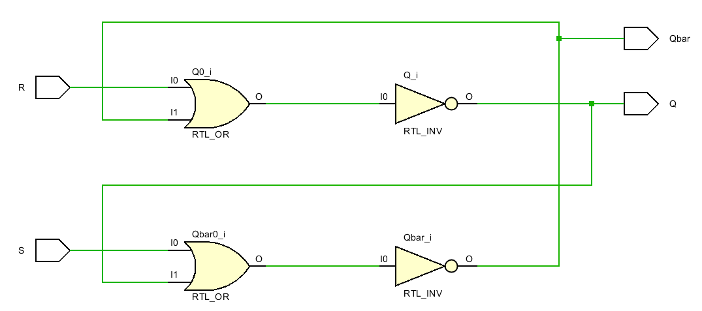

#### RTL Schematic

Implemented with LUTS! Clearly there is going to be delay thru LUT3 that is going to cause a glitch or bounce on Qbar.  It is going to happen so fast that we will not be able to see it. 

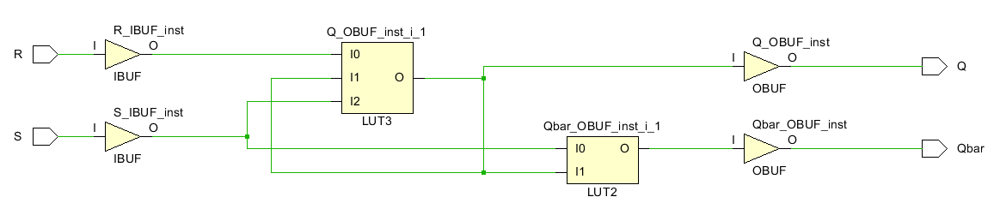

#### Something Interesting on the Device Window

What is interesting is one of the LUTs has three inputs. Looking at the inputs, one is a **loop** of it's own output! Can see this in the RTL schematic also. The top LUT gets input from only one of the pads and an output of the bottom LUT! Click on wires to make them white. 

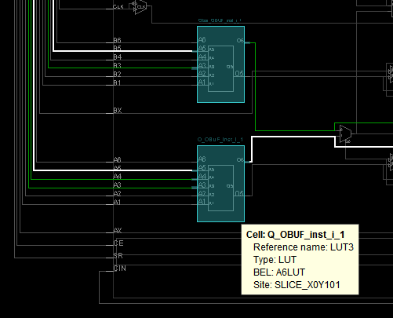

#### Test/Demo

#### Prompts

*What gate(s) does the LUT2 truth table (look at the equation) represent?* 

*What gate(s) does the LUT3 truth table (look at the equation) represent?* A complicated mess. 

*What feature or pattern in the LUT3 truth table prevents an oscillation, prevents the output feeding back to the input, changing the output again, changing the input again?* *Cut and paste the truth table here.  And then discuss.* 

*Click Run Simulation. What are the options?  Type them or insert a screen shot.* 

*Click on the top option, Behavioral Simulation. What new command appears in the top, horizontal ribbon bar?* Run

*Does "Open Synthesized Design" cause a new option on the top level ribbon?* No.
*Does "Open Implemented Design" cause a new option on the top level ribbon?* No.

*What changes on the second to the top ribbon?* 

before

after

*In most software packages do you expect the top level menu bar to change .. what stimulates you into thinking that the top level menu bar changes?* 

Double click on each of the Design Unit names: 

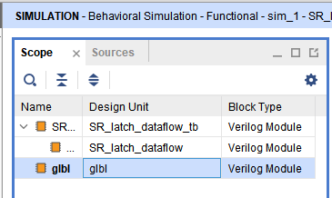

*What new, never seen before, verilog code appears as something you can modify? Just write the name of the file.* 

*What does jtag within this verilog code tell you about it's purpose?* It is the circuit communicating through the   USB port. Hypothesis: It is sent first in the bitstream to describe that the USB port on the Nexys4DDR board is to be used to take the rest of the bit file and create a circuit when the board is physically programmed. 

Within a source code window like this one, the red dots are break points. 

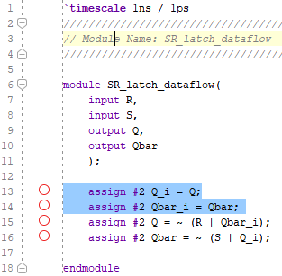

*You can turn them off and on. What does a break point mean to you in other programming environments?*

*Can you still edit code?*

*Can you still mouse over to figure out why something is blue or underlined in a jagged red line?*

Re-run the simulation choosing various break points. Use zoom fit to look at what is happening.  

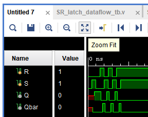

Or you can drag the white lines.

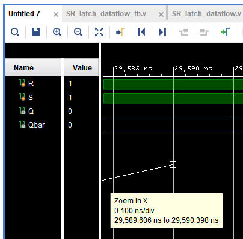

Reset the simulation and then run_for or step. Watch the break points. *How does the timing diagram change?*

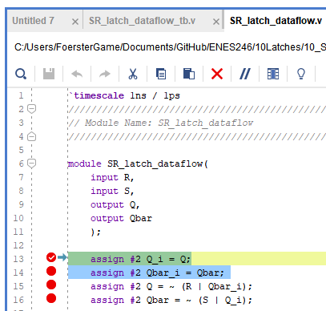

*What is the difference between run_for and step?*

## 2_Physical SR Latch

An SR Latch is called a SET, RESET Latch. There are two outputs,  Q and Qbar. Q = ~Q ***most of the time***. 

In this lab we will physically build an SR Latch with two NOR gates:

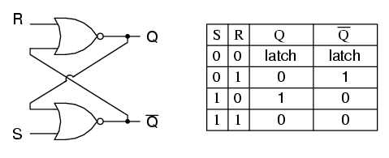

We will be using TTL  integrated circuits called the [7400 series](https://en.wikipedia.org/wiki/7400-series_integrated_circuits).

We will be assembling the circuit on this heath kit digital trainer . Here is a [10 minute video introduction](https://www.youtube.com/watch?v=kqK9Ay4IiP8) 

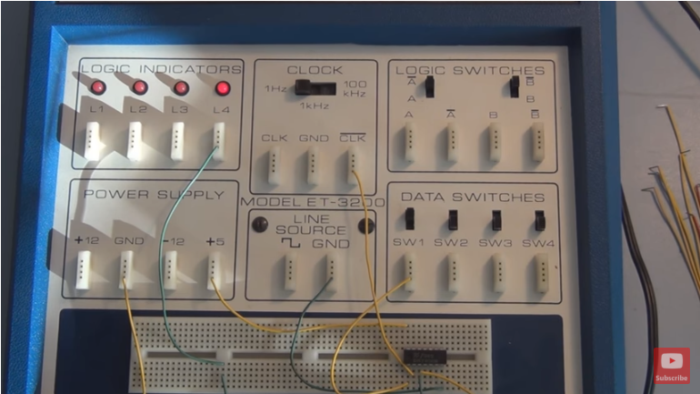 

Watch the video, [look up the chip number for a NOR gate](https://en.wikipedia.org/wiki/List_of_7400-series_integrated_circuits#Larger_footprints), find the chip in the part trays. Learn how to straighten the chip legs, how to push one row in at a time with your thumb, how to look for legs bent underneath the chip, and how to take the chip out of the breadboard with a pen or pencil. 

Wire up power. Hook switches to inputs and LED's to outputs just like Vivado does inside the FPGA. Prove to yourself the NOR gates are working on the IC (integrated circuit). Build the SR Latch.  

## Test

In your demonstration testing the SR Latch, describe the SR truth table like this: 

| S    | R    | Q    | Qbar | state description  |
| ---- | ---- | ---- | ---- | ------------------ |
| 0    | 0    | Q    | Qbar | remembering        |
| 0    | 1    | 0    | 1    | reset              |
| 1    | 0    | 1    | 0    | set                |
| 1    | 1    | 0    | 0    | point of no return |

## Prompts

The following is a sequence of events where you are to change S or R switch positions. Start with Q and Q~ remembering anything you want.  Time moves left to right. The vertical dashed lines are when you are to change input switch positions. Use  paint or some other drawing tool to edit this graphic. It is in the assets folder.

 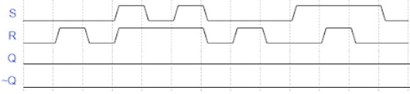

In the above exercise you should have become confused. Remember the rule: only one input can change at a time in a combinational, data_path type circuit. Look at these two truth tables. *What is metastable, what is invalid, what is forbidden? Why did I say "point of no return" above? You have reality in your hands. Does anything smoke? Does the trainer die? What is the grave danger?* 

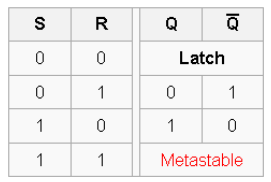

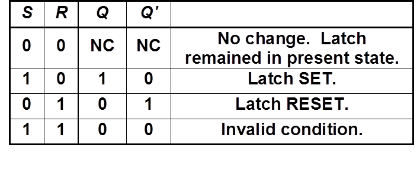

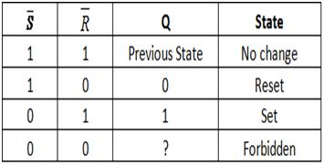

Remembering is associated with the loops above. *Can the loop be really big and involve lots of chips?*

## 3_Combinatory Loops

The SR Latch above formed one combinatory loop. The goal is to design with these. So we need to create a test that forms multiple combinatory loops. 

## 4_Combination Lock

Given that a latch can be built with gates, very complicated latches are possible at the logic level. This is a [folder](https://drive.google.com/open?id=1mmDgvehUsZptyUC1DJaS3hS-7YKicYsD) containing all the design documents for combination lock built with an asynchronous sequential network .. a circuit that remembers with latches. It is [built and logically tested in logisim](https://drive.google.com/open?id=1DUO0JLfWKmXFU6xp1Bfre7Y39bEB5K_i). I represents a relatively unknown design workflow that incorporates many similar concepts to what Vivado software is trying to shield us from in the FPGA workflow .. particularly the clock domains.  Since an unclocked data_path runs at the speed of light,  as Xilinx increase clock speeds, *when will Vivado itself have to deal with the same design issues as an asynchronous, data_flow, latch oriented circuit? How are these issues going to be exposed to the Verilog code designer?*

Logisim can barely run it. You try. *How many latches are in the circuit?* 

*The fact that logisim can demonstrate the circuit working means that it might pass which workflow state in Vivado? Simulation, RTL analysis, Synthesis, Implementation, Bitstream?*

*What are the chances this can be turned into verilog code and run in Vivado?* 

This is the starting point for [designing radically different CPUs](https://en.wikipedia.org/wiki/Asynchronous_circuit#Asynchronous_CPU) without clocks. In the wikipedia article CalTech designed such a CPU and it speeded up when cooled, slowed down when heated in a manner the  opposite of a reptile. The closest shipping product is a [greenarray cpu](http://www.greenarraychips.com/) programmed in [color Forth](https://en.wikipedia.org/wiki/ColorForth). 

How to [force Vivado to allow combinatory loops](https://forums.xilinx.com/t5/Implementation/DRC-LUTLP-1-Combinatorial-Loop-Error-bitstream-generation-failed/td-p/833650)