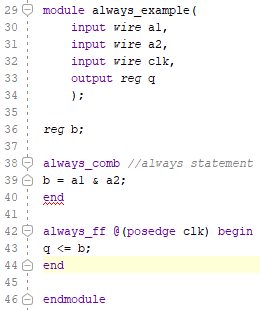
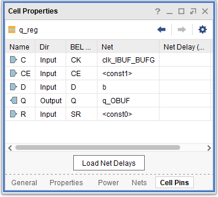
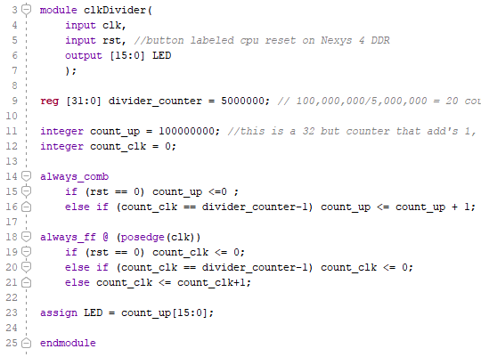
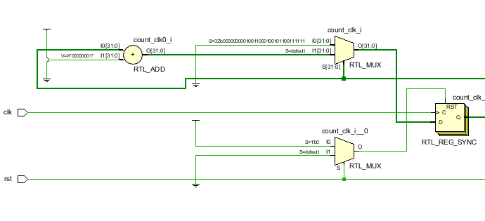
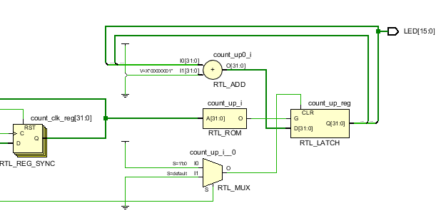

# Lab 12 Style and Flip Flops

# 0 Style .. Begin End Labels

This project was not finished. It focuses on the utility of the Begin End Label

*Is this just another method of commenting?*

*Is it a method of helping identify lots of Begin End pairs?*

*Why is statement 11 underlined in red above?*

*Why is it ok to not have an end label, but not ok to have a misspelled end label?*

*This looks useful, but why allow a begin to be labeled without forcing it's associated end to be labeled?*

*Do begin-ends really clarify the code or just get in the way?*

*For one line of code, is white space and a comment good enough?*

*When are begin end's necessary?*

*Why are many small, always_comb blocks good?*

*When do you envision using begin end labels?*

#### Test

Don't implement and physically test. Play around in the Vivado code editor.

# Coding Rules

The starting point of this lab was to look at good coding practice.  Searching the internet is not helpful. Here is [2013 good coding practice](https://www.xilinx.com/support/answers/51835.html).  Yet none of these 8 examples seems to be the current coding style consensus on the internet. We are walking up to the timing, clocking issue where Vivado evolves the fastest. 

We need to start with small test examples, just like we did with data_path, asynchronuous. Lots of hopefully will expose problems,. From these we can make up rules. 

## 1 Multiple Assign_Comb

*Why would anyone write this sloppy code?*

*Can you predict what is going to happen?*

*In a complicated program, under what circumstances will you make this mistake?*

*What is a rule you can make up that will prevent this from happening?* 

Suggested rules:

​	always have a default value for any reg
​	make assignments once within all data_paths in a circuit
​	

The first point was made in Lab The last is the same point that was made in Lab 1  Multiple Switches. 
	

## 2 Timing Control

This is driven by the 100Mhz clock. 

This project follows best practice. 

Where is combination logic done

#### Testing

*How can you tell if the clock was implemented?*

#### Prompts

*What screen shot proves that the flip flop was actually implemented?*

*What is best practice in terms of blocking and non-blocking statements?*

*Where is combination logic done?*

*Which variables are changed in the data path?*

*Which variables are looked at in the data path?*

*Which variables are changed in the control path?*

*Which variables are looked at in the control path?*

*Why is it wrong to change a variable in two different places?* 

*When visualizing data path circuits, there is a flow from input to output with no loops. What is the flow in this circuit?*

*What is best practice in terms of blocking and non-blocking statements?*

*Why not eliminate b by putting the a1& a2 in the control block?*

## 3 Growth

#### 

*Why could begin end be eliminated in the control_path?*

*Why grow the data_path rather than the control_path?*

*What is mux selecting between?* 

*Is it a  2 input, 1 select line mux or a 3 input, 2 select line mux?*

*What is growing, the data_path or control_path?*

*Which goes at the speed of light, data_path or control_path?*

*What does the control_path control?*

*Could this data_path be split into two parallel data_paths?*

*There isn't an else for the if command. Why didn't Vivado create a latch?*

*CE and SR are wired up in the device, but not in the RTL Schematic. What do these [inputs mean](https://www.xilinx.com/support/documentation/user_guides/ug474_7Series_CLB.pdf)? Is CE chip enable or clock enable?*

## 4 Reset

The development of the anode clock in the 7seg display started off with this code (see Lab8 project 5):

The code works, but failed many times. The error messages complained about the if commands. The problem was reset.  The posedge(reset) started off negedge(reset). Later while expanding 7seg display to include 0 blanking and adding the option to split into two displays, everything failed. Error messages did not point to the problem again. Out of desperation, inspired only by error messages about timing and clocks,  posedge(reset) was eliminated and the code began to work. (See Lab8 project 6). 

The goal of this project is to fiddle and figure out what is going on. 

Looking  the most simple clock that can be displayed on LEDs:

This illustrates the problem with copying sample clock circuits from the internet. Most don't deal with the fact that the clocks on most trainers such as the Nexys4DDR are going at speeds of 100Mhz. This just causes the LED's to glow. To solve the problem there needs to be a clock divider that creates a separate, slower counter.  

Many ways of implementing a slow counter from a fast counter have been tried. Most end up generating a bitstream that ends up displaying nothing.  Rather than review the failures, make the above code your starting point. 

The next step is to look carefully to see how reset is attached to the flip flops generated: 

The name of the flip flop is RTL_REG_SYNC. It has RST, rst or reset, CE  in the schematics above.  This is the rst signal after it goes through a 2Lut:

On both sides of the tree, it goes into a SR set reset port of a flip flop.

*Does it make sense that reset goes into the reset/set input of the FF?*

*What value is the FF reset to?* 

*Does the physical testing of this circuit confirm this?*

*Is CE tied high or low?*

*Is this true on all flip flops?* 

## 5 Reset Async

This code actually works, but it will cause problems in larger projects.

The first thing to notice is that the flip flops have different names: RTL_REG_SYNC and RTL_REG_ASYNC. Second that SR has been replaced by CLR. 

*Why would putting posedge(rst) in the Always_ff sensitivity list cause asynchronous behavior?  We are after all trying to specify the timing.*

There don't appear to be any error messages, other than the normal complaining about clock domains, no specified clock constraints, etc.  We have been ignoring these warnings for a while now. 

Neither [this article](https://www.xilinx.com/support/documentation/white_papers/wp272.pdf) nor [this article](https://forums.xilinx.com/t5/Adaptable-Advantage-Blog/Demystifying-Resets-Synchronous-Asynchronous-other-Design/ba-p/882252) feel like starting points. So we are going to have to create one. 

The flip flops on the device window right side look like this with the inputs back to S

The left side appears to have them hooked up also. The SR network appears similar to the above:

  

The difference seems to be the CE. Groups of FlipFlops are tied together to a common clock enable. But the groups don't span the entire circuit.

Before trying to directly control the CE, let's try to re-write the code clear async and sync resets.

## 6 Reset Async Module

Can see a sync flip flop followed by a async latch:

But it looks like Vivado implements it the same way as the above project. 

*This is confusing. They all work. They all appear to implement the same. The RTL language of sync, async and latch doesn't seem to matter in these cases. What is going to be your style, your starting point?*

