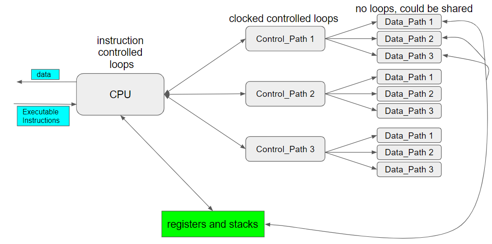

# 13 deBounce Shift

We are entering the second half of the semester where we need to eliminate Nexys4DDR switch bounce so we can see metastability and other problems that look similar to switch Bouncing problems. 

Then we want to build as much of the universal shift register as possible using async concepts.

## 1 deBounce

The switches on the Nexys4 DDR board scrap skin off your fingers. They are mechanical things that can get dirt in them. Switches break. Debouncing reality has no precise definition. There are [hardware debouncers and logic debouncers](https://electrosome.com/switch-debouncing/). Below is a logic deBouncer. A clocked circuit enables a deterministic, arbitrary, unsatisfying, answer no better than any mechanical answer. This code originated at a 200 level class like this one at the [University of Michigan](https://www.eecs.umich.edu/courses/eecs270/270lab/270_docs/debounce.html). 

This is called a finite state machine that reflects in detail what is going on above. Switch Input or sw_i is mentioned only when it is a 1. At other times isw_i is assumed to be zero. 

*Test the circuit and show your instructor. Write down a test in your notebook. If you can't, then record a pattern that is confusing in your notebook so you can repeat it on the circuit below to see if they are the same.* 

*Does the test pass? Why or why not? Why are you having trouble wrapping your brain around the simple code above?* 

I chose to record pattern from the circuit and the pattern was not easy to follow. For a test that I would've written, the circuit definitely would not have passed that test because the synchronous parts of the circuit are all getting their clock pulses at the same time, and not waiting for their previous variables to change. It is hard to wrap my brain around the code above because it looks fine if the code was asynchronous and all progressed under one "always @(posedge clk) begin end" statement.

## 2 deBounce FiZzim

The above circuit was translated into this Finite State Machine (or FSM) following the steps outlined in the [drawings folder](..\drawings\README.md).

*Why is the above finite state machine so much more complex that the circuit?* Because it should be done with several FSM's. not one. 

*At what states (circles) above does the counter reset forever?*  At all states where psp = sw_0.

*At what states does the counter actually count?* Is using states to count. The COUNT states starts the counter, the DONE states finish the counter. 

*There is obvious symmetry or pattern that has been leveraged in the turning of this state machine into the verilog code above. Describe the symmetry or pattern:*

The part where sw_0 = 0 looks like a mirror image of the part wher sw_0 = 1.

The above finite state machine diagram was draw with FiZzim, which also generates system verilog code from the drawing. This is the code. 

*Which code (original or FiZzim) is easier to see what the circuit is about and how to test it:*

The FiZzim

*How would you improve either code so that it becomes more understandable at a glance?*

Make it into an "if" statement. As in if sw_i does stays changed for 6 consecutive posedge clock pulses then sw_0 = !sw_0

*Does this circuit test the exact same way?*

Yes

*Does this work equally well for debouncing 0 to 1 transition and 1  to 0 transition?* 

Yes

*Does this work equally well for switches as well as push buttons?*

Yes, assuming there is some way to keep the push button held for 6 posedge clock pulses.

*What feature of this debouncer do PB_synch_0 and PB_synch_1 enable?*

They allow the program to be used with multiple functions on the same board or in the same circuit.

*How many clock transitions occur before this debouncer makes up it's mind that the switch is stable?*

6 posedge clock strikes

*Which circuit would be easier to modify if the switch bounces 22 times, or bounces for around a1 millisecond?*

1 millisecond

## 3 Reusable deBounce Module

The goal is to rewrite the debounce module iso it can be easily re-used. 

[Read this article](https://pubweb.eng.utah.edu/~cs5780/debouncing.pdf) and answer these questions. 

*How did the secret service push the switches?*

They threw rules at the panels from across the room.

*How much time did a "bad" switch continue to bounce?*

157 milliseconds

*What was the max time  a  "good" switch continued to bounce?*

6200 microseconds

*What was the average time a "good" switch bounced?*

1557 microseconds

*Are our Nexys4DDR board switches bouncing?*

Yes

*What does the clock rate have to do with switch deboucing?*

If the clock rate is really fast, then the max number of bounces should be increased.

*Does switch debouncing affect timed [Olympic races](<https://listosaur.com/sports/10-closest-finishes-olympics-history/>)?* 

Yes switch debouncing affects timed Olympic Races because it limits the precision of the measurement, causing the time to only measure to the hundredth of a second when the race can realistically come down to milliseconds of a difference.

*What is the difference between the resources used in debounce 1 and 2?*

The second debounce add another slice LUT which reduced the amount of bonded IOBs.

Original

FiZzim

*Is the difference meaningful?*

Yes, the second iteration makes the circuit easier to understand by the user but makes it harder to alter and reuse.

*Which circuit was chosen to build the reUseable Debounce?*

Debounce 1 was used.

Circuits are being successfully generated (software creating verilog from design documents such as FSM) at a higher level than RTL now. When they fail (Vivado doesn't synthesize), the verilog code has to be edited. Circuits are being generated so successfully, that larger projects are possible in the same amount of design time. Software that does this is Xilinx [Vivado HLS](<https://www.xilinx.com/products/design-tools/vivado/integration/esl-design.html>), Intel has a version. The most exciting news is that the rest of the market seems united behind an open source standard that involves a soft cpu called [RSIC-V](https://riscv.org/), an HLS called [Clang](https://clang.llvm.org/) and a [LLVM](http://llvm.org/) to [generate Verilog code](https://llvm.org/devmtg/2010-11/Rotem-CToVerilog.pdf). *How much [does this remind](https://news.ycombinator.com/item?id=14235483) you of playing a video game where you climb levels of abstraction to get better at the game .. that perhaps can't be verbalized or shared?* 

## 4 Shift Operator

The original, 1970's, the [universal shift register](https://en.wikipedia.org/wiki/Shift_register) has grown into many concepts that are explored in this lab. These concepts include the verilog shift operator, the [barrel shifter](https://en.wikipedia.org/wiki/Barrel_shifter), and [pipelining](https://www.xilinx.com/support/documentation/sw_manuals/xilinx2015_2/sdsoc_doc/topics/calling-coding-guidelines/concept_pipelining_loop_unrolling.html). For example multiplying by two is shifting left. Dividing by two is shifting right (if the number is unsigned).Shift applications are at the heart of most algorithms including  math, communications, error correction and cryptology. Control paths spend a lot of their time telling data_path circuits when and how to shift. 

The universal shift register has four parallel inputs, 4 parallel outputs,  leftRightDirection, and In. The goal below was to design as much of this using the >> and << verilog shift operators at the data_path level as possible. This means that a control_circuit is going to be need to shift the bits left or right, clear, and clock so they can be seen shifting. 

Figure out what this circuit does and document it below. 

*How would you test this? Show your instructor.* 

The parallelIn shows on the parallelOut. The numberOfBitsToShift will shift the output accordingly with the leftRightDirection determining the direction. The In switch determines whether the shift register ushers in 1s or 0s when it shifts the output.

*What are the new bits going into the shiftRegister if the numberOfBitsToShift is 2 and In is set at 1?*

00000011 would show on the shift register.

## 5 Shift Operator with Clock

This is a series of circuits that slowly build the Universal Shift Register.

*What is this project adding to the previous project?* 

It adds a counter to the circuit.

*Does it work?* 

Yes it all still works.

### 6 Cliff_classic

Our goal is to understand the  [cliff_classic Finite State Machine](http://www.sunburst-design.com/papers/CummingsSNUG2003SJ_SystemVerilogFSM.pdf) in order to control our "Shift Operator" data_path circuit. 

The four states below are named:  "IDLE, READ, DLY (delay) and DONE"  which are similar to "Idle, To your mark, get set, go."

The SystemVerilog code for the cliff_classic.fsm can be generated by following the steps in the drawings folder for this course. 

*Is the above code identical to that generated by FiZzim?*

I was unable to generate the FiZzim file. Perl was not working.

*Test it and show it working to your instructor.*

*What does negedge rst_n look like in the RTL-Schematic?*

It is the clear on each of the flip flops producing data.

*What is the purpose of XXX='x and nextstate = XXX?* 

It sets default states for the program to start out on.

### Project 7 Shift Clock Cliff

We now will have 3 separate circuits that need to be tied together. The purpose is to get them all working in parallel and manually tested.

We need to design the control circuitry for the shift operator circuit above. Before starting, we need to understand the role of control circuitry in general. This starts with understanding a CPU. 

The terms CPU and GPU contain the words "Processing Unit." 

[The term "Processing Unit" was created by chemical engineers in the early 1900's](https://en.wikipedia.org/wiki/History_of_chemical_engineering#Definitions). Chemical Engineers were reverse engineering the dominate German chemical industry and noticed similar "Processes" used during the creation of a variety of different products such as a distillation "Unit." Early computers in the 1950's were programmed by [rewiring](https://en.wikipedia.org/wiki/Central_processing_unit) them like the earlier [analog computers](https://en.wikipedia.org/wiki/Analog_computer#Electronic_analog_computers). The engineers noticed patterns. These early computer engineers borrowed the term  "Processing Unit" from chemical engineering rather than "[SubAssembly](https://en.wikipedia.org/wiki/Product_structure_modeling#Example)" from mechanical engineering. By the 1960's the term CPU was in wide use. 

A CPU is given tasks to perform when it receives a [machine code](https://en.wikipedia.org/wiki/Machine_code). Each task could potentially involve turning on other control_path circuits, delaying other control_paths, and waiting for a control_path to finish. Each control path has in turn a fixed, limited set of data_path circuits which it in turn turns on and off. The data_paths manipulate data stored in registers or stacks. The CPU monitors registers or stacks and often waits for control_paths to finish before using the information to figure out which executable instruction to deal with next. 

Each of these loops begins to look more and more like the [feed forward processing of our brain](https://en.wikipedia.org/wiki/Feed_forward_(control)#Physiological_feed-forward_system). A neuromorphic processing unit configures the oscillations and lets them evolve, rather than directly controlling the CPU loops like a traditional programming language. 

The control path circuitry's relationship with the data_path is what we as circuit designers have control over. Within the Data_Path there could be counters or debouncers which can contain clocks. These are the crippled control_paths we have been building so far. They control nothing except themselves and report back to the Data_Path. This is why clock domains are so sophisticated. 

What we want to examine now are control_paths that actually control DataPaths. Control passes through them. The left side of the control path is our focus at the moment. 

Read is an example of the control_path giving permission to the data_path to do something. In the modified shift operator circuit this is parallelOut. We are going to design this and more control_path signals, wires or nets below. But first we need to deal with the inputs and outputs of the Control_path.

clk - clock ... same as it has been .. the 100Mhz clock of the Nexys4DDR circuit board.
reset - same as it has been .. where ever there is a flip flop there has to be a reset 
done - CPU's may not be able to predict how long a control path is going to need to complete it's job. In any case the CPU needs this feedback to work reliably.

go/wait - form a two bit pair that enable four states such as that found in track or swim meet: "Idle, To your mark, get set, go."

Every CPU design has these elements. They may be described differently. This particular style of control_path circuits introduced below is taught by [Cliff Cummings](http://www.sunburst-design.com/cliffc/) who has dominated Verilog education since 2001. The software we are going to use is [Fizzim](http://www.fizzim.com/download/) which comes with 40 example circuits starting with the name Cliff. The circuits are all drawings like that below.

*Show your instructor testing all three separate circuits.* 

*Is this a data_path or control_path circuit?* This is a combinatory, async, data_path circuit. Inputs drive the outputs. Input change is immediately (at speed of light) reflected in the output. 

*Why is it called a shift operator?* Because it operates on bit's just like putting a pipe in front of a group causes them to collapse into an or of all of them. It operates like putting an & creates one bit that is true only if all were ones. 

*Why is it called arithmetic?* Because it operates on bit's like adding does. It produces an output based upon doing something logical or mathematical to all the bits. 

*If we set **bit** at one, then it appears to shift one left or right. Why isn't this identical to the universal shift register?*  Because you can not shift again and choose a different input. 

*But you could if you changed the input to reflect the new output, if you closed the loop then you would have a shift register.* Exactly. A loop. But a shift register requires no human intervention. A register or a flip flop is created by looping back with a clock. We have to begin seeing clearly when a register is created, when timing becomes an issue. 

### 8 Slowing Down CliffClassic

*Describe differences in code between project 6 and 7.*

*Did this project slow down CliffClassic?*

CliffClassic is the same speed as far as I can tell.

*Show the circuit to your instructor. Can you see both the read and delay states? How?*

Not really. The read and delay states go back and forth and essentially become the same thing when ws = 1.

### Inbetween 8 and 9 what happened

The overall goal was to add the shift operator to cliff classic. The project kept failing. Always generating a bitstream, but strange things happening. The bits shifted would all turn to 1s. Or 0s. Or random bits. 

**Attempt 1** So backed off and made one incremental change to slow Cliff Classic above. Added a constant and looped it. This was a success.

**Attempt 2** Then added a wrap of the shifted out bit around to the shifted in bit.
This was a success.

**Attempt 3** Then added state display on the RGB LED of the Nexys4DDR board.
This was a success. 

The goal was to keep adding incrementally little things until the strange symptoms above started happening again. At this point could not think of any small change that could add that worked. 

**Attempt 4** Saw a Latch, implemented but failed to act like a shift register. Latch was not associated with if command or case command defaults. Was associated with reset in the always_ff sensitivity list. 

**Attempt 5** got rid of latch, focused on the load of newly shifted register proposal or temp variable into the real shift register. Tried to load in a state rather than assign. Load worked but cleared in the next state.

**Attempt 6** Created 5th state just for loading the shift register loop. Failed, did not clear, but failed to act like a shift register. Random 1's and 0's. 

##### Giving Up and Why

Am trying to create another loop. Idea failed because was creating a loop with async in it. Can see the loop below: 

Shift Register => Parallel In => Parallel Out => Parallel Out Temp => back to Shift Register 

Closest was attempt5 which had no latches

*Why doesn't Vivado just say what was attempted here is impossible?*

Because the code is logical and Vivado sends to the board what it gathers from the code.

## 9 Success a Universal Shift Register

*This works! With only a slight modification! Mostly. What doesn't work?*

*How would you go about troubleshooting the problem?* 

*Would you have ever found the problem without a Nexys4DDR board to physically troubleshoot with?*

*What line of code replaced the shift operator?*

*What feature of the shift operator was sacrificed?*

*Which above is it most similar to?*

*Why does it work and the shift operator doesn't?*

*What rule can we make for ourselves that explains what happened?*

*How would you modify this code to make a [barrel shifter](https://en.wikipedia.org/wiki/Barrel_shifter)? (Do't create a project, just add some untested verilog code below.)*

*How is a [Fibonacci shift register different from a Galois shift register](http://www.math.ias.edu/~goresky/pdf/Fib.jour.pdf)? What do LFSR and FCSR mean?*

The next lab discusses mod in more depth. Mod 2 above can be thought of as an even/odd detector or as binary decimal places. 

*The sprints at the end of semester are filled with verilog code to get working. How many different types of shift registers are there?*

*Why is there no universal shift register?*

*What is the difference between a shift register and [fifo](https://zipcpu.com/blog/2018/07/06/afifo.html)?*

