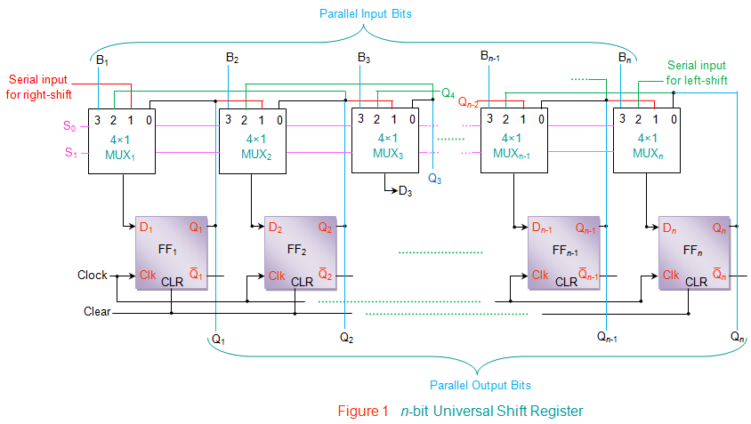
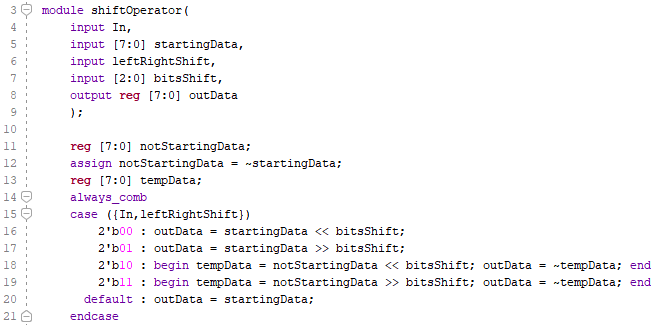
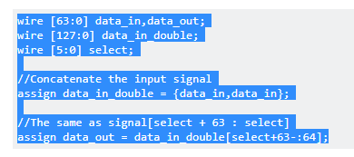

Before Verilog a major design concept was a universal shift register.

Shifting has many uses. Multiplying by two is shifting left. Dividing by two is shifting right (if the number is unsigned).  It is an introductory topic to the more advanced topic of  [pipelining](https://www.xilinx.com/support/documentation/sw_manuals/xilinx2015_2/sdsoc_doc/topics/calling-coding-guidelines/concept_pipelining_loop_unrolling.html). 

Let's start by decoding the above graphic. So and S1 together determine whether nothing happens (0), rightshift (1), left shift(2) or parallel load(3) happens.  The muxes select from the four inputs and feed them to flip flops that are clocked. 

## 4_Arithmetic Shift Operator

The shift operator creates a data_path.  It is driven by the question "How many places do you want to shift?" It translates into a LUT rather than flipflops. It is not a universal shift register. 

#### SystemVerilog Code

replace with this

Which is a [barrel shifter from stackexchange](https://stackoverflow.com/questions/7543592/verilog-barrel-shifter)

#### Prompts

*Is this a data_path or control_path circuit?* This is a combinatory, async, data_path circuit. Inputs drive the outputs. Input change is immediately (at speed of light) reflected in the output. 

*Why is it called a shift operator?* Because it operates on bit's just like putting a pipe in front of a group causes them to collapse into an or of all of them. It operates like putting an & creates one bit that is true only if all were ones. 

*Why is it called arithmetic?* Because it operates on bit's like adding does. It produces an output based upon doing something logical or mathematical to all the bits. 

*If we set **bit** at one, then it appears to shift one left or right. Why isn't this identical to the universal shift register?*  Because you can not shift again and choose a different input. 

*But you could if you changed the input to reflect the new output, if you closed the loop then you would have a shift register.* Exactly. A loop. But a shift register requires no human intervention. A register or a flip flop is created by looping back with a clock. We have to begin seeing clearly when a register is created, when timing becomes an issue. 

## 5_Shift Register

#### Testing

Have to re-Load before switching directions .. which is not a universal shift register. 

*Why didn't you fix it?* Was chasing problems inside the control_path.  Fixed one problem by expanding to 10 bits and preloading In on either end.  This didn't feel right. Normally when fixing problems, a new problem doesn't surface  .. if  you are on the right track.  Maybe if I fixed them all, I could extract and collapse the fixed logic into a data_path. More likely, the code just gets bigger and bigger and I oscillate between problems. 

*What would be your next step if you continued working on this?* I would add a register to remember the direction I was going,  check to see if the direction changed on every clk pulse and then make an adjustment. 

#### Prompts

*Why does shift register IP exist?* Because shifting turns into the bottleneck, the weak chain in a link, the source of problems in many projects. 

*The above code works, why wouldn't it work when a real clock is changing at 100Mhz?* All the timing issues we discussed above ... which are beyond the scope of this course. 

*Isn't this the boggy man, something to be scared of, a generic excuse for any design decision, something that can not be argued with. something similar to political, fear based rhetoric?* Yes. You should question anything that is based upon authority and experience in this world. So just recognize that shift IP does exist.

## 6_Shift Register IP

