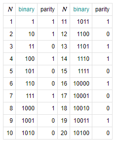
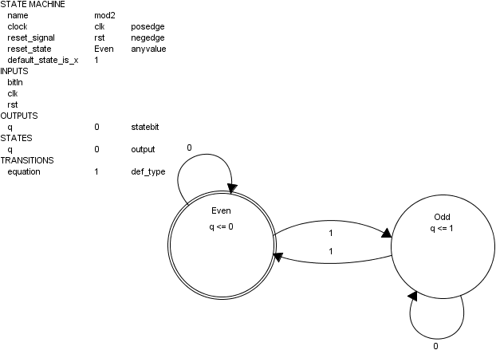
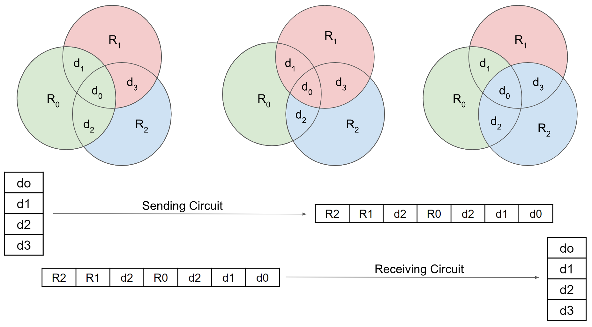
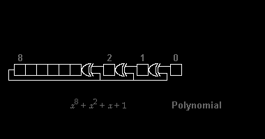
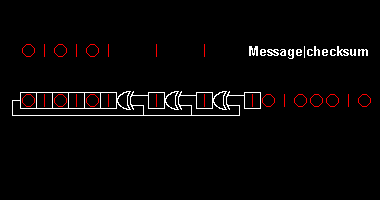

# 14 Parity Hamming CRC

# 1 Rings

Ring circuits are those where the output is driven by the state. The only inputs are enable, and reset(s). The example here is a complicated ring. Your goal is to predict the output before looking at the implemented circuit. Make this prediction in your lab notebook. Create a Rant, particularly if your prediction was wrong. Go back to the code and try again. Don't bounce back and forth staring at the code and then the actual circuit working before writing. You want to design, not troubleshoot. You want to engineer, not repair. The goal here is design engineering. 

*What was your initial hypothesis from reading the code?*

My initial hypothesis was that the circuit would act like a shift register and move the LED to the left until it restarts. It would also show which inputs were on and show the current state. There would be 3 resets: a hard reset, a conditional reset, and a halfway reset.

*What does the actual circuit do?* 

It does exactly what I predicted

*This project includes a more simple clock. It is not as flexible as the previous clocks you have seen. In what way is it "not as flexible?"*

It is harder to determine the exact timing of the clock as it relates to seconds, therefore it is harder to change how often you would like to clock to count. Or simply, it is less precise.

## 2 Mod 
Computer science algorithms include an integer math called Modular Arithmetic. Very simple circuits can be built that do this.  Read this [Khan Academy introduction to Modular Arithmetic](https://www.khanacademy.org/computing/computer-science/cryptography/modarithmetic/a/what-is-modular-arithmetic) and go through the first practice.  Then start inspecting these circuits. 

Mod 2 is also called [parity](https://en.wikipedia.org/wiki/Parity_bit) the most simple form of error detection possible. 

Here is the statemachine version:

## 3 Hamming Codes

Hamming Codes both **detect** errors like parity **and correct** the arrows without retransmitting the data. 

## Design

This is an outline of the [Hamming  7/4 algorithm](https://en.wikipedia.org/wiki/Hamming(7,4)) illustrating the sending and receiving circuits

[Alternative to linear algebra Gp Encoding  (see wikipedia article)](https://en.wikipedia.org/wiki/Hamming(7,4)#Channel_coding)

Error correcting is a linear algebra operation best done 

Going to calculate the parity like this:

R2 R1 D3 R0 D2 D1 D0  

from least significant (on the right) to most significant (on the left)

using odd parity in the equation such as R2 = odd (D0, D2, D3)
making the entire contents of the blue circle (R2,D0,D2,D3) above even

1 0 1 1   original data

_ _ 1 _ 0 1 1  original data with Redundant Bits added as blanks  
**?** _ **1** _ **0** 1 **1** calculating R2   
0 **? 0** _ 0 **1 1** calculating R1   
0 1 1 **? 0 1 1**  calculating R0  
0 1 1 0 0 1 1 data sent  

Both the sending circuit and receiving circuit compute R0, R1, and R2. 

The receiving circuit knows that   
	if only R0computed ne R0, then R0 is in error  
	if only R1computed ne R1, then R1 is in error  
	if only R2computed ne R2, then R2 is in error  
	if only R0computed ne R0 and R1computed ne R1 then D1 is in error  
	if only R2computed ne R2 and R0computed ne R0 then D2 is in error 
	if only R2computed ne R2 and R1computed ne R1 then D3 is in error   
	if all three R bits have toggled, then D0 is in error  

The correction of the problem is to toggle the bit back into it's original version

## Your Task

Your task, expand this to cover four more bits like this: _ _ 1 _ 0 0 1 _ 1 0 1 0
Calculate the parity for each parity bit (a ? represents the bit position being set) like this:

**?** _ **1** _ **0** 0 **1** _ **1** 0 **1** 0  
0 **? 1** _ 0 **0 1** _ 1 **0 1** 0  
0 1 1 **? 0 0 1** _ 1 0 1 **0**  
0 1 1 1 0 0 1 **? 1 0 1 0**  

These are links to the files used to create the graphics above. You are probably going to have to add a bank switch and design the testing more than modifying the starting code. 

## 4 CRC

A **cyclic redundancy check** (**CRC**) is an [error-detecting code](https://en.wikipedia.org/wiki/Error_detection_and_correction) commonly used in digital [networks](https://en.wikipedia.org/wiki/Telecommunications_network) and storage devices to detect accidental changes to raw data. We are interested in its [computation](https://en.wikipedia.org/wiki/Computation_of_cyclic_redundancy_checks) as illustrated by these graphics:

Start at these graphics. The upper one is the sending circuit. Data is moving right to left. The data enters first, followed by an equal number of zeros. What follows the data is the CRC.

The lower one is the receiving circuit. The data enters first, then the CRC. If the final result is zero, the receiver is confident the data was stored, transmitted and received correctly.

How would you go about [implementing this CRC](https://www.easics.com/webtools/crctool)? Would you start at the gate level like this diagram shows or would you by drawing a finite state machine? 