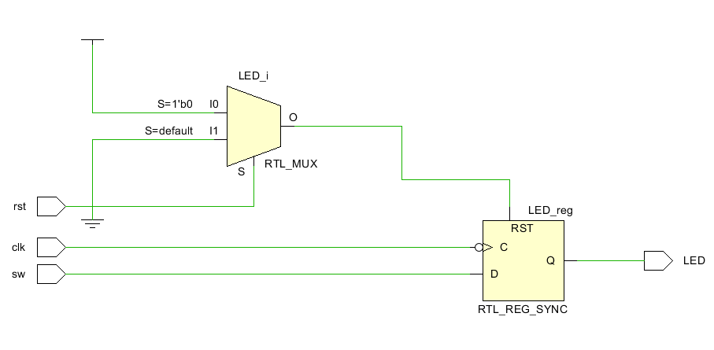
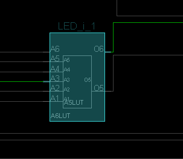

# 15 Finite State Machines

In the last lab we employed the Cliff_Classic and began using FizZim. In this lab we are going to explore Finite State Machines through FizZim.

## 1 Moore

When finite state machines stop just driving Data_path circuits can combine previous state and inputs to form new states. When the output is feed into separate Data

### 1 Moore Heros

Heros stands for **H**ighly **E**ncoded with **R**egistered **O**utputs as **S**tatebits. Design starts off with conceptual names of for states like idle, read, delay, done. Four states can be compressed into two bits. Conserving bits is usually not necessary but back in the beginning of the computers, when every bit counted, techniques were developed to find identical states that used [implicate tables](https://www.youtube.com/watch?v=bRR602-_uf4&t=534s). Heros is the FizZim default interpretation of a state diagram. FizZim counts the number of state names. Two state names or less is 1 state bit. Four or less state names turn into  2 state bits. Eight or less become 3 bits. Sixteen or less fit into to 4 state bits. 

### 2 Moore One Hot

One Hot encoding means that 

### 3 Moore Gray

Encoding is the general term for states originating in some physical reality such as a [wheel turning](https://en.wikipedia.org/wiki/Rotary_encoder). If the circuit states match the physical world states, then one can tell the direction the wheel is turning , if it is stopped or a gear has grown so smooth that a state was skipped. 

There are many [different encodings](https://en.wikipedia.org/wiki/Gray_code#Lucal) that offer a one bit change from physically adjacent states. 

States can be assigned by hand by directly editing the systemVerilog code that FizZim produces. What kind of gray scale does FizZim produce?

### 3 Vivado Examples

Vivado has thousands of example programs. The goal is to explore these and figure out the reset,set,load,enable, disable, async or sync chaos. What does vivado recommend? What does vivado support?

Go through this path in the Vivado Interface:

Vivado>Tools>Language Templates> Verilog>Synthesis Constructs>Flip Flops>D Flip Flop

You will find 4 examples under Negedge edge, and 4 under Posedge

Implement all 8 with both RTL schematics and implementation device zooms in on the actual flip flops used. 

### 4 Add third flip flop control

In each add a third else if (load) <reg> <= <signal> for a total of another 8.

### 5 Stretch Vivado

Keep adding else if (<signal) until Vivado starts throwing a Lut into the problem rather than messing with the flip flop configurations. 

Draw some conclusions.

