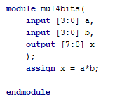
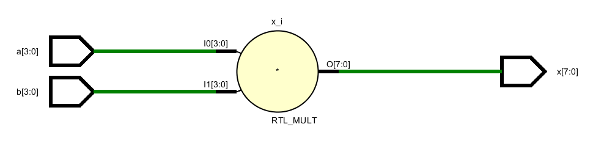
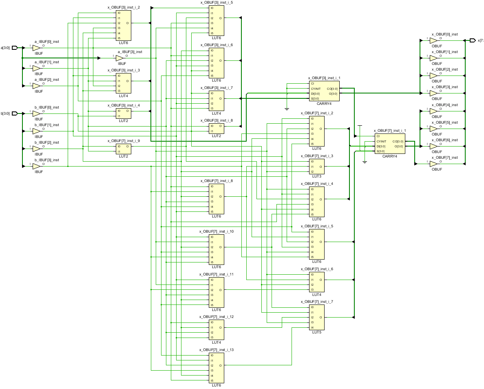
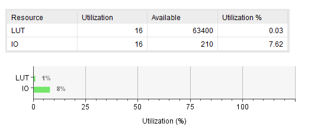
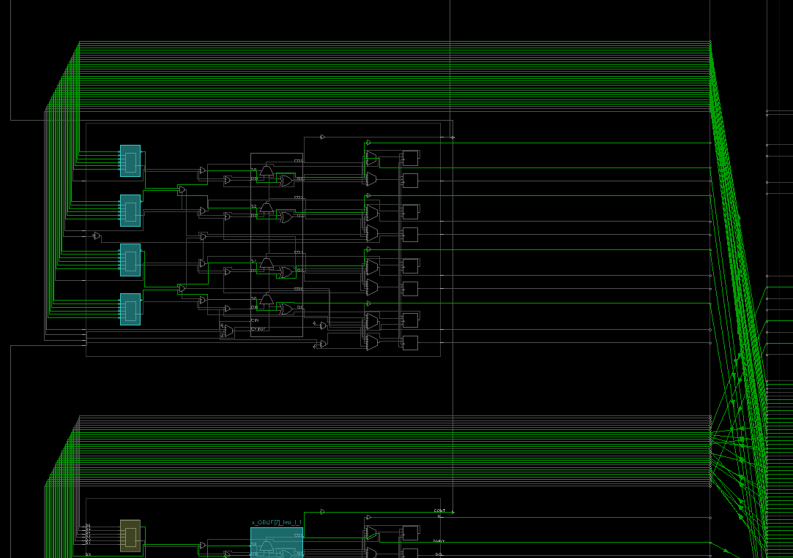

Verilog Source

RTL Schematic

Synthesis Schematic

Utilization Summary

Implementation

Manual Testing

​	Can see a pattern of when ask to multiply by 2,4,8,16 ... just shifts the other number left	 

