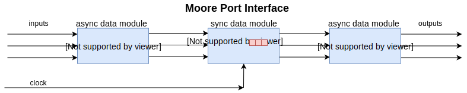
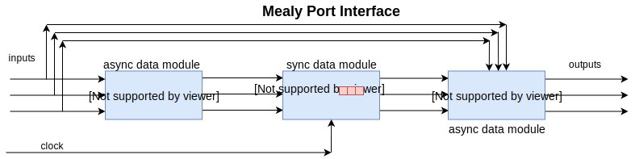

# Drawings

The purpose of drawings is to create the documents that explain the verilog code you are going to write or have written. Typically, you create the drawings, write the code, and then match them backup with the verilog code that was written.  There are three types of drawings in this class:

 [Port Interfaces](https://en.wikipedia.org/wiki/Computer_port_(hardware))    
 [State Diagrams](https://en.wikipedia.org/wiki/State_diagram)  
Finite State Machines (FSM):  [Moore](https://en.wikipedia.org/wiki/Moore_machine) and [Mealy](https://en.wikipedia.org/wiki/Mealy_machine)  
[Algorithmic State Machines ](https://en.wikipedia.org/wiki/Algorithmic_state_machine) (ASM)   

In this class, you will be asked to make drawings of different types. What follows are svg graphics of xml drawings that can be uploaded and edited at [draw.io](https://www.draw.io/).

Modules are circuits. Ports are where wires plug in, like a harbor port where ships dock. 

Asynchronous is how the world works. Events drive what happens, not a clock. Synchronous has a clock that orchestrates movement of data between circuits.  The registers remember or output the previous input while the input async data module makes up its mind about what the next input is going to be.

The Mealy causes inputs to bypass the registers and directly influence the output. This is used primarily in serial communications such as USB, Ethernet, CanBus, wifi, xbee, bluetooth, etc. Without this there would be more video with out of sync sound caused by splitting video into picture and sound with different sending and receiving, different compression and error correction techniques. 

Next would be a port interface of a project such as the $15 gum machine that has a control module , sync data module, and async data module. The trouble with this is that the port interface is not the starting point of a project .  A state diagram is the starting point.  So we start with a $15 gum machine generic state diagram and then move onto a $15 gum machine port interface.  

The [linked](http://www.sunburst-design.com/papers/CummingsSNUG1998SJ_FSM.pdf) paper is out of date, but modern in it's understanding of how Vivado interprets case commands. May be useful in the transition labs between flipflops and IP. It certainly has good state diagrams  whose interpretation could be test questions. 