# Drawings

The purpose of drawings is to create the documents that explain the verilog code you are going to write or have written. Typically, you create the drawings, write the code, and then edit the drawings until they match the verilog code that was written.  These are the drawing types in this class:

 [Port Interfaces](https://en.wikipedia.org/wiki/Computer_port_(hardware))    
 [State Diagrams](https://en.wikipedia.org/wiki/State_diagram)  
Finite State Machines (FSM) called [Moore](https://en.wikipedia.org/wiki/Moore_machine) and 2 forms of  [Mealy](https://en.wikipedia.org/wiki/Mealy_machine)  
[Algorithmic State Machines ](https://en.wikipedia.org/wiki/Algorithmic_state_machine) (ASM)   
ASMD

In this class, you will be asked to make drawings of different types. What follows are svg graphics of xml drawings that can be uploaded and edited at [draw.io](https://www.draw.io/).

## Ports Interface Drawings

Ports are where wires plug in, like a harbor port where ships dock.  All circuits start off with a port interface. The primary goal is to name the wires as they will be named in the verilog code. In complex projects consisting of 20 circuits, each with wires having similar names, one has to print all the port interfaces and put them on a wall to see the big picture of how they are all connected together.

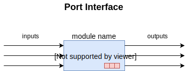

Asynchronous is how the world works. Events drive what happens, not a clock. Synchronous has a clock that orchestrates movement of data between circuits.  The registers remember or output the previous input while the input async data module makes up its mind about what the next input is going to be.

Port Interfaces are sufficient for asynchronous combinatory networks where input changes directly control the outputs of a circuit with out memory. 

Circuits that have memory require additional drawings that begin to look like a flow chart. 

# Finite State Machine Drawings

___

Finite State Machines (FSM) have other names in other contexts. For example a [Labelled Transmission Systems](https://www.win.tue.nl/~jschmalt/teaching/2IX20/reader_software_specification_ch_8.pdf) is used in creating tests of Verilog code. More broadly both are part of a [Transition System](https://en.wikipedia.org/wiki/Transition_system). But this is another subject. 

We are going to be using FizZim software for finite state drawings. FizZim both draws the state diagram FizZim generates the SystemVerilog code. 

FizZim does not put an explicit “!go” on the IDLE loopback transition, nor an explicit “!ws” on the DLY to DONE transition. That is because FizZim understands that a transition with an equation of “1” is the default, lowest priority, transition. Arrows with nothing on them can be assumed to be go=0 and ws=0 and thus just the rising edge of the clock moves from state to state. 

All FSM's must have a reset signal, a reset state (IDLE), a clock and a default state. 

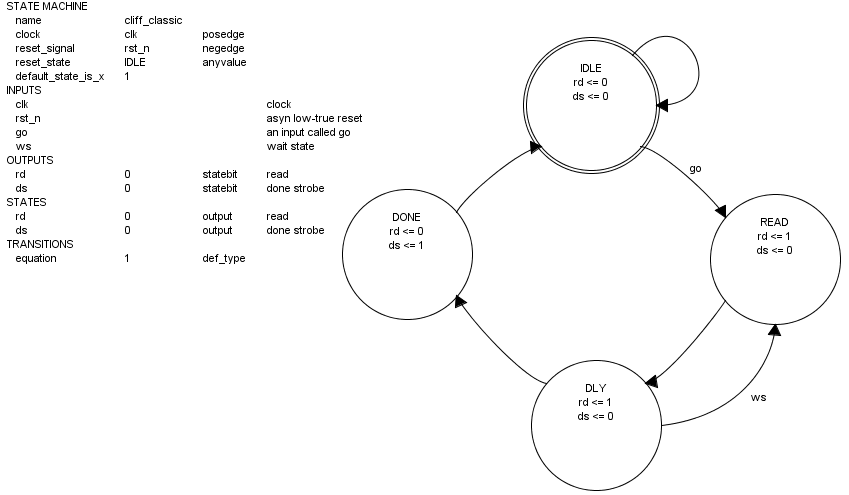

The output variables rd and ds are called "state variables" because their content is determined by the state they are in. The variables "go" and "ws" are "input variables." They are driven external, perhaps asyn input like a physical switch. Or they can be driven by sync variables coming from a larger controlling circuit.  

Read "rd" and "Done Strobe" are outputs to other circuits or LED's. The circuit controlling the above FSM may look at "rd" and block all other circuits from changing the input the FSM above needs. For testing purposes, these input are switches. The input could be from RAM which can both be read from and written to. We don't want RAM or an async module both written to and read from at the same time. For testing purposes, the wire or net "rd" needs to be sent to an LED. We look at it and make sure our switches are in place because on the next cycle "DLY" everything will be read. 

Done Strobe (ds) is set at the end of the DONE state. It stays high through the IDLE state, giving the controlling circuit time to set "Go" at the end the IDLE state to cause a transition to the READ state on the next clock tick. 

Remember that <= means non blocking. This means it's value becomes available to other circuits on the next clock tick.  Done Strobe will remain high for only one clock pulse while in the IDLE state. It will drop back to 0 on the next loop back through IDLE. This is why it is called a "Strobe." Say "Done Strobe" in your mind when you see "ds" in order to build this timing context in your mind.

Read (rd) and Done Strobe (ds), go, rst_n and clock are the minimal variables needed for a Finite State Machine to communicate with other circuits. Leave them in the FSM. The "dly" or Delay State and "ws" or Wait State input cause a loop. This is so that the circuit or human controlling the above FSM can "pause" it and coordinate it's output with another circuits. Right now this application is beyond the scope of our class. Just leave ws in with the circuit along with rd, ds, go, rst_n and clock. Don't use them. Add states instead. 

These are the steps for generating the SystemVerilog code for the cliff_classic.fsm drawing. 

- Find an installation of perl (find perl.exe) inside Vivado and setup a path to it:

  path C:\Xilinx\Vivado\2018.3\tps\win64\git-2.16.2\usr\bin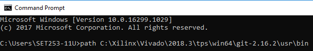

- Change to the directory containing the FizZim extracted folder

- Copy fizzim.pl to the examples folder 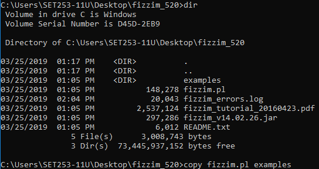

- Change to the examples folder

- ​     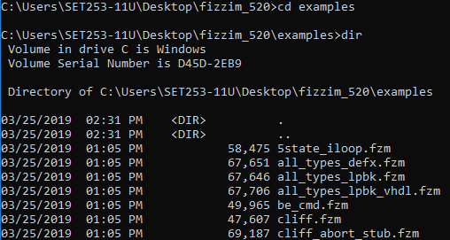

- make sure fizzim.pl and cliff_classic.fzm files are present. Then type this command:

  C:\Users\SET253-11U\Desktop\fizzim_520\examples>perl fizzim.pl -terse -language SystemVerilog cliff_classic.fzm > cliff_counter.sv

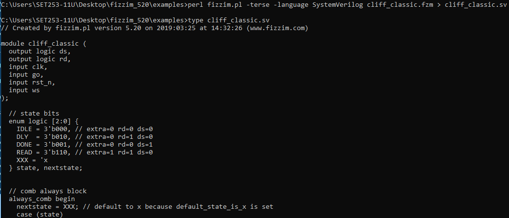

You should able to type the contents of the newly created cliff_classic.sv file. 

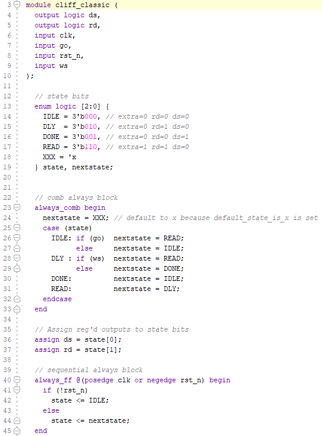

Look in Lab 13 Debounce_Shift, UniversalShift Register, Project2_CliffClassic for a bitstream implementing the above where you can manually test it. 

### Moore Port Interface

The above state machine is Moore. The variables inside the state are assigned values all at once like playing a chord on the piano.  None-blocking is indicated by the <= assignment. This means they get their new values at the beginning of the next state.  Moore output can only be driven by information about the state itself. Within FizZim, these are called statebits or reg. In the above SystemVerilog code, the assign commands form the inside of the async data module below.  This is where  the  moore outs  of rd (read)  and ds (done strobe) are set. 

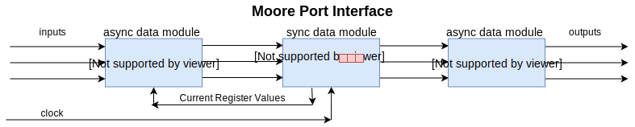

### Mealy Port Interface

The Mealy datapath adds to Moore. The async circuits controlling output can contain a mixture of state information as well as the async input from switches or other clock domains. 

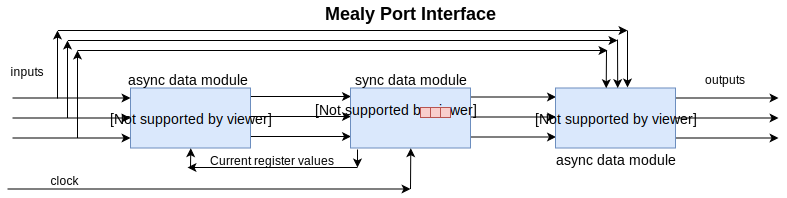

Mealy variables such as (go_missed) can be assigned to states. But they are implemented immediately upon entering the state. This is indicated by the blocking = assignment. 

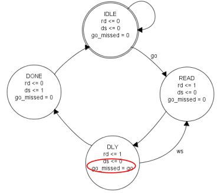

This type of mealy appears in the async always_comb block twice. The default is above the case command and it is set in the DELAY state without an "if" command. The utility of this will be seen later in the labs. 

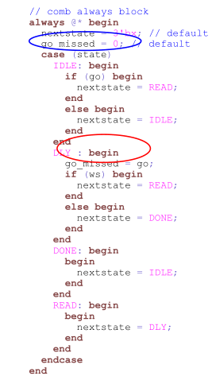

Mealy variables can also be assigned or associated with async inputs within a state inside an "if" command.  On the FSM diagram, they appear on the transition lines between states. Here pre_rd=1 which appears activated when go async input causes a transition between IDLE and READ. 

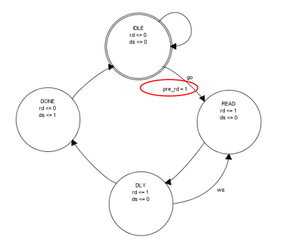

This moves the mealy output under an if command:

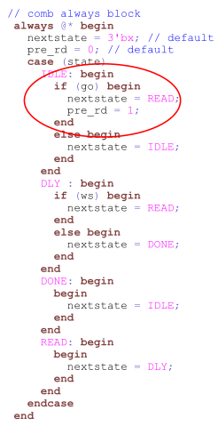

### Why Mealy?

Mealy is important in serial communications. For example, your cell phone is playing music. A group of bits is so damaged it needs to be retransmitted before the video buffer starts moving a singers lips.  There is a window of time in which it can be corrected with out the video and sound disappearing and a circle appearing on the cell phone screen indicating some kind of problem. A cell phone that can fix the problem one clk cycle quicker (Mealy) is going to keep the sound and lips in sync better.  One bit delays through every piece of equipment that moves the video and sound data can and does add up. 

# Algorithmic State Machines

___

There are other names for this. One is [Labelled Transmission Systems](https://www.win.tue.nl/~jschmalt/teaching/2IX20/reader_software_specification_ch_8.pdf). 

### Why?

**Why #1**  Imagine yourself deep in a concentration tunnel, trying to build a a circuit to support other circuits .. or trying to figure out why an existing circuit stopped working. You can not hold all the detail in your brain. You need to draw diagrams and abstract patterns from them.  You have built lots of Finite State Machines (FSMs) but have become frustrated. They do not capture the detail you need to see the big picture. You want to do both Mealy and Moore. You want to deal with more inputs. You want to grow large FSM. You intuitively feel that there should be a better way of doing things. You want something that drags you through the detail yet captures high level abstractions in order to clear the fog. 

**Why #2** Someone has heard that any software program written can be implemented much faster, at less cost, with less energy consumption in hardware. They hand you their favorite MathWorks Simulink model, or Lab View model that has generated Verilog code. Almost all programs from Fortran to Python, from Math Lab to Lab View can generate Verilog code. But Vivado, Quartus, Synoptics, MentorGraphics, etc. won't synthesize it. 

**Why #3** Someone hands you a C program and ask, can you make this go really fast in hardware, bypassing an operating system? You say yes but the person pushes back saying Xilinix [MicroBlaze Open Source CPU](https://xilinx-wiki.atlassian.net/wiki/spaces/A/pages/18842560/MicroBlaze) running C code complied for it is not fast enough, can't be tested, is supported by a commercial company, etc. What do you do?

The answer to all these work flows is to build an Algorithmic State Machine or **ASM**. 

### ASM is not a Flow Chart

A flow chart ends in many different types of output. An ASM outputs along each step of the way and loops back to an idle state waiting to be told to do it again. Forever. Can you tell the difference below?

This ASM was drawn with  [DrakonHub](<https://drakonhub.com/ide/doc/sfoerster/3>). If you click on the link, there are differences. The Drakon standard is No is to the left, yes is down. "Yes" was changed to 1. The world "No" was deleted. The Drakon standard has clear ends. This means the big start over loop had to be manually added as well as an arrow head. At the bottom was a word  "**end**" in an oval box. Three changes were made to the Drakon standard that includes no arrow heads on downward flow.

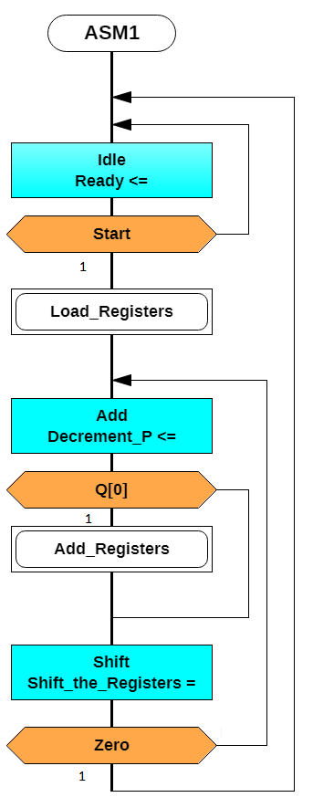

### ASMs **&#8800;** Flow Chart

Variables above such as Ready, Load_Registers, Decrement_P, Add_Registers, Shift_the_Registers are set to 0 if not mentioned in a state. They are all 1 bit nets. They trigger async arrays or net groups. 

People coming from traditional sequential programming view flow charts as something they can intuitively feel or see in the code. In the same way FPGA programmers looking at Verilog or VHDL see FSMs. Novices start by drawing the diagrams until they can see them in the code. As long as code chunks are small, and then number of code chunks stitched together is small, flow charts and FSMs are not needed. 

Big projects create the need for big flow charts or ASMs. Flow charts or ASMs are necessary for people to have conversations about a big project. The fact that the workflows parallel each doesn't mean that the big flow chart and an ASM are equivalent. 

Traditional programming, traditional flow charts capture only the logic. They execute sequentially. They don't worry about starting or stopping functions or instantiated objects. They let the operating system do the heavy lifting of running programs on multiple CPUs. They let the compliers do the heaving lifting of splitting the code up into chunks that can run on 6,000 machines. They celebrate peta flop languages such as [Fortran, C and Julia](https://juliacomputing.com/communication/2017/09/12/julia-joins-petaflop-club.html). At best traditional computer science worries about the [halting problem](https://juliacomputing.com/communication/2017/09/12/julia-joins-petaflop-club.html) which has nothing to do with timing. 

[Real time computing](https://en.wikipedia.org/wiki/Real-time_computing) does share concepts with an ASM, but this is on a much larger, slower scale than an ASM and involve a real time operating system coordinating everything. [Sheet music into a programming languages](https://en.wikipedia.org/wiki/MUSIC-N) are the closet to Verilog and VHDL. The music world wrestles with how to play a chord (non-blocking), how to mix several notes played by different instruments together into single output driving one speaker. 

Verilog or VHDL generators could have unique IP (intellectual property) that doesn't work with different synthesis engines and hardware platforms. The generators often create variables with no context. The code is often bloated. It is often a generation older than the synthesis software expects. When it doesn't work, it is often easier to look at the language that generated it (or the symbols in the case of Simulink or LabView.) 

When generated code works, it creates more work if sustainability, testing and troubleshooting in the future are necessary. However all this is [evolving really fast](https://llvm.org/devmtg/2010-11/Rotem-CToVerilog.pdf). It could be that everything we are studying here will be replaced with something like [myHDL](http://www.myhdl.org/) and [cocotb](https://cocotb.readthedocs.io/en/latest/introduction.html). Or a new version of C ([Clang](https://clang.llvm.org/)) will emerge that can generate Verilog as well as traditional computer languages, complier and operating systems. It could be that there becomes a world wide instruction set standard ([RISC-V](file:///C:/Users/FoersterGame/Documents/GitHub/ENES246/17AlgorithmicStateMachine/riscv-spec-v2.2.pdf)) that scales to support all modern CPUs .. that is [not Xilinx MicroBlaze](https://www.linux-kvm.org/images/6/6a/02x04B-QEMU-Support_for_the_RISC-V_Instruction_Set_Architecture.pdf). Verilog would become like gates . something we look at to see if the higher abstraction is working. 

### ASM = FSM

Finite State Machines, as defined by FiZzim, are the equivalent of an ASM. There are lots of FSM descriptions that don't separate out the two types of Mealy. There are lots of FSMs that clutter up the interface by talking about every 0 and 1 rather than build an intuition of input/output priority. Non FiZzim FSMs are different from an ASM.

Good ASM's focus on signals that enable and disable async circuits. Good ASM's decorate control/sync with data/async. Good ASM's don't worry about the logic. Good ASM's worry about the **timing** of everything. Good ASM's focus on **when** async/data_path output is gathered up and when it is feed back into another (or even the same data_path. FiZzim FSM's do all this. 

The blue boxes begin new algorithmic states. The blue/orange/white patterns are equivalent to the state circles in a Finite State Machine. White boxes are the immediate mealy output after an if command with in a state. The blue box <= are Moore output which takes affect at the beginning of the next state and stays true only through the next state. Like the FSM, all state variables (mealy moore) are reset to zero in between states. 

### ASM = Circle

An ASM creates a circle of states just like an FSM. The world or another ASM starts the ASM. It then stops on it's own and signals that it is done back to the world. A regular flow chart doesn't circle back to the beginning.  

### ASM documents parallel circuit elements

ASM's can split up internally and run in parallel. An organizing ASM can tell the fast ASM to idle while the slower ASM's finish. 

An ASM describes what goes on during a clock tick and what happens in between clock ticks. Parallel circuits have to come back together to get to complete a circle. But clock ticks have to be counted. 

AMS's are designed to communicate a lot of information much clearer than a FSM. 

### ASM and FSM Documentation starts with a port diagram 

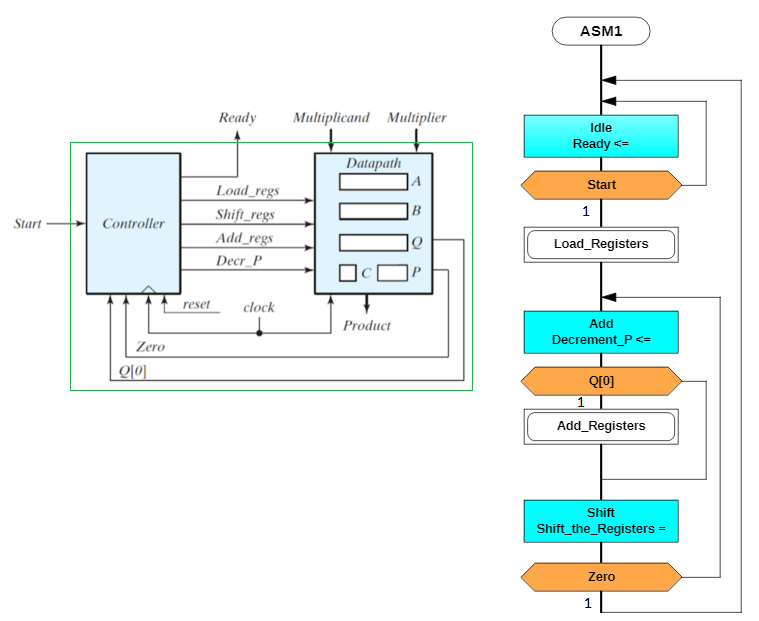

The above is an ASM implementation of the control path that is inside the controller circuit. The gold are inputs, the blue are Moore outputs (<= that happen at the beginning of the next state) and Mealy outputs (= that start at the beginning of the algorithmic state). The white are Mealy outputs that happen conditionally (=) at the beginning of the algorithmic state. Algorithmic states begin at the blue. The name of the algorithmic state is the first name in the blue. 

# Algorithmic State Machines with Data

Algorithmic State Machines with Data (ASMD) look like the control path above. But they are decorated with what the actual output triggers the async circuits to do. The above diagram needs a little bit more information in order to understand what is being asked of it. 

The above algorithmic state machine is a first draft at multiply. Normal RTL programming would just use the * symbol and let the synthesis software decide how to implement the multiply. Maybe the synthesis software would it would use a truth table to multiply. Maybe it would implement some specialized hardware in the FPGA.

We are focused on multiply because you have studied multiplication by hand. We are going to take this algorithm of shifting and adding and turn it into a moderately complicated circuit. You always shift. You only add if the multiplier digit, you are working on, is not zero. Q[0] indicates whether the multiplier digit is 0 or not. You are done when there are no more multiplier digits. This is the signal Zero below. There is a counter circuit (not pictured) that counts down to 0 that is associated with register C. 

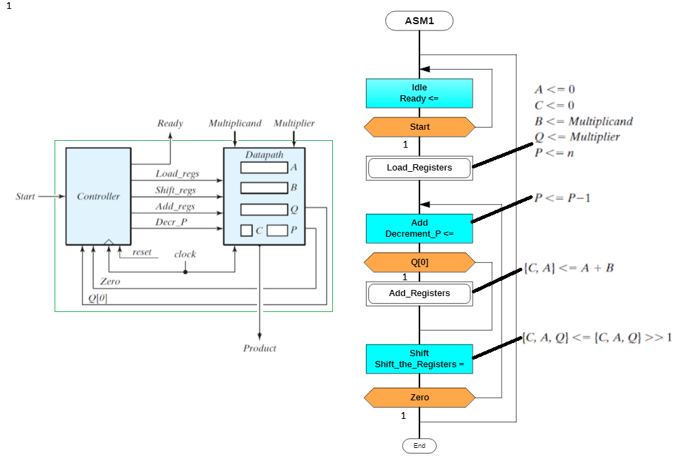

An engineer reviewing this would look at the shift_the_register = and start asking questions:  
Why the blocking "equal" sign?   
Won't the >> left shift generate a really slow async circuit? 

And then the reviewing engineer might suggest:  
Perhaps { right most bit = left most, rest } = {original} ? 

The goal is to enable two engineers to have a conversation about a large project, not create a blue print that another engineer can create Verilog or VHDL code from ... without a conversation. 

